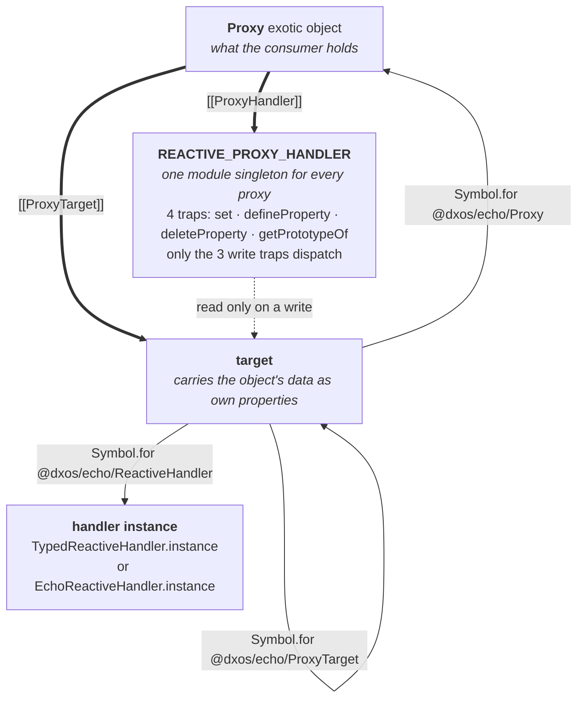
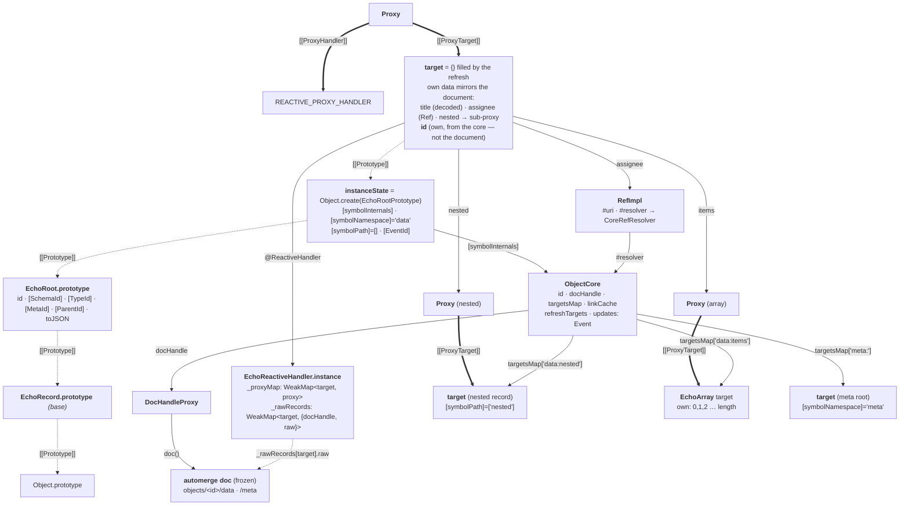
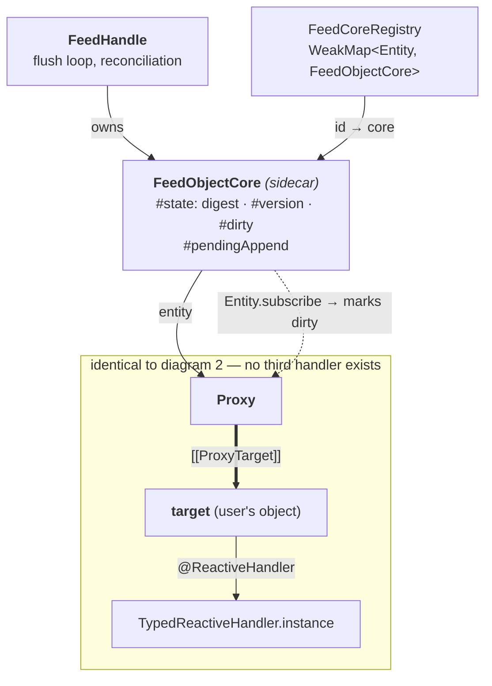
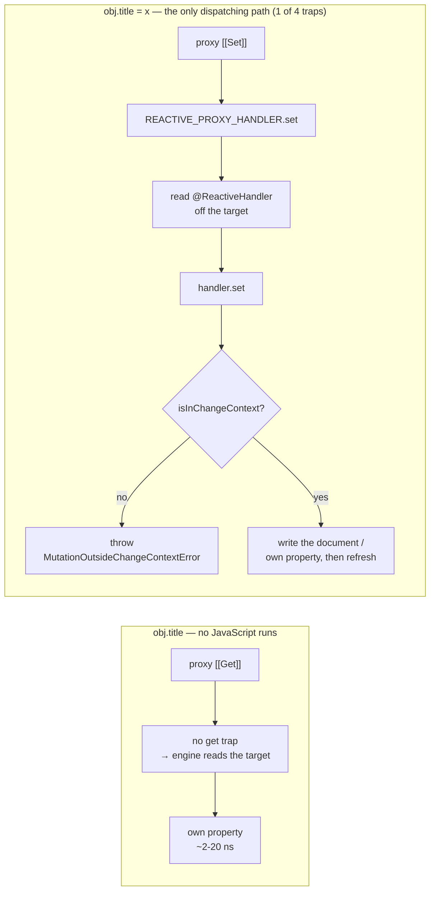

# ECHO object layout — the V8 objects behind one reactive object

Every node below is one JavaScript object in the heap. Solid arrows are **own property references**
(labelled with the key); dashed arrows are **`[[Prototype]]` links**. State after Stage E
(`cf4c23bf`), where every target carries its own data and one shared four-trap handler serves every
proxy.

**There are two handler classes, not three.** `TypedReactiveHandler` backs in-memory objects and
`EchoReactiveHandler` backs database-backed ones. A _feed_ object is not a third variant: it is an
ordinary typed object with a `FeedObjectCore` sidecar syncing it (see diagram 4).

---

## 1. The skeleton every variant shares



A read touches **none** of this. There is no `get`, `has`, `ownKeys` or `getOwnPropertyDescriptor`
trap, so `obj.title`, `'title' in obj`, `Object.keys(obj)`, a spread and a descriptor lookup are all
answered by the engine off the target with no JavaScript call. `getPrototypeOf` is trapped but does
not dispatch. The dashed edge is the only dispatch left, and it is reached only by a mutation.

### Symbols carried on a target

| Symbol                       | Set by                                        | Purpose                                               |
| ---------------------------- | --------------------------------------------- | ----------------------------------------------------- |
| `@dxos/echo/Proxy`           | `createProxy`                                 | identity — `v[sym] === v` iff `v` is a proxy          |
| `@dxos/echo/ProxyTarget`     | `createProxy`                                 | `getProxyTarget(proxy)` (the proxy forwards the read) |
| `@dxos/echo/ReactiveHandler` | `createProxy`, rewritten by `setProxyHandler` | trap dispatch                                         |
| `inspectCustom`              | handler `init`                                | node `util.inspect`                                   |

All are `Symbol.for(...)` registry keys, so a proxy built by one evaluated copy of the module is
fully usable by another.

---

## 2. Typed (in-memory) object — `Obj.make(Person, {...})`

```mermaid
graph TD
  P["<b>Proxy</b>"]
  H["REACTIVE_PROXY_HANDLER"]
  T["<b>target</b> — the user's own object<br/>own data: name, age<br/>own: nested → sub-proxy, items → array proxy"]
  IS["<b>instanceState</b> = Object.create(TypedObjectPrototype)<br/>[EventId] (root only) · [ObjectDeletedId]<br/>[SchemaId] · [TypeId] · [TypeEntityId] · [StaticTypeSchemaSlot]"]
  TP["<b>TypedObjectPrototype</b> <i>(one per process)</i><br/>[symbolReactivePrototype] · [objectData] · [ChangeId]"]
  OP["Object.prototype"]
  HANDLER["<b>TypedReactiveHandler.instance</b><br/>_proxyMap: WeakMap&lt;target, proxy&gt;"]
  EV["Event"]
  NP["<b>Proxy</b> (nested record)"]
  NT["<b>target</b> (nested record)<br/>own data"]
  AP["<b>Proxy</b> (array)"]
  AT["<b>ReactiveArray</b> target<br/>own: 0,1,2 … length"]

  P ==>|"[[ProxyTarget]]"| T
  P ==>|"[[ProxyHandler]]"| H
  T -.->|"[[Prototype]]"| IS
  IS -.->|"[[Prototype]]"| TP
  TP -.->|"[[Prototype]]"| OP
  T -->|"@ReactiveHandler"| HANDLER
  IS -->|"[EventId]"| EV
  T -->|"nested"| NP
  NP ==>|"[[ProxyTarget]]"| NT
  T -->|"items"| AP
  AP ==>|"[[ProxyTarget]]"| AT
```



User data lives directly on the target as ordinary own properties. Nested records and arrays are
stored **already wrapped** — `init` wraps what is there and `_prepareValueForAssignment` wraps what
is assigned later — which is what lets reads be forwarded.

---

## 3. Database-backed object — `db.add(Obj.make(...))`



The document is the source of truth; the target is a **materialized mirror** of it, refreshed on
every change. `_rawRecords` holds the raw record the target was last filled from — automerge shares
untouched subtrees structurally, so an unchanged record is the identical object and the refresh is a
pointer compare.

`targetsMap` is the core's index of every target it has handed out, which is what the refresh walks.

---

## 4. Feed-backed object — a typed object with a sidecar



`FeedObjectCore` never participates in the proxy at all: it subscribes to the object, digests
`Entity.toJSON(entity)`, and appends blocks. So the benchmark's "feed" rows measure the **typed**
read path plus feed sync — not a distinct object layout.

---

## 5. What a read and a write actually traverse



The read path is dispatch-free and trap-free. The write path is where the remaining multiple dispatch
lives — and outside `Obj.update` it always ends in the same throw regardless of variant, which is the
argument for rejecting there too, with no handler lookup at all:

```js
const READONLY_PROXY_HANDLER = {
  set: (target, prop) => {
    throw createPropertySetError(prop);
  },
  defineProperty: (target, prop) => {
    throw createPropertySetError(prop);
  },
  deleteProperty: (target, prop) => {
    throw createPropertyDeleteError(prop);
  },
  getPrototypeOf: (target) => (Array.isArray(target) ? Reflect.getPrototypeOf(target) : Object.prototype),
};
```

The key-set traps are already gone (`cf4c23bf`) — they differed from the raw target in four ways, three
of which were bugs. What remains before the write traps can reject without dispatching: a single
change-context predicate (`change-context.ts` keeps one module-global `currentChangeContext`, so
"is any context open" is an O(1) variant-free check), an exemption for the symbol writes that are
legitimate outside `Obj.update` (`Obj.setParent` stamps `[ParentId]` after every update), and
unifying the two packages' differing error messages.
