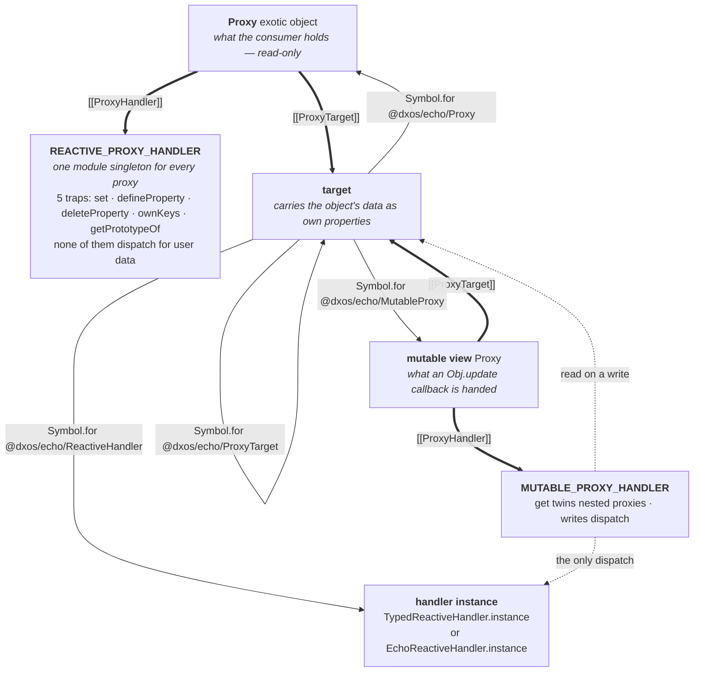
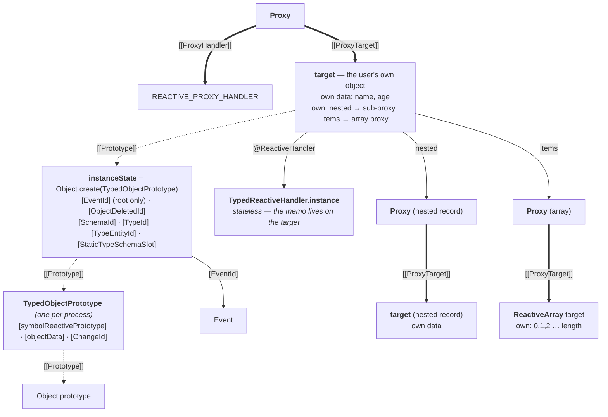
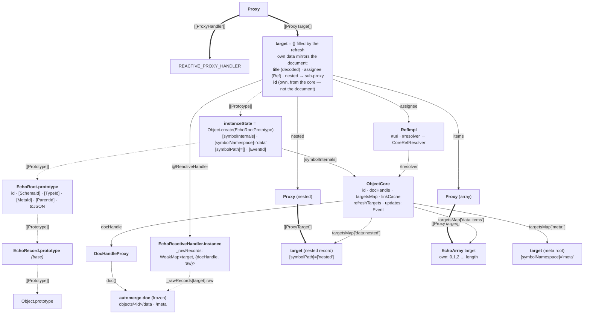
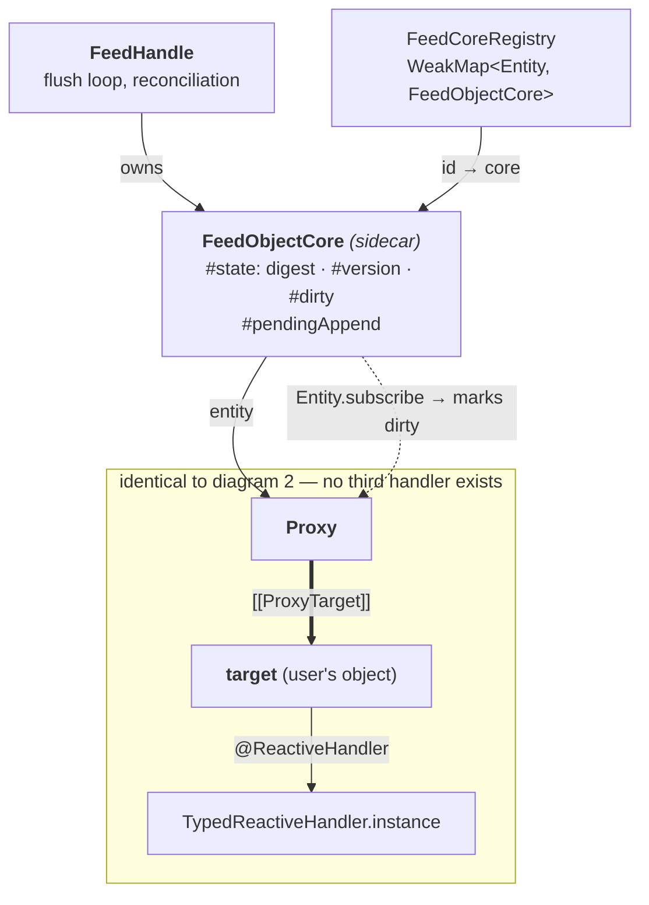
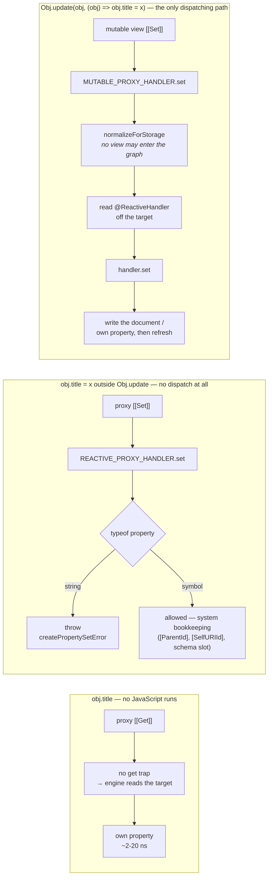

# ECHO object layout — the V8 objects behind one reactive object

Every node below is one JavaScript object in the heap. Solid arrows are **own property references**
(labelled with the key); dashed arrows are **`[[Prototype]]` links**. State as merged (`0cde959956`),
where every target carries its own data, one shared five-trap handler serves every read-only proxy,
and a second handler backs the mutable view an `Obj.update` callback is handed.

**There are two handler classes, not three.** `TypedReactiveHandler` backs in-memory objects and
`EchoReactiveHandler` backs database-backed ones. A _feed_ object is not a third variant: it is an
ordinary typed object with a `FeedObjectCore` sidecar syncing it (see diagram 4).

---

## 1. The skeleton every variant shares

A read touches **none** of the read-only path. There is no `get`, `has` or
`getOwnPropertyDescriptor` trap, so `obj.title`, `'title' in obj`, a spread and a descriptor lookup
are all answered by the engine off the target with no JavaScript call. Two traps exist but never
dispatch: `getPrototypeOf` is one `Array.isArray`, and `ownKeys` is one `Reflect.ownKeys` plus a
filter that hides configurable symbols (a generic walker that read `[symbolReactiveHandler]` or
`[symbolInternals]` and recursed would reach `Function.prototype.caller` and throw — this is what
`Object.keys`, spread and structural hashing go through; `Reflect.ownKeys` on the **raw** target
still shows everything).

Writability belongs to the **reference**, not to a dynamic extent. The read-only proxy's write traps
throw before consulting any handler (`assertReadOnly`, O(1), fail-closed), so the proxy named outside
`Obj.update` stays read-only for the callback's whole duration. All variant dispatch is now reached
only through the mutable view.

### Symbols carried on a target

| Symbol                       | Set by                                        | Purpose                                                                  |
| ---------------------------- | --------------------------------------------- | ------------------------------------------------------------------------ |
| `@dxos/echo/Proxy`           | `createProxy`                                 | identity — `v[sym] === v` iff `v` is a proxy; also the target→proxy memo |
| `@dxos/echo/ProxyTarget`     | `createProxy`                                 | `getProxyTarget(proxy)` (the proxy forwards the read)                    |
| `@dxos/echo/ReactiveHandler` | `createProxy`, rewritten by `setProxyHandler` | trap dispatch                                                            |
| `@dxos/echo/MutableProxy`    | `getMutableProxy` (lazily, on first update)   | the target's mutable view; `canonicalOf` keeps one out of the graph      |
| `inspectCustom`              | handler `init`                                | node `util.inspect`                                                      |

All are `Symbol.for(...)` registry keys, so a proxy built by one evaluated copy of the module is
fully usable by another.

`[ChangeKeyId]` (`@dxos/live-object/ChangeKey`) is not stamped on the target — it is an **accessor on
the behaviour prototype**, resolving to the root target (typed) or the `ObjectCore` (echo). It is the
one key the array and text gates read, which is why `assertMutable` needs no variant dispatch.

---

## 2. Typed (in-memory) object — `Obj.make(Person, {...})`

User data lives directly on the target as ordinary own properties. Nested records and arrays are
stored **already wrapped** — `init` wraps what is there and `_prepareValueForAssignment` wraps what
is assigned later — which is what lets reads be forwarded.

---

## 3. Database-backed object — `db.add(Obj.make(...))`

The document is the source of truth; the target is a **materialized mirror** of it, refreshed on
every change. `_rawRecords` holds the raw record the target was last filled from — automerge shares
untouched subtrees structurally, so an unchanged record is the identical object and the refresh is a
pointer compare.

`targetsMap` is the core's index of every target it has handed out, which is what the refresh walks.

---

## 4. Feed-backed object — a typed object with a sidecar

`FeedObjectCore` never participates in the proxy at all: it subscribes to the object, digests
`Entity.toJSON(entity)`, and appends blocks. So the benchmark's "feed" rows measure the **typed**
read path plus feed sync — not a distinct object layout.

---

## 5. What a read and a write actually traverse

The read path is dispatch-free and trap-free. Rejection is now constant-cost and **fail-closed**:
there is no state to be wrong about, which is what a context lookup could not promise. Symbols are
exempt because they are never user data — the system stamps `[ParentId]` and friends on objects
consumers hold read-only, outside any update.

Dispatch survives in exactly one place, the mutable view, and the change context still exists — but
only to batch notifications and to gate the mutations a proxy cannot intercept (`Array` methods, text
CRDT ops), which call `assertMutable(target, name, …)` directly against `[ChangeKeyId]`.

Two invariants hold the design together:

- **A mutable view must never enter the graph.** Storing one would hand a permanent write capability
  to every later reader and break identity for anyone holding the read-only reference. `canonicalOf`
  maps a view back to its read-only twin; `normalizeForStorage` applies it through the literal being
  assigned (`obj.rows = [obj.rec]`), descending only into plain containers and writing back only
  where normalization changed something — an unconditional write throws on a frozen constant.
  `Array.prototype.sort`/`reverse` return `canonicalOf(this)` for the same reason.
- **`isProxy` still answers true for a view**, with no knowledge of views: the `get` trap twins every
  proxy-valued read, so `view[symbolProxy] === view` holds. `[symbolTarget]` is not a proxy, so it
  answers the raw target and `getRawTarget` unwraps a view correctly.

Enforcement is fail-closed rather than advisory, which is what surfaced five latent defects during
the change (nested arrays ungated, `toJsonSchema` mutating live schema, a view leaking through a
literal, three sites mutating references captured outside their callback). The
`consistent-update-param` lint rule catches the last of those **only when the callback body is
written at the `Obj.update` call site** — two of the three were structurally invisible to it.
