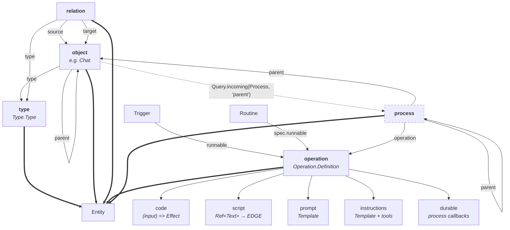

# Process & Operation API redesign

Status: spec (no implementation yet).

Scope: the public shape of operations and processes in `@dxos/compute` /
`@dxos/compute-runtime`, and the ECHO entity kinds they need.

Five changes, specified independently but landing as one API break:

1. **Entity kinds become open.** ECHO owns the mechanism and knows nothing about
   operations or processes; `@dxos/compute` registers the two new kinds. Neither is an
   object type, and neither is bound to automerge.
2. `Operation.Definition` becomes the operation-kind entity, **replacing**
   `Operation.PersistentOperation` and its lossy serialize/deserialize bridge.
3. `Process` stops being a callback bag and becomes the process-kind entity — a **live
   handle** with a URI, referenceable by `Ref`, observable.
4. An operation's implementation becomes a **handler kind**: code, script, prompt,
   instructions or durable. `durable` carries every semantic currently in `Process.make`;
   `script` absorbs `Script.Script` and its deploy-created operation record.
5. A process has a **parent**, which may be another process or an ECHO object.

## At a glance

Nodes are entity kinds. `==>` is "is an entity kind"; `-->` is a reference one entity holds
to another; `-.->` is derived by query rather than stored.



Reading it:

- **The five kinds are siblings.** `operation` and `process` are not object types with a
  `type` ref; their kind _is_ their identity, and the schema behind each is declared once
  by `@dxos/compute` when it registers the kind (§2).
- **Dashed node = never stored.** A process lives only in the compute runtime. Everything
  else may live in the registry or in a space document, at the owner's choice (§2).
- **The object → process edge is dotted because it is a query, not a stored ref.** A
  conversation's agent process is parented to its `Chat` — today a `TargetAnnotation`
  holding a Chat DXN (`agent-process.ts:135`) — and the `Chat` finds its processes by
  querying. It must not hold a `Ref<Process>`: a process ref resolves only where that
  runtime is reachable, so persisting one would dangle on every other peer (§7).
- **Two indirections collapse.** `Runnable` (`compute/src/Runnable.ts`) is today a type
  alias for `Operation.PersistentOperation`, so a trigger and a routine already point at an
  operation through an extra name — after §3 they point at the definition itself. And
  `Routine.spec.instructions` currently carries an owned `Instructions` object whose
  operation is "implicitly the static `RunInstructions`" (`types/Routine.ts:46-48`); with
  `instructions` as a handler kind, that routine references an operation like any other.

## 1. Before

Today three distinct things are called "process", and operations are modelled twice:

| Concern                          | Type                                                  | Location                               |
| -------------------------------- | ----------------------------------------------------- | -------------------------------------- |
| Process definition               | `Process.Process`, `Process.Callbacks`                | `compute/src/Process.ts`               |
| Process live instance (internal) | `ProcessManager.Handle`, `ProcessHandleImpl`          | `compute-runtime/src/ProcessHandle.ts` |
| Process read-only projection     | `Process.Info` + `Process.Monitor`                    | `Process.ts`, `ProcessMonitor.ts`      |
| Operation definition             | `Operation.Definition` (a plain value)                | `compute/src/Operation.ts`             |
| Operation database record        | `Operation.PersistentOperation` (an object-kind type) | `compute/src/Operation.ts:426`         |

Consequences we are removing:

- **Two vocabularies for one process.** A caller that spawns gets a `Handle`; a caller
  that observes gets an `Info`. The two are not convertible, so UI listing processes
  cannot act on one without going back to a manager.
- **Two models for one operation.** `serialize` / `deserialize` / `setFrom`
  (`Operation.ts:478-560`) convert between them on every registry sync, dropping the
  handler, narrowing `services: Context.Key[]` to `string[]`, and rendering the
  input/output codecs as JSON Schema.
- **`Process.make` is a second way to write a unit of work**, duplicating the operation
  metadata (`key`, `input`, `output`, `services`, `types`) its definition already has.
- **Processes are invisible to ECHO.** `Monitor.list(filter)` is a bespoke query language
  parallel to `Filter` / `Query`.

## 2. Open entity kinds

**ECHO must know nothing about operations or processes.** It owns the _mechanism_ —
entities have a kind, kinds decide addressing and storability — and `@dxos/compute`
registers the two new kinds against it. Nothing in `@dxos/echo` names either one.

That means the closed enum goes:

```ts
// @dxos/echo — an open brand, plus the three kinds ECHO itself owns.
export type EntityKind = string & Brand.Brand<'EntityKind'>;
export const EntityKind = { Object: …, Relation: …, Type: … } as const;

// Decodes ANY kind — an unknown kind is data, not a parse error.
export const EntityKindSchema = Schema.String.pipe(Schema.brand('EntityKind'));

export interface KindDescriptor {
  readonly kind: EntityKind;
  /** URIs an instance is indexed and resolved under (registry + ref resolution). */
  readonly addressing: (entity: Entity.Unknown) => readonly URI.URI[];
  /** Whether instances may be written into a document. */
  readonly storage: 'document' | 'external';
}

export const registerKind: (descriptor: KindDescriptor) => void;
```

and `@dxos/compute` registers:

| Kind        | `storage`  | `addressing`                          |
| ----------- | ---------- | ------------------------------------- |
| `operation` | `document` | `dxn:<key>` and `dxn:<key>:<version>` |
| `process`   | `external` | `process://<runtimeId>/<pid>`         |

A kind fixes identity/addressing, which APIs accept the value, and what a persisted
projection looks like — but **not** where instances live. Storage is orthogonal and
per-entity: an operation may sit in the registry _or_ in a space document; a process lives
in the compute runtime and is never stored.

|                      | Type                             | **Operation**                                         | **Process**                            |
| -------------------- | -------------------------------- | ----------------------------------------------------- | -------------------------------------- |
| Is a                 | definition of _shape_            | definition of _behavior_                              | _instance_ of behavior                 |
| Created by           | `Type.makeObject(dxn)(schema)`   | `Operation.make({ key, input, output, services, … })` | `manager.spawn(op, input, options)`    |
| Identity             | typename DXN, or EID when stored | key DXN                                               | pid                                    |
| Backing store        | registry, or a space (`addType`) | registry, **or** a space (`addOperation`)             | the compute runtime — **never stored** |
| Hidden slots         | source Effect Schema             | input/output codecs, `services`, `types`, handler     | scope, output queue, status atom, RPC  |
| Persisted projection | `jsonSchema`                     | `inputSchema`/`outputSchema`, `services: string[]`    | none                                   |

### 2.1 Making the mechanism generic

Each of these is a place ECHO currently hard-codes its three kinds. Opening them is the
whole of the ECHO-side work; none of it mentions operations or processes.

1. `internal/common/types/entity.ts:124` — enum → brand + descriptor registry;
   `EntityKindSchema` → open string. `EchoTypeSchema` is already generic over
   `K extends EntityKind` (`internal/Entity/entity.ts:63`) and needs no change.
2. `internal/Entity/type-kind.ts` — generalize `EchoTypeKindSchema` into
   `makeEntityType(kind, dxn)(schema)`. The type-kind pipeable becomes one call of it;
   `Operation.makeDefinition` and the process type factory are two more, declared in
   `@dxos/compute`.
3. `internal/Obj/create-object.ts:106-110` — the three-way kind-inference ladder becomes a
   read of `annotation.kind`.
4. `registry.ts` `getEntityUris` — the type-kind special case becomes
   `descriptor.addressing(entity)`, with the existing behavior registered as the `type`
   descriptor. (It falls back to `getEntityKeyDXNs`, which is empty for an unkeyed entity —
   a bare-EID fallback is worth adding as the default.)
5. `Ref.ts:56-70` — the per-kind overload arms (object, relation, `Type.Type`,
   `UnknownTypeSchema`) collapse into **one** arm over any entity type of any registered
   kind. Fewer arms than today, and no new ones per kind.
6. `Database.ts:83` — `RejectTypeEntity` hard-codes `EntityKind.Type`. Replace it with a
   capability brand: `db.add()` bounds on kinds whose descriptor is `storage: 'document'`,
   so ECHO rejects by _capability_ rather than by naming a kind. The runtime check reads
   the same descriptor. `db.addType()` gets a generic sibling (`db.addEntity(kind, …)`, or
   a per-kind entry point contributed by the registering package) for the deliberate
   persist path.

### 2.2 What an unregistered kind must do

Once kinds are open, a peer can receive an entity whose kind it has never heard of — a
space holding operations opened by a client that did not load `@dxos/compute`. The
decoder must surface it as an opaque `Entity.Unknown` carrying its kind string, never
fail. This is strictly better than the closed enum, which decodes `entityKind` with
`Schema.decodeSync` today (`JsonSchema/json-schema.ts:585`) and would throw.

## 3. Operation — the definition is the entity

`Operation.PersistentOperation` is deleted. An operation definition is no longer a plain
value shadowed by a separate database record: **it is an instance of the operation kind**,
which `@dxos/compute` registers once (§2) under the existing `org.dxos.type.function`
v0.2.0 DXN, so stored data needs no migration.

For a consumer, almost nothing changes at the point of definition — `Operation.make`
already produces what is now the entity:

```ts
// packages/plugins/plugin-markdown/src/types/MarkdownOperation.ts — unchanged today.
export const Create = Operation.make({
  meta: {
    key: DXN.make('org.dxos.operation.markdown.create'),
    name: 'Create',
    description: 'Creates a new markdown document and adds it to the space.',
    icon: 'ph--file-text--regular',
  },
  services: [Database.Service],
  input: Schema.Struct({ name: Schema.String, content: Schema.String }),
  output: Schema.Struct({ object: Type.getSchema(Markdown.Document) }),
});
```

What changes is what that value now _is_ — an entity with a URI, so it can be referenced,
resolved, queried and (optionally) persisted:

```ts
Type.getURI(Create); // 'dxn:org.dxos.operation.markdown.create'
Obj.getMeta(Create).key; // the registry key — already true today
```

### 3.1 Attaching a handler

Unchanged for the code kind; the other kinds are siblings (§5):

```ts
export default Create.pipe(
  Operation.withHandler(({ name, content }) =>
    Effect.gen(function* () {
      const db = yield* Database.Service;
      return { object: db.add(Markdown.make({ name, content })) };
    }),
  ),
);
```

### 3.2 Referencing an operation

The reason to make it an entity. Today a reference to an operation is a bare string
(`Skill.tools: Array(ToolId)`) resolved by convention; it becomes an ordinary ref:

```ts
// In a schema.
export class Trigger extends Type.makeObject<Trigger>(DXN.make('org.dxos.type.trigger', '0.1.0'))(
  Schema.Struct({
    operation: Ref.Ref(Operation.Definition), // was: Schema.String
    input: Schema.Any,
  }),
) {}

// At a call site.
const op = yield * trigger.operation.load(); // Operation.Definition
const result = yield * Operation.invoke(op, trigger.input);
```

`Ref` resolution needs nothing new: the operation-kind descriptor indexes instances under
`dxn:<key>` and `dxn:<key>:<version>` (§2), which the registry ref backend already serves.

### 3.3 Where the definition lives

Registry or space document, **one entity either way** — the same registry-first,
db-second path `Type` already takes (`hypergraph.ts:214-218`):

```ts
// From code: contributed by a plugin, resolvable process-wide.
graph.registry.add([Create]);

// From a space: authored or deployed, replicated, resolvable by any peer that opens it.
yield * db.addOperation(Create);

// Either way, one query.
const ops = yield * db.query(Filter.type(Operation.Definition)).from(Scope.registry()).run();
```

### 3.4 What rides where

The parts a database cannot hold live on hidden slots, as `Type` already does with its
source Effect Schema:

| Slot                                   | Holds                       | Persisted projection                 |
| -------------------------------------- | --------------------------- | ------------------------------------ |
| `InputSchemaSlot` / `OutputSchemaSlot` | the Effect `Schema.Codec`   | `inputSchema`/`outputSchema`         |
| `ServicesSlot`                         | `readonly Context.Key[]`    | `services: string[]`                 |
| `TypesSlot`                            | `readonly Type.AnyEntity[]` | refs, or omitted                     |
| `HandlerSlot`                          | the attached handler        | `handlerKind`, plus a data body (§5) |

So `serialize` / `serializable` / `deserialize` / `setFrom` (`Operation.ts:478-560`)
disappear. A definition read back from a space _is_ a `Definition`, rehydrated by these
rules:

- **Codecs** rebuild lazily from `inputSchema`/`outputSchema` on first access — the
  `Type.getSchema` rebuild path.
- **Services** rebuild from their keys, `services.map(Context.Service)`, exactly as
  `deserialize` does today (`Operation.ts:529`). The key string _is_ the tag identity, so
  a handler's declared requirements survive the round trip; a service absent from the
  resolving runtime fails at invocation, not at read.
- **The handler** rehydrates per kind. `handlerKind` always persists, so a peer can tell
  what backs a definition without having its code:

  | Kind              | Persisted body                          | Rehydrates to                                                                 |
  | ----------------- | --------------------------------------- | ----------------------------------------------------------------------------- |
  | `script`          | `source: Ref<Text.Text>`, `changed`     | the body itself — invoke by deployment                                        |
  | `prompt`          | the `Template.Template` (pending §9.8)  | the body itself                                                               |
  | `instructions`    | the template + tool keys (pending §9.8) | the body itself                                                               |
  | `code`, `durable` | nothing — the body is compiled code     | nothing; resolved from the local `OperationHandlerSet`, else invoked remotely |

  A definition whose kind is `code` or `durable` and which the local handler set cannot
  resolve is invoked remotely — but only under the deployment invariant in §5.1.

**Instance ids must be derived from `key` + `version`, not random.** `Operation.make` is
called at module scope in hundreds of files, and module-scope RNG is forbidden under
workerd — the constraint `Type.makeObject` already documents. Deriving the id also makes
the in-process and persisted forms one entity rather than two.

## 4. Process — the live handle

`Process.Process` becomes the process-kind entity: the _instance_, not a factory. It is
what `spawn` returns, what a query result item is, and what `Monitor` used to describe.

```ts
export interface Process<_Input = any, _Output = any, _Rpcs extends Rpc.Any = never> {
  readonly uri: URI.URI; // process://<runtimeId>/<pid>
  readonly pid: ID;
  readonly operation: Ref.Ref<Operation.Definition>;
  readonly params: Params;
  readonly environment: Environment;
  readonly parent: Ref.Ref<Process | Obj.Any> | null; // §6

  // Observation.
  readonly status: Status; // { state, exit, startedAt, completedAt }
  readonly statusAtom: Atom.Atom<Status>;
  readonly metrics: Metrics;
  readonly error: SerializedError | null;
  subscribeOutputs(): Stream.Stream<_Output>;
  subscribeEphemeral(): Stream.Stream<Trace.Message>;
  children(): Effect.Effect<readonly Process[]>;

  // Control.
  submitInput(input: _Input): Effect.Effect<void>;
  terminate(): Effect.Effect<void>;
  runToCompletion(): Effect.Effect<void>;
  runUntilSettled(): Effect.Effect<void>;
  runAndExit(options: { readonly inputs: readonly _Input[] }): Stream.Stream<_Output>;
  readonly rpc: RpcClient.RpcClient<_Rpcs>;
}
```

- **`Info` is deleted.** Everything it carried is a field or a `status` field here.
- **Dormant vs live is a state, not a type.** `Handle.hydrate()` goes away. A control call
  on a process restored from the durable mailbox **hydrates and then proceeds** — the
  caller never retries, and `submitInput` delivers to the hydrated process rather than
  bouncing. The runtime resolves the definition through the process's `operation` ref,
  which is why the ref is on the entity. `ProcessNotLiveError` is reserved for the case
  where that resolution fails: the operation is not in this runtime's handler set and has
  no remote destination. Observation (`status`, `subscribeOutputs`, queries) never
  hydrates — reading a dormant process must stay cheap.
- **`Process.Monitor` / `ProcessMonitorService` are removed** (§7).
  `subscribeToTraceMessages` moves to `Trace.Monitor`, keeping its aggregate layer.
- `Status`, `State`, `Params`, `Environment`, `ChildEvent`, the annotations and the trace
  event types keep their current definitions.

## 5. Handler kinds

An operation declares _what_ it does (key, input, output, services, types). _How_ it is
implemented is a **handler kind** attached to the definition. `Operation.withHandler` — an
ordinary `(input) => Effect<O>` — is the baseline. Four kinds sit beside it:

| Kind             | Attached with                   | Body is                                             | Runs as                                        |
| ---------------- | ------------------------------- | --------------------------------------------------- | ---------------------------------------------- |
| **script**       | `Operation.scriptHandler`       | user-authored source, bundled and deployed to EDGE  | a remote invocation of the deployed function   |
| **prompt**       | `Operation.promptHandler`       | a `Template.Template` rendered from the input       | one model call, output parsed to `output`      |
| **instructions** | `Operation.instructionsHandler` | natural-language instructions plus the tools to use | an agent turn that works until `output` is met |
| **durable**      | `Operation.durableHandler`      | callbacks over a process context                    | a long-lived process, suspend/resume capable   |

Properties they share, and why they are kinds rather than five unrelated APIs:

- All of them produce a **process** (§5.2). Only the durable kind writes its own
  lifecycle; the rest are wrapped by an adapter that spawns, runs, submits output and
  succeeds.
- All of them are addressed and invoked identically — by operation key, through
  `OperationHandlerSet`. A caller does not know or care which kind backs a definition,
  which is what lets an operation be reimplemented from code to script to instructions
  without touching its callers.
- Three of them — script, prompt, instructions — have bodies that are **data**
  (`Ref<Text>` or a `Template.Template`), so those operations can be authored and
  redefined in a space with no code deployed. Script already works that way today, which
  is the existence proof; §9.8 is whether prompt and instructions follow it into the
  persisted projection.

`OperationHandlerSet` resolves kinds uniformly: `getHandlerFor(key)` returns the
definition with whichever handler slot is populated, and the runtime dispatches on the
marker. `Operation.lazyHandler` composes with each of them.

### 5.1 Defining each kind

Each example is a complete module as a consumer would write it: the definition, the
handler, and how it is reached. The definition half is identical across kinds — only the
combinator and the body differ.

**Code** — the baseline, unchanged from today (§3.1):
`Op.pipe(Operation.withHandler((input) => …))`.

#### Durable

`Process.make`, `MakeProcessOpts`, `Process.Callbacks`, `ProcessContext` and
`Process.fromOperation` are removed; their semantics become a handler on an ordinary
definition. Today's `AgentProcess` (`agent-runtime/src/agent-service/agent-process.ts:106`)
re-declares `key`, `input`, `output`, `types` and `services` beside the operation that
spawns it; after, it declares them once.

A digest process — accumulates inputs, wakes on an alarm, delegates each item to a child
operation, and exposes a control surface — exercising every callback:

```ts
//
// Copyright 2026 DXOS.org
//

import * as Effect from 'effect/Effect';
import * as Schema from 'effect/Schema';
import * as RpcGroup from 'effect/unstable/rpc/RpcGroup';
import * as Rpc from 'effect/unstable/rpc/Rpc';

import * as Operation from '@dxos/compute/Operation';
import * as StorageService from '@dxos/compute/StorageService';
import { Database, DXN, Ref } from '@dxos/echo';

import { Digest } from './types.ts';
import { SummarizeItem } from './SummarizeItem.ts';

const FLUSH_INTERVAL_MS = 60_000;

/** Control surface, callable on a live process via `process.rpc`. */
const DigestControl = RpcGroup.make(
  Rpc.make('flushNow', { success: Schema.Void }),
  Rpc.make('pending', { success: Schema.Number }),
);

/**
 * Durable state. Survives suspend/resume: the runtime persists cells between turns, so a
 * process hibernating on an alarm keeps its buffer without holding a fiber.
 */
const PendingCell = StorageService.cell(Schema.fromJsonString(Schema.Array(Schema.String)), 'digest/pending').pipe(
  StorageService.withDefault(() => [] as readonly string[]),
);

export const RunDigest = Operation.make({
  meta: {
    key: DXN.make('org.dxos.operation.digest.run'),
    name: 'Run Digest',
    description: 'Batches incoming items and emits a periodic digest.',
  },
  input: Schema.String,
  output: Ref.Ref(Digest),
  types: [Digest],
  services: [Database.Service],
  rpcs: DigestControl, // the one field moving onto `make`.
});

export default RunDigest.pipe(
  Operation.durableHandler((ctx) =>
    Effect.gen(function* () {
      // Runtime state lives in this scope, exactly as `Process.make`'s `create` does today.
      const db = yield* Database.Service;

      const flush = Effect.gen(function* () {
        const pending = yield* PendingCell.get;
        if (pending.length === 0) {
          return;
        }
        const digest = db.add(Digest.make({ items: pending }));
        yield* PendingCell.set([]);
        ctx.submitOutput(Ref.make(digest)); // one output per flush; the process stays alive.
      });

      return {
        // Not called on resume from a suspended state — only on first spawn.
        onSpawn: () => ctx.setAlarm(FLUSH_INTERVAL_MS),

        onInput: (item: string) =>
          Effect.gen(function* () {
            const pending = yield* PendingCell.get;
            yield* PendingCell.set([...pending, item]);
            // Delegate the slow part to a child; the parent hibernates while it runs.
            yield* Operation.spawnChild(SummarizeItem, { item });
          }),

        onAlarm: () =>
          Effect.gen(function* () {
            yield* flush;
            yield* ctx.setAlarm(FLUSH_INTERVAL_MS); // re-arm; alarms are one-shot.
          }),

        onChildEvent: (event) => (event._tag === 'exited' ? flush : Effect.void),

        rpcHandlers: DigestControl.toLayer({
          flushNow: () => flush,
          pending: () => Effect.map(PendingCell.get, (items) => items.length),
        }),
      };
    }),
  ),
);
```

Reaching it:

```ts
const process = yield * manager.spawn(RunDigest, 'first item', { parent: chat });
yield * process.submitInput('second item');
yield * process.rpc.flushNow();
const digests = yield * process.subscribeOutputs().pipe(Stream.take(1), Stream.runCollect);
```

- `DurableCallbacks` is today's `Process.Callbacks` verbatim — `onSpawn`, `onInput`,
  `onAlarm`, `onChildEvent`, `rpcHandlers`, all defaulted to no-ops by the combinator, so
  a handler declares only the ones it uses.
- `DurableContext` is today's `ProcessContext` with `ctx.process` (the live `Process`)
  replacing `ctx.id` / `ctx.params`, so a handler can hand its own URI to what it spawns.
- A durable handler is the only kind that calls `ctx.succeed()` / `ctx.fail()` itself; the
  others are completed by the adapter when their body returns (§5.2).

#### Instructions

The body is prose plus the tools the agent may use. The runtime runs an agent turn against
the definition's `output` schema and completes when it is satisfied — the same thing a
`Skill` expresses today, addressable as an operation:

```ts
//
// Copyright 2026 DXOS.org
//

import * as Schema from 'effect/Schema';

import * as Operation from '@dxos/compute/Operation';
import * as Template from '@dxos/compute/Template';
import { Database, DXN, Ref } from '@dxos/echo';

import { Contact, Issue, Severity } from './types.ts';
import { ListContacts, SearchIssues } from './operations.ts';

export const TriageIssue = Operation.make({
  meta: {
    key: DXN.make('org.dxos.operation.issue.triage'),
    name: 'Triage Issue',
    description: 'Assigns a severity and, where clear, an owner.',
    icon: 'ph--first-aid-kit--regular',
  },
  input: Schema.Struct({ issue: Ref.Ref(Issue) }),
  output: Schema.Struct({
    severity: Severity,
    assignee: Schema.optional(Ref.Ref(Contact)),
    rationale: Schema.String,
  }),
  types: [Issue, Contact],
  services: [Database.Service],
});

export default TriageIssue.pipe(
  Operation.instructionsHandler({
    instructions: Template.make(`
      Read {{issue}} and any discussion it links to.

      Assign a severity from the rubric: 'critical' only when users lose data or the app
      cannot start; 'major' when a documented flow is broken with no workaround.

      Search for issues describing the same failure before deciding — a recurrence is at
      least 'major'. Suggest an assignee only when exactly one contact owns that area;
      leave it unset rather than guessing, and say why in the rationale.
    `),
    // Tools are operations. The agent sees their input/output schemas, so nothing has to
    // be described twice.
    tools: [SearchIssues, ListContacts],
  }),
);
```

Invoked exactly like any other operation — the caller cannot tell which kind backs it:

```ts
const { severity, assignee } = yield * Operation.invoke(TriageIssue, { issue: Ref.make(issue) });
```

#### Script

`Script` stops being a separate object joined to an operation record by a deploy step.
Today `deployScript` (`plugin-script/src/util/deploy.ts`) bundles the source, uploads it to
EDGE, and then creates or updates a **second** object — a `PersistentOperation` whose meta
carries the deployed function id and whose `source` field points back at the script. After,
there is one entity whose handler kind is `script`.

Authored in the app, where the source is data the user edits:

```ts
//
// Copyright 2026 DXOS.org
//

import * as Effect from 'effect/Effect';
import * as Schema from 'effect/Schema';

import * as Operation from '@dxos/compute/Operation';
import { Database, DXN, Ref } from '@dxos/echo';
import { Text } from '@dxos/schema';

const SOURCE = `
  export default async ({ quarter }) => {
    const res = await fetch(\`https://api.example.com/sales?q=\${encodeURIComponent(quarter)}\`);
    return { rows: await res.json() };
  };
`;

export const createFetchSales = Effect.gen(function* () {
  const db = yield* Database.Service;

  const op = Operation.make({
    meta: {
      key: DXN.make('org.dxos.operation.user.fetchSales'),
      name: 'Fetch Sales',
      description: 'Pulls quarterly sales rows from the reporting API.',
    },
    input: Schema.Struct({ quarter: Schema.String }),
    output: Schema.Struct({ rows: Schema.Array(Schema.Any) }),
  }).pipe(
    // The body is a ref to editable text — the same `Text` object the editor binds to.
    Operation.scriptHandler({ source: Ref.make(Text.make({ content: SOURCE })) }),
  );

  // One entity, not two: the definition and its body are added together…
  yield* db.addOperation(op);
  // …and deploying bundles, uploads, and stamps the deployed id onto that same entity.
  yield* Operation.deploy(op);

  return op;
});
```

Editing the source later marks the deployment stale rather than breaking it:

```ts
Obj.update(op, (op) => {
  op.source.target!.content = nextSource;
});
Operation.isChanged(op); // true — body ahead of deployment, still invocable at the old one.
yield * Operation.deploy(op); // clears it.
```

- **`addOperation` persists the body with it.** `Text.make` only constructs the object, but
  `db.add` already saves unsaved ref targets recursively — `saveRefs` → `createRef` calls
  `database.add(otherEchoObj)` for a target with no database
  (`echo-client/src/echo-handler/echo-handler.ts:710-713`). `addOperation` keeps that contract, so the
  script body is persisted by the same call and resolves through the ref after reload; no
  separate `db.add(text)` is needed.
- The handler payload is `{ source: Ref<Text.Text>, changed?: boolean }`; the deployed
  function id and `binding` stay where they already are — the entity's meta and its
  `binding` field (`Operation.ts:452`).
- `changed` moves from `Script.changed` onto the script handler, where it describes exactly
  one thing: this body is ahead of its deployment.
- **Invocation requires an explicit deployment.** Today `makeOperationServiceLayer` asserts
  `op.meta.deployedId` before calling `FunctionsService`
  (`compute-runtime/src/protocol.ts:386`), and `schedule` drops an undeployed followup with
  a warning rather than failing its caller. The redesign keeps that invariant and states
  it: an absent local handler is _not_ on its own a licence to dispatch remotely. A
  definition stored but never deployed — the normal state between `db.addOperation` and
  `Operation.deploy` — fails invocation with `OperationNotDeployedError` naming the key.
  The omission-based behavior `deserialize` encodes today is thus narrowed to "no local
  handler **and** a deployed id".
- `Script` the type is deleted. Its `source`/`description`/`name` fold into the operation;
  the `source: Ref.Ref(Obj.Unknown)` field on today's record (`Operation.ts:439`) becomes
  the typed `Ref<Text.Text>` on the handler.

#### Prompt

One model call — a template rendered from the input, its reply parsed into `output`. No
tools, no turn loop:

```ts
export const Summarize = Operation.make({
  meta: { key: DXN.make('org.dxos.operation.text.summarize'), name: 'Summarize' },
  input: Schema.Struct({ text: Schema.String }),
  output: Schema.Struct({ summary: Schema.String }),
});

export default Summarize.pipe(
  Operation.promptHandler({
    prompt: Template.make('Summarize in one sentence:\n\n{{text}}'),
  }),
);
```

Script, prompt and instructions bodies are all _data_ — a `Ref<Text>` or a
`Template.Template` — which is what makes §9.8 a real question rather than a detail: script
bodies already persist, and if prompt and instructions follow, such an operation is
authored entirely in a space with no code deployed.

### 5.2 One execution model

Every operation invocation is a process. The kinds differ only in who writes the
lifecycle:

| Handler kind                          | Runtime behavior                                                                                                                                            |
| ------------------------------------- | ----------------------------------------------------------------------------------------------------------------------------------------------------------- |
| code / script / prompt / instructions | Wrapped in the **default adapter** — today's `Process.fromOperation` body: idempotency marker, the four trace events, `submitOutput` + `succeed` on return. |
| durable                               | Runs as-is; the adapter's trace events are emitted by the runtime around `onSpawn`/`onInput`.                                                               |

`executionMode: 'sync'` stays a hint that the caller may await inline; it does not bypass
the process runtime.

### 5.3 Spawning

```ts
spawn<Def extends Operation.Definition.Any>(
  op: Def,
  input?: Operation.Definition.Input<Def>,
  options?: SpawnOptions,
): Effect.Effect<Process<Input<Def>, Output<Def>, Rpcs<Def>>>;

attach(uri: URI.URI): Effect.Effect<Process.Any, ProcessNotFoundError>;
```

`SpawnOptions.parentProcessId` **and** `target` are both replaced by `parent` (§6) — a
process parent for the former, an object parent for the latter. `name`, `traceMeta`,
`environment`, `notify` and `annotations` are unchanged. `target` is accepted for one
release as a deprecated alias that folds into `parent`, alongside the read-only
`TargetAnnotation`.

## 6. Parentage

```ts
readonly parent: Ref.Ref<Process | Obj.Any> | null;

interface SpawnOptions {
  readonly parent?: Process.Any | Obj.Any | Ref.Ref<Process.Any | Obj.Any> | URI.URI;
}
```

- **Process parent** keeps today's semantics: trace-context inheritance, `onChildEvent`
  delivery, hibernation while a child runs, terminal-state cascade.
- **ECHO object parent** is ownership, not supervision: no `onChildEvent`, no cascade. It
  records what the process runs for and makes it discoverable from the object. It subsumes
  `TargetAnnotation`, kept for one release as a read-only alias.
- The parent's space seeds `Environment.space` when the caller did not set it.

A process holding `Ref<Process | Obj.Any>` is safe because the process is never persisted.
**The reverse is not**: an object must not persist a `Ref<Process>` — see §7.

## 7. Entity sources, queries and refs

The graph resolves and queries entities through two sources today: the registry
(`RegistryQuerySource` + the `dxn:` ref backend) and spaces (`SpaceQuerySource` + the
`echo://` backends). Generalize that into an **`EntitySource`** — query, resolve-by-URI,
change event — and the compute runtime registers as a third:

```ts
Query.select(Filter.type(Process, { status: { state: Process.State.RUNNING } }));
Query.select(Filter.type(Operation.Definition, { meta: { key: '…' } }));
obj.pipe(Query.incoming(Process, 'parent')); // processes running for this object
```

Predicate keys follow the entity's declared shape — `status.state` on a process,
`meta.key` on a definition — since `Filter.type` matches properties as declared and
defines no flattened projection.

- The ProcessManager is the authority for process entities; `RemoteProcessManager`
  registers as a second source under the same URI authority, so remote processes answer
  the same query rather than a parallel API. Results are live, driven by the same signal
  that feeds `statusAtom`.
- Results are `Process` values, directly controllable, subject to `ProcessNotLiveError`.
- `MonitorFilter`, `matchesFilter` and `listFromTree` are deleted. `Manager.list(options)`
  survives only as the runtime-local, non-reactive read.
- **A `Ref<Process>` resolves only where that runtime is reachable**, so it must never be
  written into a document — it would dangle on every other peer. Process refs are
  in-memory values; persisted schemas must not declare them.

## 8. Migration map

| Removed                                                            | Replacement                                             |
| ------------------------------------------------------------------ | ------------------------------------------------------- |
| `Operation.PersistentOperation`                                    | `Operation.Definition` (operation-kind entity)          |
| `Operation.serialize` / `serializable` / `deserialize` / `setFrom` | nothing — the definition is the entity                  |
| `Process.make`, `MakeProcessOpts`                                  | `Operation.make` + `Operation.durableHandler`           |
| `Process.Callbacks`, `ProcessContext`                              | `Operation.DurableCallbacks`, `DurableContext`          |
| `Process.fromOperation`                                            | implicit (default adapter, §5.2)                        |
| `Process.Info`                                                     | `Process` (§4)                                          |
| `Process.Monitor`, `ProcessMonitorService`, `ProcessMonitor.layer` | `EntitySource` + query (§7); `Trace.Monitor` for traces |
| `Process.MonitorFilter`, `matchesFilter`, `listFromTree`           | `Filter` / `Query`                                      |
| `ProcessManager.Handle`, `Handle.hydrate`                          | `Process`, lazy hydration                               |
| `SpawnOptions.parentProcessId`, `SpawnOptions.target`              | `SpawnOptions.parent`                                   |
| `Info.parentPid`                                                   | `Process.parent`                                        |

Call sites to update (non-exhaustive): `ProcessOperationInvoker`, `RemoteProcessManager`,
`RemoteProcessHandle`, `EdgeProcessManager`, `TriggerMonitor`, `process-store`,
`McpServer.ts:754`, `assistant-evals/mcp-host.ts:109`, `devtools/cli/util/runtime.ts:89`,
`plugin-routine/{layer-specs,registry-sync}.ts`,
`app-framework/plugin-process-manager`, `plugin-deck/notification-tracker`,
`plugin-client/trace-progress`, `plugin-assistant` hooks (`useSessionTimeline`,
`useProcessEphemeralStatus`), `assistant-test-layer`.

### 8.1 Reading existing operation records

Objects already stored under `org.dxos.type.function` carry `kind: 'object'` in their
document (`core-db/object-core.ts:568` defaults unknown kinds to `Object`). They load
without error but as the _wrong kind_, so the loader must derive the kind from the
typename rather than trusting the stored value. Nothing needs rewriting on disk.

Opening the enum (§2) removes the wire hazard the closed version had: an older peer no
longer fails to decode a persisted operation-kind entity, it reads it as an opaque entity
of an unregistered kind (§2.2). Processes never reach a document at all.

## 9. Open questions

1. Kind naming — `operation` / `process` as written, or `definition` / `process`.
2. URI authority for processes: `process://<runtimeId>/<pid>` needs a runtime id stable
   across restart for durable processes; the alternative is `process:///<pid>` with the
   runtime carried in `Environment`.
3. Reaping policy for terminal processes — how long a query still sees a finished process.
4. Whether `rpcs` belongs on `Definition` (and so in its persisted projection) or only on
   the durable handler.
5. Whether `Definition.types` should be narrowed to reject operation- and process-kind
   entities, now that `Type.AnyEntity` spans every registered kind.
6. Whether kind registration is global (a module-scope `registerKind` side effect) or
   scoped to a graph. Global is simpler and matches how types are declared today; scoped
   avoids two runtimes in one process disagreeing about what `operation` means.
7. Whether the plain code handler counts as a fifth handler kind or as the baseline the
   other four are declared against (§5).
8. Whether a prompt template or an instructions body belongs in the persisted projection,
   as a script body already does. If so, those operations are fully defined by data —
   authored in a space, no code deployed.
9. Whether `Operation.deploy` belongs in `@dxos/compute` or stays in the script plugin.
   The script kind is the only one whose body needs a build-and-upload step, and pulling
   it into core drags the bundler and the EDGE functions client with it.
