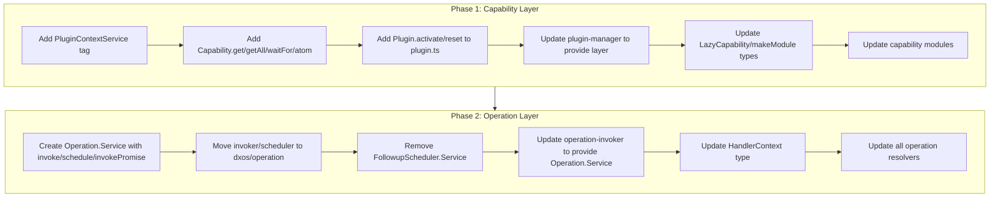

# Capability and Operation Effect Layers

## Phase 1: PluginContext Layer for Capability Modules

### Goal

**Complete replacement** of passing `PluginContext` as an argument to capability modules with Effect service layers. The API is split into two namespaces:

- `Capability.get` / `Capability.getAll` - for accessing capabilities (takes `InterfaceDef`)
- `Plugin.activate` / `Plugin.reset` - for lifecycle methods
```ts
// Before
Capability.makeModule((context) => Effect.sync(() => {
  const invoker = context.getCapability(Common.Capability.OperationInvoker);
  context.activate(SomeEvent);
}));

// After
Capability.makeModule(Effect.fnUntraced(function* () {
  const invoker = yield* Capability.get(Common.Capability.OperationInvoker);
  yield* Plugin.activate(SomeEvent);
}));

// Before (with options)
Capability.makeModule(({ context, createInvitationUrl, observability }) => Effect.gen(function* () {
  const client = context.getCapability(ClientCapabilities.Client);
}));

// After (options without context)
Capability.makeModule(Effect.fnUntraced(function* ({ createInvitationUrl, observability }) {
  const client = yield* Capability.get(ClientCapabilities.Client);
}));
```


### Changes

**1. Add PluginContext Service to [capability.ts](packages/sdk/app-framework/src/core/capability.ts)**

Create an Effect Context.Tag for PluginContext:

```ts
export class PluginContextService extends Context.Tag('@dxos/app-framework/PluginContext')<
  PluginContextService,
  PluginContext
>() {}
```

Add accessor functions in `Capability` namespace:

```ts
// Get single capability (throws if not found) - takes InterfaceDef
export const get = <T>(interfaceDef: InterfaceDef<T>): Effect.Effect<T, Error, PluginContextService> =>
  Effect.flatMap(PluginContextService, (context) => Effect.sync(() => context.getCapability(interfaceDef)));

// Get all capabilities - takes InterfaceDef
export const getAll = <T>(interfaceDef: InterfaceDef<T>): Effect.Effect<T[], never, PluginContextService> =>
  Effect.map(PluginContextService, (context) => context.getCapabilities(interfaceDef));

// Wait for a capability - takes InterfaceDef
export const waitFor = <T>(interfaceDef: InterfaceDef<T>): Effect.Effect<T, Error, PluginContextService> =>
  Effect.flatMap(PluginContextService, (context) => context.waitForCapability(interfaceDef));

// Get Atom reference to capabilities
export const atom = <T>(interfaceDef: InterfaceDef<T>): Effect.Effect<Atom.Atom<T[]>, never, PluginContextService> =>
  Effect.map(PluginContextService, (context) => context.capabilities(interfaceDef));
```

**2. Add lifecycle functions to existing [plugin.ts](packages/sdk/app-framework/src/core/plugin.ts)**

Add `activate` and `reset` functions to the existing Plugin module (which already imports from `capability.ts` and `activation-event.ts`):

```ts
// Add to packages/sdk/app-framework/src/core/plugin.ts

import * as Effect from 'effect/Effect';

// Lifecycle functions that access PluginContext via layer
export const activate = (event: ActivationEvent.ActivationEvent): Effect.Effect<boolean, Error, Capability.PluginContextService> =>
  Effect.flatMap(Capability.PluginContextService, (context) => context.activate(event));

export const reset = (event: ActivationEvent.ActivationEvent): Effect.Effect<boolean, Error, Capability.PluginContextService> =>
  Effect.flatMap(Capability.PluginContextService, (context) => context.reset(event));
```

Usage in modules:

```ts
import { Plugin } from '@dxos/app-framework';

yield* Plugin.activate(ClientEvents.SpacesReady);
yield* Plugin.reset(SomeEvent);
```

**3. Update module activation in [plugin-manager.ts](packages/sdk/app-framework/src/core/plugin-manager.ts)**

Modify `_loadModule` to provide the PluginContextService layer when running module activate functions:

```ts
private _loadModule = (module: Plugin.PluginModule): Effect.Effect<Capability.Any[], Error> =>
  Effect.gen(this, function* () {
    // ... existing code ...
    const [duration, capabilities] = yield* Effect.timed(
      module.activate().pipe(  // No longer passing context as argument
        Effect.provideService(Capability.PluginContextService, this.context)
      )
    );
    // ...
  });
```

**4. Update capability modules (143 files)**

Three patterns to handle:

**Pattern A: No options** (most common)

```ts
// Before
export default Capability.makeModule((context) =>
  Effect.sync(() => {
    const { invokePromise } = context.getCapability(Common.Capability.OperationInvoker);
  })
);

// After  
export default Capability.makeModule(
  Effect.fnUntraced(function* () {
    const { invokePromise } = yield* Capability.get(Common.Capability.OperationInvoker);
  })
);
```

**Pattern B: Options with context** (e.g., plugin-client)

```ts
// Before
export default Capability.makeModule(
  ({ context, onClientInitialized, onSpacesReady, ...options }: ClientCapabilityOptions) =>
    Effect.gen(function* () {
      const client = new Client(options);
      yield* context.activate(ClientEvents.SpacesReady);
    })
);

// After
export default Capability.makeModule(
  Effect.fnUntraced(function* ({ onClientInitialized, onSpacesReady, ...options }: Omit<ClientCapabilityOptions, 'context'>) {
    const client = new Client(options);
    yield* Plugin.activate(ClientEvents.SpacesReady);
  })
);
```

**Pattern C: Using context.capabilities() for Atom access**

```ts
// Before
const settingsStore = get(context.capabilities(Common.Capability.SettingsStore))[0];

// After
const settingsStoreAtom = yield* Capability.atom(Common.Capability.SettingsStore);
const settingsStore = get(settingsStoreAtom)[0];
```

**5. Update `LazyCapability` type signature**

Update the type - context is no longer passed as argument:

```ts
export type LazyCapability<Props = void, Capabilities extends ModuleReturn = ModuleReturn> = (
  props?: Props,
) => Effect.Effect<NormalizeReturn<Capabilities>, Error, PluginContextService>;
```

**6. Update `makeModule` signature**

```ts
// Before: first arg was always context or {context, ...options}
export const makeModule = <TArgs extends any[] = [PluginContext], TReturn extends ModuleReturn = ModuleReturn>(
  fn: (...args: TArgs) => Effect.Effect<TReturn, Error>,
): ((...args: TArgs) => Effect.Effect<TReturn, Error>) => fn;

// After: no context in args, context accessed via layer
export const makeModule = <TArgs extends any[] = [], TReturn extends ModuleReturn = ModuleReturn>(
  fn: (...args: TArgs) => Effect.Effect<TReturn, Error, PluginContextService>,
): ((...args: TArgs) => Effect.Effect<TReturn, Error, PluginContextService>) => fn;
```

---

## Phase 2: Operation Layer for Invocation

### Goal

Factor operation invocation and followup scheduling to `@dxos/operation` and create an Effect layer that is automatically provided to operation handlers. All methods exposed via `Operation` namespace. **Remove `FollowupScheduler.Service` immediately** (no backwards compatibility).

```ts
// Handler uses Operation namespace directly
handler: Effect.fnUntraced(function* (input) {
  yield* Operation.invoke(SomeOtherOperation, { data: 'test' });
  yield* Operation.schedule(FollowupOperation, { data: 'later' });
  
  // With options (e.g., spaceId for database context)
  yield* Operation.invoke(DbOperation, { id: '123' }, { spaceId: 'space-1' });
})

// Non-Effect usage
const result = await Operation.invokePromise(MyOp, { data: 'test' });
```

### Changes

**1. Extend [@dxos/operation](packages/core/operation/src/operation.ts)**

Add new files to `@dxos/operation`:

- `src/invoker.ts` - Operation invoker interface and implementation
- `src/scheduler.ts` - Followup scheduler implementation (internal, not exported as Service)
- `src/resolver.ts` - Operation resolver interface
- `src/service.ts` - Effect Service tag with invoke/schedule/invokePromise

**2. Create Operation.Service and namespace functions**

```ts
// packages/core/operation/src/service.ts

/** Options for operation invocation */
export interface InvokeOptions {
  /** Space ID to provide database context for the handler */
  spaceId?: Key.SpaceId;
}

/** Operation service interface */
export interface OperationService {
  invoke: <I, O>(
    op: OperationDefinition<I, O>,
    ...args: void extends I ? [input?: I, options?: InvokeOptions] : [input: I, options?: InvokeOptions]
  ) => Effect.Effect<O, Error>;
  
  schedule: <I, O>(op: OperationDefinition<I, O>, input: I, options?: InvokeOptions) => Effect.Effect<void>;
  
  invokePromise: <I, O>(
    op: OperationDefinition<I, O>,
    ...args: void extends I ? [input?: I, options?: InvokeOptions] : [input: I, options?: InvokeOptions]
  ) => Promise<{ data?: O; error?: Error }>;
}

export class Service extends Context.Tag('@dxos/operation/OperationService')<
  Service,
  OperationService
>() {}

// Namespace functions that access the service
export const invoke = <I, O>(
  op: OperationDefinition<I, O>,
  ...args: void extends I ? [input?: I, options?: InvokeOptions] : [input: I, options?: InvokeOptions]
): Effect.Effect<O, Error, Service> =>
  Effect.flatMap(Service, (service) => service.invoke(op, ...args));

export const schedule = <I, O>(
  op: OperationDefinition<I, O>,
  input: I,
  options?: InvokeOptions,
): Effect.Effect<void, never, Service> =>
  Effect.flatMap(Service, (service) => service.schedule(op, input, options));

// invokePromise is non-Effect, accessed directly from service instance
```

**3. Move code from app-framework to @dxos/operation**

Files to migrate:

- `operation-invoker.ts` -> Core logic to `@dxos/operation/src/invoker.ts`
- `followup-scheduler.ts` -> `@dxos/operation/src/scheduler.ts` (internal implementation, no Service export)
- `operation-resolver.ts` -> `@dxos/operation/src/resolver.ts`

**Remove `FollowupScheduler.Service`** - it will be replaced by `Operation.schedule`.

**4. Update operation handler invocation in [operation-invoker.ts](packages/sdk/app-framework/src/plugin-operation/invoker/operation-invoker.ts)**

Provide only `Operation.Service` to handlers (FollowupScheduler.Service is removed):

```ts
// Build the effect with Operation.Service provided.
let handlerEffect = handler(input).pipe(
  Effect.provideService(Operation.Service, {
    invoke: this.invoke,
    schedule: (op, input, options) => this._followupScheduler.schedule(op, input, options),
    invokePromise: this.invokePromise,
  }),
);
```

**5. Update HandlerContext type in [operation-resolver.ts](packages/sdk/app-framework/src/plugin-operation/invoker/operation-resolver.ts)**

```ts
// Base requirements provided to all operation handlers - only Operation.Service now
export type HandlerContext = Operation.Service;
```

**6. Update all operation resolvers (~30 files)**

Replace `FollowupScheduler.Service` with `Operation` namespace:

```ts
// Before
handler: (input) => Effect.gen(function* () {
  const scheduler = yield* FollowupScheduler.Service;
  yield* scheduler.schedule(MyOp, { data: 'test' });
})

// After
handler: Effect.fnUntraced(function* (input) {
  yield* Operation.schedule(MyOp, { data: 'test' });
})
```

For handlers that need to invoke other operations:

```ts
// Before (typically done via context.getCapability)
handler: (input) => Effect.gen(function* () {
  const { invoke } = context.getCapability(Common.Capability.OperationInvoker);
  yield* invoke(OtherOp, { data: 'test' });
})

// After
handler: Effect.fnUntraced(function* (input) {
  yield* Operation.invoke(OtherOp, { data: 'test' });
})
```

---

## Dependency Graph



---

## File Summary

**Phase 1 (core changes):**

- `packages/sdk/app-framework/src/core/capability.ts` - Add PluginContextService + Capability.get/getAll/waitFor/atom
- `packages/sdk/app-framework/src/core/plugin.ts` - Add Plugin.activate/reset to existing module
- `packages/sdk/app-framework/src/core/plugin-manager.ts` - Provide layer during activation, remove context argument
- ~143 capability modules - Remove context param, use layer-based API

**Phase 1 module update categories:**

- Pattern A (~100 modules): Simple `(context) =>` to `() =>` with `Capability.get` calls
- Pattern B (~10 modules): Options with context `({context, ...opts}) =>` to `(opts) =>` 
- Pattern C (~30 modules): Using `context.capabilities()` for Atoms - use `Capability.atom`
- Pattern D (~10 modules): Using `context.activate/reset` - use `Plugin.activate/reset`

**Phase 2 (core changes):**

- `packages/core/operation/src/service.ts` - New file for Operation.Service + namespace functions (invoke/schedule)
- `packages/core/operation/src/invoker.ts` - Moved/refactored from app-framework
- `packages/core/operation/src/scheduler.ts` - Internal scheduler (no Service export)
- `packages/core/operation/src/resolver.ts` - Moved/refactored from app-framework
- `packages/sdk/app-framework/src/plugin-operation/invoker/followup-scheduler.ts` - Remove FollowupScheduler.Service
- `packages/sdk/app-framework/src/plugin-operation/invoker/operation-invoker.ts` - Provide only Operation.Service
- `packages/sdk/app-framework/src/plugin-operation/invoker/operation-resolver.ts` - Update HandlerContext type
- ~30 operation resolver modules - **Required** update to use Operation.invoke/schedule

---

## Implementation Process

**Build verification throughout:**

- Run `pnpm build` after each major step to catch type errors early
- Fix any build errors before proceeding to the next step

**Phase 1 module enumeration:**

Before updating capability modules, enumerate all files that need changes:

```bash
# Find all modules using makeModule with context parameter
rg "makeModule\((context|{.*context)" --type ts -l packages/

# Find all modules using context.getCapability
rg "context\.getCapability" --type ts -l packages/

# Find all modules using context.getCapabilities  
rg "context\.getCapabilities" --type ts -l packages/

# Find all modules using context.capabilities (Atom access)
rg "context\.capabilities\(" --type ts -l packages/

# Find all modules using context.activate or context.reset
rg "context\.(activate|reset)\(" --type ts -l packages/
```

Create a tracking todo list from the enumerated modules to ensure each one is updated.

**Phase 2 module enumeration:**

```bash
# Find all files using FollowupScheduler.Service
rg "FollowupScheduler\.Service" --type ts -l packages/

# Find all operation resolvers
rg "OperationResolver\.make" --type ts -l packages/
```

Create a tracking todo list from the enumerated operation resolvers.

**Final verification:**

- Run `pnpm build` to ensure all types pass
- Run `pnpm lint-changed` to fix any linting issues introduced

---

## Status / Progress Notes

### Phase 1: COMPLETE ✅

**Completed 2026-01-13:**

All Phase 1 tasks are complete. The PluginContext is now provided via an Effect layer (`Capability.PluginContextService`) instead of being passed as an argument to capability modules.

**Key implementation details:**

1. **`makeModule` type signature** - Modified to accept generic error type `E extends Error = Error` to accommodate `UnknownException` from `Effect.tryPromise` without requiring explicit casts.

2. **Graph builder pattern** - For `GraphBuilder` extensions (with synchronous callbacks like `actions`, `connector`, `resolve`), use `const context = yield* Capability.PluginContextService;` at module top-level, then `context.getCapability()` inside callbacks. This preserves runtime behavior since callbacks can't directly yield effects.

3. **Non-graph-builder modules** - Use `Effect.fnUntraced` (preferred over `() => Effect.gen`), with:

   - `yield* Capability.get(...)` instead of `context.getCapability(...)`
   - `yield* Capability.getAll(...)` instead of `context.getCapabilities(...)`
   - `yield* Plugin.activate(...)` instead of `context.activate(...)`

4. **Build passes** - 410 tasks completed with no TypeScript errors.

**Files modified (~150 files):**

- Core: `capability.ts`, `plugin.ts`, `plugin-manager.ts`
- All capability modules across plugins: `app-graph-builder`, `operation-resolver`, `state`, `markdown`, `react-surface`, etc.
- Stories and tests: `stories-assistant/testing.tsx`, etc.

### Phase 2: PENDING

Phase 2 will factor operation invocation and followup scheduling to `@dxos/operation` and create a unified `Operation.Service` layer automatically provided to handlers.