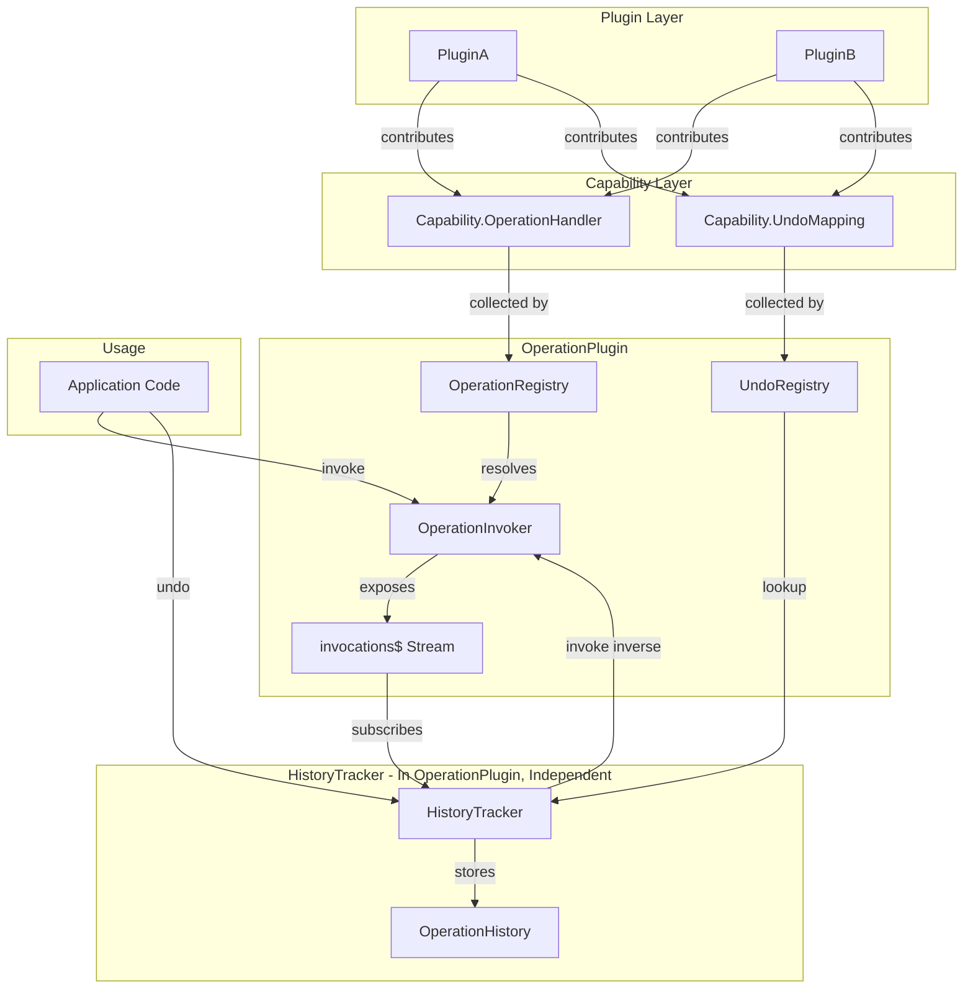
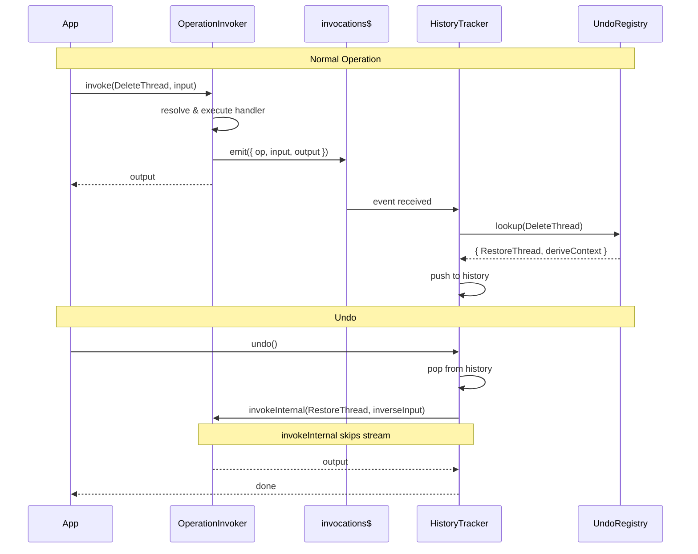

# Phase 3: Replace Intents with Operations

## Architecture Overview




## Design Decisions

1. **Two independent registries** in OperationPlugin:

- `OperationRegistry` - collects handlers (Capability.OperationHandler)
- `UndoRegistry` - collects undo mappings (Capability.UndoMapping)
- Both independent, both owned by OperationPlugin

2. **Pub/Sub on OperationInvoker** - Not a separate capability:

- `OperationInvoker` capability exposes `invocations$` Effect stream
- HistoryTracker accesses via plugin context, subscribes to stream
- Decoupled by going through capability, not direct import

3. **Effect streams** for pub/sub - Use Effect throughout
4. **No redo** - Not needed initially (doesn't exist today)
5. **HistoryTracker in OperationPlugin** - Lives in same plugin but is an independent class:

- Accesses invoker and registry via capabilities (no internal coupling)
- Can be extracted to separate plugin later if needed
- Client-specific, not used by functions-runtime

## Core Components

### 1. Capabilities Contributed by Plugins

```typescript
import * as Stream from 'effect/Stream';

// Handler registration - contributed by plugins
export const OperationHandler = Capability<{
  operation: OperationDefinition<any, any>;
  handler: OperationHandler<any, any, any, any>;
  position?: Position;
  filter?: (input: any) => boolean;
}[]>();

// Undo mapping registration - contributed by plugins (mirrors handler pattern)
export const UndoMapping = Capability<{
  operation: OperationDefinition<any, any>;
  inverse: OperationDefinition<any, any>;
  deriveContext: (input: any, output: any) => any;
}[]>();
```

Plugins contribute both independently:

```typescript
// In plugin capabilities
contributes(Capability.OperationHandler, [{
  operation: DeleteThread,
  handler: deleteThreadHandler,
}]);

contributes(Capability.OperationHandler, [{
  operation: RestoreThread,
  handler: restoreThreadHandler,
}]);

contributes(Capability.UndoMapping, [{
  operation: DeleteThread,
  inverse: RestoreThread,
  deriveContext: (input, output) => ({ threadId: input.threadId, snapshot: output.snapshot }),
}]);
```


### 2. OperationInvoker Capability (with Stream)

```typescript
import * as Stream from 'effect/Stream';

// Invocation event
export type InvocationEvent<I = any, O = any> = {
  operation: OperationDefinition<I, O>;
  input: I;
  output: O;
  timestamp: number;
};

// Provided by OperationPlugin
export const OperationInvoker = Capability<{
  invoke: <I, O>(op: OperationDefinition<I, O>, input: I) => Effect.Effect<O, Error>;
  invokePromise: <I, O>(op: OperationDefinition<I, O>, input: I) => Promise<{ data?: O; error?: Error }>;
  
  // Effect stream of invocation events - HistoryTracker subscribes to this
  invocations$: Stream.Stream<InvocationEvent>;
}>();
```

The invoker:

1. Resolves handler by `operation.meta.key`
2. Invokes handler
3. On success, emits to `invocations$` stream
4. Returns output

### 3. UndoRegistry Capability

```typescript
// Provided by OperationPlugin - lookup service built from UndoMapping contributions
export const UndoRegistry = Capability<{
  lookup: (operation: OperationDefinition<any, any>) => {
    inverse: OperationDefinition<any, any>;
    deriveContext: (input: any, output: any) => any;
  } | undefined;
}>();
```


### 4. HistoryTracker Capability

```typescript
// Provided by OperationPlugin - client-side only
export const HistoryTracker = Capability<{
  undo: () => Effect.Effect<void, Error>;
  undoPromise: () => Promise<{ error?: Error }>;
  canUndo: () => boolean;
}>();

type HistoryEntry = {
  operation: OperationDefinition<any, any>;
  input: any;
  output: any;
  inverse: OperationDefinition<any, any>;
  inverseInput: any;  // Pre-computed from deriveContext
  timestamp: number;
};
```

HistoryTracker implementation:

```typescript
// In OperationPlugin module setup
const createHistoryTracker = (context: PluginContext) => {
  const invoker = context.getCapability(Capability.OperationInvoker);
  const inverseRegistry = context.getCapability(Capability.UndoRegistry);
  const history: HistoryEntry[] = [];
  
  // Subscribe to invocation stream
  Effect.runFork(
    Stream.runForEach(invoker.invocations$, (event) =>
      Effect.sync(() => {
        const mapping = inverseRegistry.lookup(event.operation);
        if (mapping) {
          history.push({
            ...event,
            inverse: mapping.inverse,
            inverseInput: mapping.deriveContext(event.input, event.output),
          });
        }
      })
    )
  );
  
  return {
    undo: () => Effect.gen(function* () {
      const entry = history.pop();
      if (entry) {
        // Use invokeInternal to skip stream emission
        yield* invoker.invokeInternal(entry.inverse, entry.inverseInput);
      }
    }),
    undoPromise: () => runAndForwardErrors(this.undo()),
    canUndo: () => history.length > 0,
  };
};
```


## Undo Flow




## Avoiding Undo-of-Undo Loops

OperationInvoker exposes an internal invoke method that skips stream emission:

```typescript
export const OperationInvoker = Capability<{
  invoke: <I, O>(op: OperationDefinition<I, O>, input: I) => Effect.Effect<O, Error>;
  invokePromise: <I, O>(op: OperationDefinition<I, O>, input: I) => Promise<{ data?: O; error?: Error }>;
  
  // Internal - skips invocations$ stream, used by HistoryTracker for undo
  invokeInternal: <I, O>(op: OperationDefinition<I, O>, input: I) => Effect.Effect<O, Error>;
  
  invocations$: Stream.Stream<InvocationEvent>;
}>();
```


## Benefits

1. **True independence**: Registries are separate, only share capability contracts
2. **Direct invocation**: App calls Invoker directly, no wrapper
3. **Effect-native**: Uses Effect streams throughout
4. **Extensibility**: Other code can subscribe to `invocations$` (logging, analytics, sync)
5. **Optional history**: HistoryTracker can be omitted (e.g., for functions-runtime)
6. **Symmetric contribution**: Handlers and undo mappings contributed the same way

## Implementation Strategy

**Phase 3a: Build and test within app-framework**

1. Implement all components in `plugin-operation/`:

- OperationInvoker with stream
- UndoRegistry
- HistoryTracker

2. Write comprehensive unit tests within app-framework:

- Operation registration and invocation
- Undo mapping registration and lookup
- Stream emission and subscription
- History tracking (push on invoke, pop on undo)
- Undo invocation via invokeInternal (skips stream)
- Edge cases: no handler, no undo mapping, empty history

3. Test with mock operations defined in tests—no real plugin dependencies

**Phase 3b: Migrate existing plugins (after confidence in architecture)**Only after tests pass and architecture is validated:

- Migrate plugin-layout intents to operations (reference implementation)
- Migrate plugin-space intents to operations
- Migrate remaining plugins incrementally

## Key Files