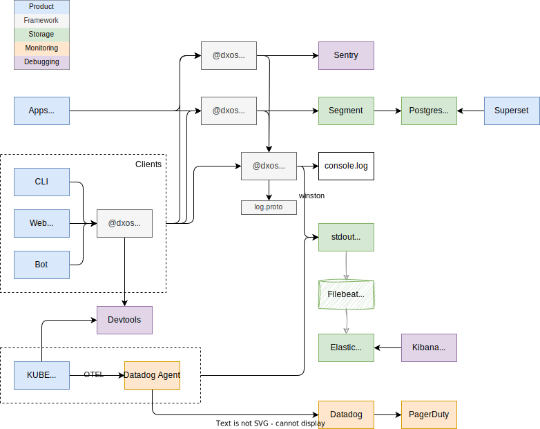

# DXOS Operations Guide

Documentation about the runtime components of DXOS.

## Code

There are two repositories that deploy in combination to produce the environments below.

| Repository | Description                                                                                  |
| :--------- | :------------------------------------------------------------------------------------------- |
| kube       |                                                                                              |
| dxos       | Deploys packages to npm and applications to kubes. Deploys using GitHub Actions and CircleCi |

## Environments

See the full [branch flow](./REPOSITORY_GUIDE.md#branch-diagram) in the [Repository Guide](./REPOSITORY_GUIDE.md).

| Environment | Description                                       |
| :---------- | :------------------------------------------------ |
| prod        | whatever is on `production` branch in `dxos` repo |
| staging     | whatever is on `staging` branch in `dxos` repo    |
| dev         | whatever is on `main` branch in `dxos` repo       |

## Properties

#### Applications

These are all deployed from `dxos` repo via CircleCI. See [.circleci/scripts/publish.sh](./.circleci/scripts/publish.sh).

> note: the [☁](https://docs.dev.kube.dxos.org) links bypass CloudFlare.

| App                                   | Production                                                                         | Staging                                                                                                    | Dev                                                                                            |
| :------------------------------------ | :--------------------------------------------------------------------------------- | :--------------------------------------------------------------------------------------------------------- | :--------------------------------------------------------------------------------------------- |
| [Composer](https://composer.dxos.org) | [composer.dxos.org](https://composer.dxos.org) [☁](https://composer.kube.dxos.org) | [composer.staging.dxos.org](https://composer.staging.dxos.org) [☁](https://composer.staging.kube.dxos.org) | [composer.dev.dxos.org](https://composer.dev.dxos.org) [☁](https://composer.dev.kube.dxos.org) |
| [Kai](https://kai.dxos.org) (PWA)          | [kai.dxos.org](https://kai.dxos.org) [☁](https://kai.kube.dxos.org)                | [kai.staging.dxos.org](https://kai.staging.dxos.org) [☁](https://kai.staging.kube.dxos.org)                | [kai.dev.dxos.org](https://kai.dev.dxos.org) [☁](https://kai.dev.kube.dxos.org)                |
| [Kai-web](https://kai-web.dxos.org) (Non-PWA)   | [kai-web.dxos.org](https://kai-web.dxos.org) [☁](https://kai-web.kube.dxos.org)                | [kai-web.staging.dxos.org](https://kai-web.staging.dxos.org) [☁](https://kai-web.staging.kube.dxos.org)                | [kai-web.dev.dxos.org](https://kai-web.dev.dxos.org) [☁](https://kai-web.dev.kube.dxos.org)                |
| [Docs](https://docs.dxos.org)         | [docs.dxos.org](https://docs.dxos.org) [☁](https://docs.kube.dxos.org)             | [docs.staging.dxos.org](https://docs.staging.dxos.org) [☁](https://docs.staging.kube.dxos.org)             | [docs.dev.dxos.org](https://docs.dev.dxos.org) [☁](https://docs.dev.kube.dxos.org)             |
| Halo                                  |                                                                                    |                                                                                                            |
| TodoMVC                               |                                                                                    |                                                                                                            |
| Tasks App                             |                                                                                    |                                                                                                            |
| Kube Console                          |                                                                                    |                                                                                                            |
| Dev Tools                             |                                                                                    |                                                                                                            |
#### Infrastructure
See [kube ops documentation](https://github.com/dxos/kube/tree/main/docs/ops).

## Supporting Assets

| Asset          | Role                              | Description                                                                           |
| :------------- | :-------------------------------- | :------------------------------------------------------------------------------------ |
| PagerDuty      | Notifications                     | Reliably notifies DXOS developers when monitors fail                                  |
| DataDog        | Server telemetry (short term)     | Collects detailed telemetry from servers, runs monitors, and notifies PagerDuty       |
| Sentry         | Errors and traces                 | Collects error reports from servers and clients, replays, and traces from all clients |
| Segment        | Long term usage telemetry ingress | Collects long term product usage telemetry into PostgreSQL                            |
| Superset       | Telemetry visualizer              | Visualizes telemetry stored in PostgreSQL, running on DigitalOcean                    |
| PostgreSQL     | Long term telemetry store         | Contains long term usage telemetry from all sources via Segment                       |
| Elastic Search | Log store                         | Contains access and runtime logs from servers                                         |
| Kibana         | Log visualizer                    | Visualizes logs stored in Elastic Search, running on DigitalOcean                     |
| DigitalOcean   | Infrastructure service            | Runs machines for kubes and PostgreSQL                                                |
| PipeDream      | Custom API connectors             | Forwards certain events from GitHub (such as CI failures) to Discord                  |
| CloudFlare     | CDN                               | Caches assets by intercepting DNS traffic                                             |
| NPM  | Package store | Node.js packages are hosted in the public NPM registry |

No system collects all client side logs entirely. Only the errors, traces, and replays subset is covered by Sentry for all clients and may be impaired by client side blockers like browsers, extensions, proxies, etc.

## Other dependencies

|      |               |                                                        |
| :--- | :------------ | :----------------------------------------------------- |
| IPFS | Content Store | Applications in KUBE are backed by IPFS storage        |

## Diagram

