# @dxos/dx-cli

CLI Test using oclif.

## Dependency Graph

```mermaid
%%{ init: {'flowchart':{'curve':'basis'}} }%%

flowchart LR

%% Links
dxos/broadcast --> dxos/crypto;
dxos/client --> dxos/config;
dxos/client --> dxos/echo-db;
dxos/client --> dxos/rpc-tunnel;
dxos/credentials --> dxos/crypto;
dxos/credentials --> dxos/feed-store;
dxos/credentials --> dxos/mesh-protocol;
dxos/crypto --> dxos/protocols;
dxos/dx-cli --> dxos/client;
dxos/dx-cli --> dxos/plate;
dxos/echo-db --> dxos/network-manager;
dxos/echo-db --> dxos/object-model;
dxos/echo-db --> dxos/protocol-plugin-replicator;
dxos/echo-db --> dxos/random-access-storage;
dxos/echo-protocol --> dxos/credentials;
dxos/messaging --> dxos/rpc;
dxos/network-manager --> dxos/credentials;
dxos/network-manager --> dxos/messaging;
dxos/network-manager --> dxos/protocol-plugin-presence;
dxos/object-model --> dxos/echo-protocol;
dxos/object-model --> dxos/model-factory;
dxos/plate --> dxos/file;
dxos/protocol-plugin-presence --> dxos/broadcast;
dxos/protocol-plugin-presence --> dxos/mesh-protocol;
dxos/protocol-plugin-replicator --> dxos/mesh-protocol;
dxos/protocols --> dxos/codec-protobuf;
dxos/rpc-tunnel --> dxos/rpc;
dxos/util --> dxos/protocols;

%% Sections
subgraph apps
  style apps fill:#abedeb,stroke:#fff;

  dxos/dx-cli("@dxos/dx-cli")
end

subgraph common
  style common fill:#debac2,stroke:#fff;

  dxos/codec-protobuf("@dxos/codec-protobuf")
  dxos/crypto("@dxos/crypto")
  dxos/protocols("@dxos/protocols")
  dxos/random-access-storage("@dxos/random-access-storage")
  dxos/rpc("@dxos/rpc")
  dxos/rpc-tunnel("@dxos/rpc-tunnel")

  subgraph common-excluded [ ]
    style common-excluded fill:#debac2,stroke:#333,stroke-dasharray:5 5;

    dxos/async("@dxos/async")
    dxos/debug("@dxos/debug")
    dxos/log("@dxos/log")
    dxos/util("@dxos/util")
  end
end

subgraph sdk
  style sdk fill:#dddeba,stroke:#fff;

  dxos/client("@dxos/client")
  dxos/config("@dxos/config")
end

subgraph echo
  style echo fill:#b3cae6,stroke:#fff;

  dxos/echo-db("@dxos/echo-db")
  dxos/echo-protocol("@dxos/echo-protocol")
  dxos/feed-store("@dxos/feed-store")
  dxos/model-factory("@dxos/model-factory")
  dxos/object-model("@dxos/object-model")
end

subgraph halo
  style halo fill:#cabade,stroke:#fff;

  dxos/credentials("@dxos/credentials")
end

subgraph mesh
  style mesh fill:#b3e6c0,stroke:#fff;

  dxos/broadcast("@dxos/broadcast")
  dxos/mesh-protocol("@dxos/mesh-protocol")
  dxos/messaging("@dxos/messaging")
  dxos/network-manager("@dxos/network-manager")
  dxos/protocol-plugin-presence("@dxos/protocol-plugin-presence")
  dxos/protocol-plugin-replicator("@dxos/protocol-plugin-replicator")
end

subgraph fx
  style fx fill:#e6b3c3,stroke:#fff;

  dxos/file("@dxos/file")
  dxos/plate("@dxos/plate")
end


%% Hyperlinks
click dxos/async "dxos/dxos/tree/main/packages/common/async/docs";
click dxos/client "dxos/dxos/tree/main/packages/sdk/client/docs";
click dxos/codec-protobuf "dxos/dxos/tree/main/packages/common/codec-protobuf/docs";
click dxos/config "dxos/dxos/tree/main/packages/sdk/config/docs";
click dxos/debug "dxos/dxos/tree/main/packages/common/debug/docs";
click dxos/echo-db "dxos/dxos/tree/main/packages/echo/echo-db/docs";
click dxos/file "dxos/dxos/tree/main/packages/fx/file/docs";
click dxos/messaging "dxos/dxos/tree/main/packages/mesh/messaging/docs";
click dxos/model-factory "dxos/dxos/tree/main/packages/echo/model-factory/docs";
click dxos/plate "dxos/dxos/tree/main/packages/fx/plate/docs";
click dxos/protocols "dxos/dxos/tree/main/packages/common/protocols/docs";
click dxos/rpc "dxos/dxos/tree/main/packages/common/rpc/docs";
click dxos/rpc-tunnel "dxos/dxos/tree/main/packages/common/rpc-tunnel/docs";
click dxos/util "dxos/dxos/tree/main/packages/common/util/docs";

%% Styles
classDef rootNode fill:#fff,stroke:#333,stroke-width:2px
classDef defaultNode fill:#fff,stroke:#333,stroke-width:1px
linkStyle default stroke:#333,stroke-width:1px

dxos/dx-cli:::rootNode

dxos/async:::defaultNode
dxos/client:::defaultNode
dxos/codec-protobuf:::defaultNode
dxos/config:::defaultNode
dxos/debug:::defaultNode
dxos/echo-db:::defaultNode
dxos/file:::defaultNode
dxos/messaging:::defaultNode
dxos/model-factory:::defaultNode
dxos/plate:::defaultNode
dxos/protocols:::defaultNode
dxos/rpc:::defaultNode
dxos/rpc-tunnel:::defaultNode
dxos/util:::defaultNode
```

## Dependencies

| Module | Direct |
|---|---|
| [`@dxos/async`](../../../packages/common/async/docs/README.md) | &check; |
| [`@dxos/client`](../../../packages/sdk/client/docs/README.md) | &check; |
| [`@dxos/codec-protobuf`](../../../packages/common/codec-protobuf/docs/README.md) | &check; |
| [`@dxos/config`](../../../packages/sdk/config/docs/README.md) | &check; |
| [`@dxos/debug`](../../../packages/common/debug/docs/README.md) | &check; |
| [`@dxos/echo-db`](../../../packages/echo/echo-db/docs/README.md) |  |
| [`@dxos/file`](../../../packages/fx/file/docs/README.md) |  |
| [`@dxos/messaging`](../../../packages/mesh/messaging/docs/README.md) |  |
| [`@dxos/model-factory`](../../../packages/echo/model-factory/docs/README.md) |  |
| [`@dxos/plate`](../../../packages/fx/plate/docs/README.md) | &check; |
| [`@dxos/protocols`](../../../packages/common/protocols/docs/README.md) | &check; |
| [`@dxos/rpc`](../../../packages/common/rpc/docs/README.md) | &check; |
| [`@dxos/rpc-tunnel`](../../../packages/common/rpc-tunnel/docs/README.md) |  |
| [`@dxos/util`](../../../packages/common/util/docs/README.md) |  |
