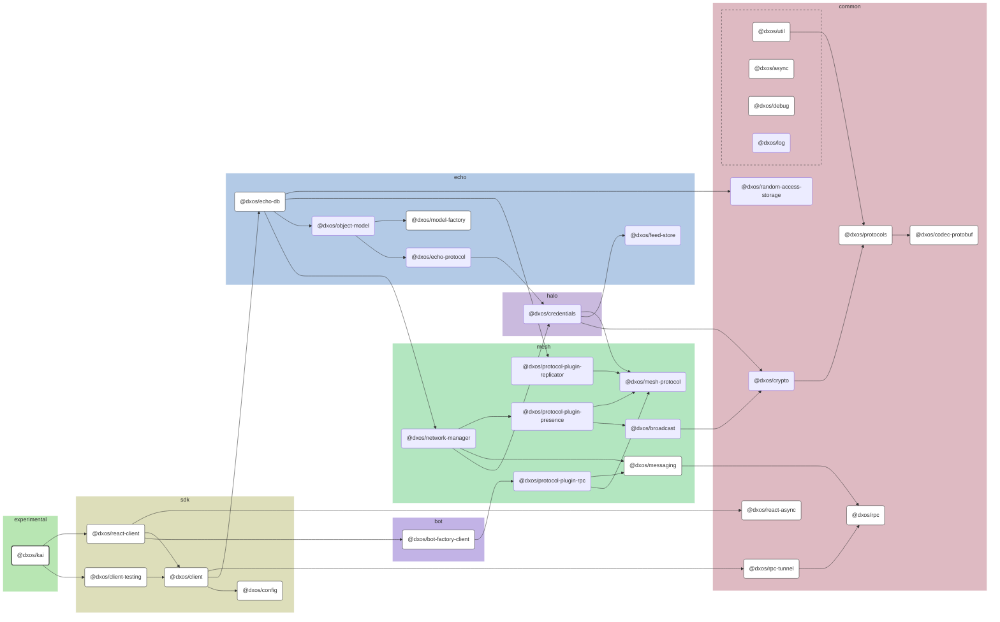

# @dxos/kai

Kai Web shell.

## Dependency Graph

## Dependencies

| Module | Direct |
|---|---|
| [`@dxos/async`](../../../../packages/common/async/docs/README.md) | &check; |
| [`@dxos/bot-factory-client`](../../../../packages/bot/bot-factory-client/docs/README.md) |  |
| [`@dxos/client`](../../../../packages/sdk/client/docs/README.md) | &check; |
| [`@dxos/client-testing`](../../../../packages/sdk/client-testing/docs/README.md) | &check; |
| [`@dxos/codec-protobuf`](../../../../packages/common/codec-protobuf/docs/README.md) |  |
| [`@dxos/config`](../../../../packages/sdk/config/docs/README.md) | &check; |
| [`@dxos/debug`](../../../../packages/common/debug/docs/README.md) | &check; |
| [`@dxos/echo-db`](../../../../packages/echo/echo-db/docs/README.md) |  |
| [`@dxos/messaging`](../../../../packages/mesh/messaging/docs/README.md) |  |
| [`@dxos/model-factory`](../../../../packages/echo/model-factory/docs/README.md) |  |
| [`@dxos/protocols`](../../../../packages/common/protocols/docs/README.md) |  |
| [`@dxos/react-async`](../../../../packages/common/react-async/docs/README.md) | &check; |
| [`@dxos/react-client`](../../../../packages/sdk/react-client/docs/README.md) | &check; |
| [`@dxos/rpc`](../../../../packages/common/rpc/docs/README.md) |  |
| [`@dxos/rpc-tunnel`](../../../../packages/common/rpc-tunnel/docs/README.md) |  |
| [`@dxos/util`](../../../../packages/common/util/docs/README.md) |  |
