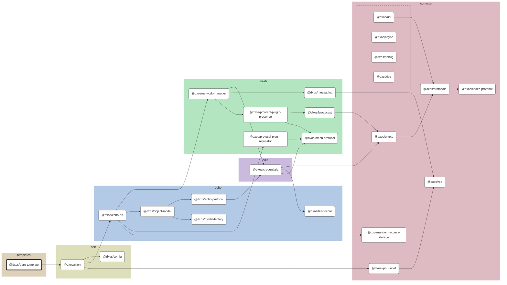

# @dxos/bare-template

Application template with only the essentials.

## Dependency Graph

## Dependencies

| Module | Direct |
|---|---|
| [`@dxos/async`](../../../../packages/common/async/docs/README.md) |  |
| [`@dxos/broadcast`](../../../../packages/mesh/broadcast/docs/README.md) |  |
| [`@dxos/client`](../../../../packages/sdk/client/docs/README.md) | &check; |
| [`@dxos/codec-protobuf`](../../../../packages/common/codec-protobuf/docs/README.md) |  |
| [`@dxos/config`](../../../../packages/sdk/config/docs/README.md) | &check; |
| [`@dxos/credentials`](../../../../packages/halo/credentials/docs/README.md) |  |
| [`@dxos/crypto`](../../../../packages/common/crypto/docs/README.md) |  |
| [`@dxos/debug`](../../../../packages/common/debug/docs/README.md) |  |
| [`@dxos/echo-db`](../../../../packages/echo/echo-db/docs/README.md) |  |
| [`@dxos/echo-protocol`](../../../../packages/echo/echo-protocol/docs/README.md) |  |
| [`@dxos/feed-store`](../../../../packages/echo/feed-store/docs/README.md) |  |
| [`@dxos/log`](../../../../packages/common/log/docs/README.md) |  |
| [`@dxos/mesh-protocol`](../../../../packages/mesh/mesh-protocol/docs/README.md) |  |
| [`@dxos/messaging`](../../../../packages/mesh/messaging/docs/README.md) |  |
| [`@dxos/model-factory`](../../../../packages/echo/model-factory/docs/README.md) |  |
| [`@dxos/network-manager`](../../../../packages/mesh/network-manager/docs/README.md) |  |
| [`@dxos/object-model`](../../../../packages/echo/object-model/docs/README.md) |  |
| [`@dxos/protocol-plugin-presence`](../../../../packages/mesh/protocol-plugin-presence/docs/README.md) |  |
| [`@dxos/protocol-plugin-replicator`](../../../../packages/mesh/protocol-plugin-replicator/docs/README.md) |  |
| [`@dxos/protocols`](../../../../packages/common/protocols/docs/README.md) |  |
| [`@dxos/random-access-storage`](../../../../packages/common/random-access-storage/docs/README.md) |  |
| [`@dxos/rpc`](../../../../packages/common/rpc/docs/README.md) |  |
| [`@dxos/rpc-tunnel`](../../../../packages/common/rpc-tunnel/docs/README.md) |  |
| [`@dxos/util`](../../../../packages/common/util/docs/README.md) |  |
