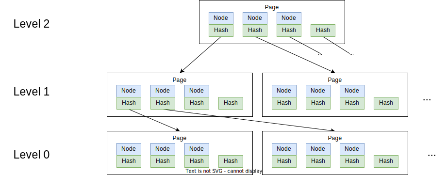

# Collection sync


## Goals

Collection sync protocol would enable peers to ensure that a certain set of documents is fully synchronized in relation to other nodes without having to load and sync each document in the set individually.

Collection is defined as a set of automerge documents with known versions (heads).
The state of a collection is mapping from document ID to the current heads of that document.

The documents in the collection might be defined as a transitive closure of all documents referenced from a certain root document. ECHO defines collection as all documents in a space. In general, the way the collection is built is implementation-specific and does not influence the protocol.

Each collection is assigned an implementation-defined ID.

The collection sync protocol builds a view of the document states (their heads) at other peers on the network.
This enables peers to selectively reconcile only the documents that are not synced using the [per-document sync protocol](https://automerge.org/automerge/api-docs/js/#syncing).

The protocol can work in non-stateful mode, where the other peer's state is initially assumed to be the same as the local one, and then refined during sync. The protocol may also run in stateful mode, where the state of other peers is preserved on-disk.

## Operation example

One operation example of collection sync being used to optimize replication is that on startup nodes would first synchronize the collection states with other peers.
This would result in per-peer mappings of document IDs to their heads.
Those mappings are then compared to the local state of the documents.
The documents that are missing or have different heads are then loaded and synchronized using the [per-document sync protocol](https://automerge.org/automerge/api-docs/js/#syncing).

## Naïve solution

The naïve solution is to exchange the entire mapping of document ID to heads uncompressed:

```protobuf
// Full state exchange protocol.
message CollectionSyncMessage {
  message Document {
    string document_id = 1;
    repeated bytes heads = 2;
  }

  string collection_id = 1;
  repeated Document documents = 2;
}
```

Each peer would transmit its entire state in one message, completing the sync protocol in one round.
The message size would be in the order of 100 bytes per document in the collection.
With an example of 1000 documents per collection, this would result in approx 100 kB messages being exchanged.
This solution is viable for collections of under 1000 documents as long as the sync has a built-in debounce mechanism.

## Merkle-tree search

Based on the 2019 paper [Merkle Search Trees: Efficient State-Based CRDTs in Open Networks](https://inria.hal.science/hal-02303490) by Alex Auvolat & François Taïani there's a more efficient way to sync key-value mappings between nodes that have significant number of matching values.



This would involve building a balanced B-Tree out of the documentID => heads pairs first.
The protocol then performs multiple rounds where first, the page hashes are exchanged, and in case of hash differences, the page contents are exchanged.
The peers start by exchanging the root hash of the merkle-tree.
If root hashes match, then the trees are already synced.
If the hashes differ -- the page contents are exchanged, which would contain the key-value pairs stored in this page, as well as hashes of the child pages.
The key-value hashes are upserted into the local tree, and child page hashes are compared with the local state.
On every round the protocol descends one level down, only exchanging the pages that are different.
With the arity of 16 a tree with only 4 levels can store 65 536 document entries.

The protocol can also be tuned to send the contents of the root page instead of just the hash, this skips one round of message exchange with the tradeoff of a larger payload size.

```protobuf
// Work in progress.

// Merkle-search-tree sync protocol.
message CollectionSyncMessage {
  message Node {
    string document_id = 1;
    repeated bytes heads = 2;
    optional bytes child_page = 3;
  }

  message Page {
    bytes digest = 1;
    repeated Node nodes = 2;
    optional bytes high_page = 3;
  }

  string collection_id = 1;
  optional bytes root_hash = 2;
  repeated Page pages = 3;
}
```

There's an [implementation of a merkle-search-tree data-structure in Rust](https://github.com/domodwyer/merkle-search-tree?tab=readme-ov-file) which can be used to implement the sync protocol.
