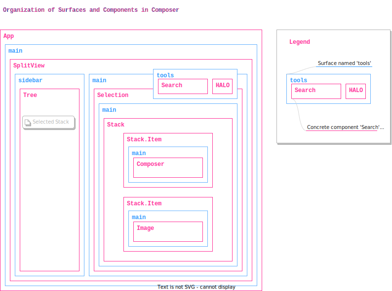

# Composer

- The App: A developer-first, peer-to-peer knowledge management system (KMS).
- The Component: A real-time, collaborative code and text editor.
- The Framework: The extensibility model upon which Composer and Kai are be built.

## Product Scenarios

mvp:

1. Users can collaborate on markdown documents in a plain-text-editor paradigm
2. Users can collaborate on a github issue together

extensibility:

3. Developers can extend any part of the UI with custom components
4. Developers can extend Composer with custom data sources

hero scenario:

5. Users can collaborate on documents in a stack-editor paradigm
6. Users can collaborate on plain-text-files on disk

see also:

7. [Shell](./shell.md)
8. [Vault](./vault.md)

## Lab Scenarios

The framework should design for these, but doesn't have to build them. We can build these in the labs workstream at a slower pace.

1. Users can work with email
2. Users can see all notifications in a universal inbox (across email and other sources)
3. Users can make presentations
4. Users can draw together
5. Users can collect lists of contacts
6. Users can manage shared todo lists
7. Users can launch and interact with bots in their spaces
8. Users can play chess together
9. Users can collaborate over kanban boards
10. Users can collaborate over post-boards of notes
11. Users can interact with LLM based agents
12. Users can chat and message with other users
13. Users can inspect the state of ECHO spaces and objects (devtools)

## Goals

1. To provide developers with full control over the interface of their app
2. To make it possible for Kai and Composer to share a common application framework
3. To make a step towards "multiple sources of knowledge interoperating in the same application"

## Non goals

1. Isolation of 3p code - all modular code is assumed to be trusted for now, with isolation to be tackled at a later point.
2. Runtime extensibility - for now it's ok to assume all plugins are compiled-in, and later we'll tackle loading and installing them at runtime via ESM.
3. Dynamic discovery and installation of modular UI components - although the design should not preclude this later once runtime extensibility is complete.
4. Central registration in DMG - no dynamic discovery and installation means DMG is not required in this design.
5. Coupling of any part of the application model to ECHO - ECHO will be just one of the sources of state for the application, and therefore the application model should not marry developers to ECHO.

## Definitions

- **Surface**: A way of delegating the concrete presentation of a piece of UI to external plugins. A surface is a React component which accepts a data context, a set of plugins, and other props which are used to resolve and instantiate concrete components to 'fulfill' that surface. Some surfaces render one component at a time, others can render more than one with a specific layout rule (i.e. arranging them horizontally or vertically).
- **Component**: A regular react component. Components are free to nest as many Surfaces within them as necessary.
- **Application**: A component which can assume it owns the whole screen.
- **Plugin**: A unit of containment of modular functionality that can be statically compiled into an application (in later versions, loaded dynamically). Plugins provide things like components and other data to the Application.
- **Shell**: The HALO button and generic UI for join flows and space management that appear in popups overtop the main application and hosted in the vault iframe. It is a subset of the vault UI surface that is restricted to the calling application.
- **Chrome**: All the UI of an application that is not user-generated content. (e.g.: buttons, toolbars, sidebar affordances, dividers, drag handles, ... etc.).
- **Vault**: HALO universal PWA which stores identity and data.
- **Stack**: A component which enables editing columns of mixed content with arbitrary (extensible) content types. A key feature is the draggability of stack elements to re-order them.

## Non-definitions

- **Frames**: are not defined because explicit coupling to ECHO is a non-goal, and without that Frames are just regular React Components which can assume certain contexts or props within this application framework. React Components or Components are used in place of Frames from prior art.

## Out of scope

- Distribution (or registration) of Components separately from Plugins. Plugins are the only unit of registration and distribution and contain / provide a list of Components to the host application. To identify a component globally, a string containing the identity of the plugin _and_ the component must be used.

## Applications are made of Surfaces and Components

- The application is just a component `<App />`.
- A component can have any number of `<Surface />` as children inside it.
- A Surface figures out what Component(s) to render given a set of `loaded plugins`, a `data context`, and `other control props`. It can be understood as the the developer intention to render/visualize the given `data context` using whatever appropriate component(s) as provided by Plugins and configured by the the end user and/or the developer.
- The main `<App />` component defines a single, full-screen `<Surface />` for rendering "anything". i.e.: does not opine about what it is, delegates that to plugins and initial configuration entirely.
- The main `<App />` component also wraps the main `Surface` with an `PluginContext` provider which gives all nested components access to the list of plugins.

## Example Structure

Below is a diagram illustrating how:

- a full application is built up to handle a `Stack` of `Composer` and `Image`
- `Surfaces` are the only element of abstraction necessary to both compose the entire application chrome and implement the abstract portion of `Stack`.



## Plugin Provides

- Plugins declare their capabilities with a namespace-less interface name (for now). Deeper interop, strong types, and smaller versioning overhead are advantages of this approach, similar to how GraphQL schemas are "version-less" and "namespace-less".

Example:

```ts
export const Plugin = {
  meta: { id: '...' },
  provides: {
    someCapability: {
      /* some capability API fulfillment provided here */
    }
  }
};
```

- Plugins are free to provide any kind of interface they want, while being mindful of the names of those capabilities. As long as all plugins are compiled and named statically, this is okay. When it's time to make plugins dynamic, their capabilities can be namespaced by `plugin.meta.id` or other declared namespaces within the framework.

- Several interfaces are to be established by the first few plugins:
  - `context` - `PluginContext` uses this to construct a nesting of all contexts from all plugins for wrapping the entire application with.
  - `components` - `Surface` uses this to select components by name.
  - `component` - `Surface` uses this when presented with data, and no specific desired component by name.
  - `routes` - `RoutesPlugin` defines a router via `provides.context` and collects `routes` from other plugins for display.
  - `graph` - `TreePlugin` and any others can use this interface to build up the application's main navigation tree.

## Routing

- Routing is left up to plugins, and entire groups of plugins are expected to form around the handful of specific routing plugins suitable for them.
- The default approach is a plugin `RoutingPlugin` using ReactRouter which uses `plugin.provides.context` to create the wrapping router element, and `plugin.provides.components.default` to collect `routes` from other plugins and thus create the entire DOM for that route.

## Application State and Mutations

### Cross plugin state sharing

- There is no central application state. Each plugin is free to declare it's own application state container.
- State containers are generally expected to be "granularly reactive" with supporting hooks and wrappers for react.
- Plugins are free to provide that state container to their components however they want. Plugins can expose a `Plugin.provides.context` which allows them to wrap the application with a custom context provider or any other DOM.
- Plugins are free to depend on each other's state by importing their state hooks directly.
  - the assumption is that the developer has instantiated the app with the right plugins in the right order.
- Plugins are free to affect each other's state by acquiring handles to each other's state containers and performing writes to them (conventionally through a functional API on top of that store, but that's up to the store / plugin owner of that store).
  - the assumption is that each plugin's state store exposes a reactive mutation (action handlers or similar) API and store mutations cause components to re-render automatically.

### ECHO vs ephemeral state

- When state is local, ephemeral, per-session: it is managed by in-memory reactive containers (stores) and backed by local or session storage as appropriate. i.e. the selection state in a List or Tree is ephemeral and not shared between windows or devices, but may be shared among components and plugins in the application.
- When state is stable across devices, permanent: it is managed by ECHO objects.

### Ephemeral state management solution

- The default state management opinion for 1P plugins is `@dxos/observable-object`. The same package powers the reactive ECHO objects API.
- The `GraphNode extends ObservableObject` and a mutable, observable tree of these represents the "state of the UI" to which React components are bound reactively.
- If ergonomics become an issue, a utility can exists on `ObservableObject` to perform a `deepMerge` with any incoming tree-ish object. This allows plugin code to declare GraphNodes as "pure functions of state" and for the `deepMerge` generic diffing process to carefully apply a minimum number of operations to the mutable state store.

## Stacks

- Stacks are just components which rely on the same `<Surface />` concept to delegate the concrete rendering of stack elements to components provided by plugins.

## Example

Below is an example of how the App in the diagram above would be instantiated illustrating how every surface and component comes from a plugin (none are statically defined by the App).

```tsx
<PluginProvider
  plugins={[
    new SplitViewPlugin(), // provides SplitView with sidebar, main, tools surfaces
    new TreePlugin(), // provides Tree and Selection which visualize the graph
    new SpacesPlugin(), // provides graph nodes that represent ECHO spaces and their contents
    new StackPlugin(), // provides Stack
    new ComposerPlugin(), // provides Composer
    new ImagePlugin(), // provides Image
    new HaloPlugin(), // provides the HALO button and shell in the tools surface
    new SearchPlugin() // provides the Search element in the tools surface
  ]}
>
  <Surface
    nestedSurfaces={{
      main: {
        component: 'SplitViewPlugin.SplitView',
        nestedSurfaces: {
          sidebar: { component: 'TreePlugin.Tree' },
          tools: {
            component: ['HaloPlugin.HaloButton', 'SearchPlugin.Search']
          },
          main: { component: 'TreePlugin.Selection' }
        }
      }
    }}
  />
</PluginProvider>
```

The entire application chrome is constructed (in this case) based on what is passed in to `Surface.nestedSurfaces` and can therefore be serialized, stored in ECHO, modified by users, or otherwise altered dynamically at runtime. It's a declaration of which component (by name) goes in which of the surfaces (to start, later this can change at runtime).

`Tree` is responsible for rendering all `GraphNodes` provided by plugins, and provides a state store via `provides.context` reflecting the currently selected node(s) and the total tree presented in the UI.

In order to populate the `Tree`, plugins are first asked to present their lists of children with no `parent` node. This generates the first level items in the Tree. Then, for each node ad-nauseum, plugins are asked to return more children until the tree reaches a steady state. This allows plugins to add nodes to each other's nodes.

::: Note
This behavior runs only one level deep (for now). If a plugin produces nodes [X] in response to a node it doesn't own, no other plugins will be asked to produce more nodes (or actions) for any nodes in [X].
:::

`SpacesPlugin` provides the entire graph in this example, starting with nodes for each ECHO space, followed by subnodes representing queries or specific types, followed by objects of each type.

`Selection` is responsible for sensing what nodes are selected in the Tree by reading the relevant area in `TreeState`, obtaining a reference to the selected `GraphNodes` and the nested ECHO objects they represent, and passing them to a `<Surface />` which knows how to choose the right component to render those objects with.

`StackPlugin` provides a Component that knows how to visualize a given ECHO object of type `stack` (by using it's `children` to render draggable items with `<Surfaces>` for each item inside), and fulfills the `main` surface of `Selection` dynamically as a result of a `Tree` selection change.

`Stack` components use `Surfaces` to obtain components from `ComposerPlugin` and `ImagePlugin` which know how to render ECHO objects of type `text` and `image` respectively.

`SearchPlugin` knows how to alter the `surfaces` section of the state such that a different control is presented instead of the `Tree` with flat search results whenever a search term is present in the input box. Alternatively, the `Tree` can equally respond to changes in the search term (global state) and filter itself down accordingly.

Other plugins possible:

1. the **markdown** plugin - which provides a plain text editor `Composer` for the content area and fills the Tree with plain text documents from ECHO
2. the **filesystem** plugin - which provides import / export to folders on disk
3. the **github** plugin - which provides nodes representing github issues and assets

## Example Plugins

See `/packages/experimental/surface`.

## Graph

This is a contract for UI affordances which present, organize and navigate over the graph of user knowledge.

The goal is to enable any kind of navigation UI such as trees, lists, accordions of lists, accordions of trees, force-directed layouts, ..., etc. and to allow them to source their content/navigation structure from plugins.

The average tree or list item has mostly similar properties:

```ts
type Node = {
  label: string;
  icon: any;
  // ... 
  children: Node[]; // if a tree
}
```

The `graph` contract is derived by working backwards from these UI models which are chosen to view and navigate "everything".

- users use a TreeView to organize and navigate items in ECHO spaces
- users can select nodes in the TreeView
- selected tree nodes are presented in detail on the right side of the app via `<Surface />`
  - if multiple nodes are selected, the detail area shows only the total number of things selected
- TreeView: first level items act as group headers, second level items have zero indent (P2)

To assemble the tree, every plugin `provides.graph(): Node[]` node arrays and the lists are concatenated before rendering in the TreeView. Later, we can enable more cross-plugin collaboration over Nodes as appropriate.

- total graph is assembled by concatenation of graph nodes from all plugins (P0)
- plugins are allowed to extend each other's nodes with actions (P2)
- plugins are allowed to extend each other's nodes with children (P3)

## Hero Scenarios

Priority legend:
- P0 - must have
- P1 - painful cut
- P2 - nice to have
- P3 - cut / next iteration

### 5. Users can collaborate on documents in a stack-editor paradigm

This scenario expands the plain-text-editor to support multimedia and other arbitrary content types by envisioning the document as a vertical sequence (**stack**) of **stack items**. 

Users are free to drag-arrange section order, insert new sections, and interact with the contents of each section.

This scenario demonstrates the value of `<Surface />` elements by delegating the presentation of each section to them, thereby taking advantage of plugins which may supply new content types for sections and components to render them with.

Pure component:

- 5.1 Developers can use a "pure", responsive `<Stack />` component to render a sequence of `<Stack.Item />` items
- 5.2 Stack items provide mobile-friendly affordances for being dragged and re-ordered
- 5.3 Stack provides an affordance for appending a new stack item
- 5.4 Stack provides affordances for inserting new stack items between other items or at the top

GFM in ECHO:

- 5.5 Developers can use the `<MarkdownStackEditor />` (MSE) component for editing GFM Markdown documents in ECHO
  - 5.5.1 MSE supports PlainText sections (P0)
  - 5.5.2 MSE supports Image sections (P0)
  - 5.5.3 MSE supports TaskList sections (P2)
  - 5.5.4 MSE supports Table sections (P3)

n.b.: until the various section types are supported, they appear as plain text.

### 6. Users can collaborate on plain-text-files on disk

This scenario demonstrates the power of bringing multiple data sources into the same application and enabling interactions between them.

By bringing the local file system into Composer, we can shorten the distance between local files and ECHO spaces. Local files are the basis for successful app ecosystems from IDEs to modern productivity tools. ECHO spaces can make it easy to collaborate on local files using Composer.

The key interactions to explore first are drag and drop operations between nodes from different data sources.

Local files:

- users can add a local disk folder to the Composer sidebar next to all the ECHO spaces
- users can see the contents of those folders in Composer, and examine files by selecting them
- details about unknown files are presented with a generic metadata presenter (file name, icon? only)
- users can edit local known plain text files with the PlainText editor
- users can see syntax highlighting for the file's language if supported (P2)
- users can edit local markdown files with `MarkdownStackEditor`
- local disk files require saving to persist
- display of local folders chosen by users survives composer restart
  - missing files do not show in the UI on restart (P0)
  - missing files are shown in a disabled state which can be re-attached to another folder on disk (P3)
- changes to local disk files live in buffers that survive composer restart (P3)
- users can view local images in the detail area (P2)
- users can view local videos in the detail area (P3)

Collaboration:

- users can drag a local file onto an ECHO space, creating a copy of it
- users can drag a document from an ECHO space onto a local folder, creating a copy of it
- name collisions are handled by appending/incrementing a number in the name/title `(1)` automatically (P0)
- name collisions are handled by a dialog choice (overwrite, keep both, cancel) (P2)
- name collisions can be handled by a merge editor (P3)

Better Collaboration:

When dropping an item, users are presented with a choice when there are more than one applicable actions:

- users can drag a local file onto an ECHO space, creating a sync relationship (P1)
- users can drag a document from an ECHO space in to a local folder, creating a sync relationship (P1)

Even Better Collaboration:

- users can drag a local file onto a document in an ECHO space, choosing (overwrite, merge, sync, cancel) (P3)
- users can drag an ECHO document onto a local file, choosing (overwrite, merge, sync, cancel) (P3)
- users can drag a local folder onto an ECHO space (or subfolder), choosing (overwrite, merge, sync, cancel) (P3)
- users can drag an ECHO space onto a local folder, choosing (overwrite, merge, sync, cancel) (P3)