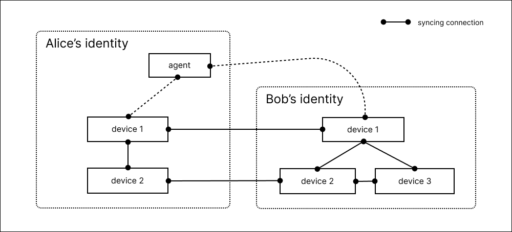

# About Composer

Composer is a collaborative productivity app where developers can build and organize knowledge, extend with custom data and UI, and run private AI against their knowledge locally.

Key features:

* **Extensibility**: If your team is operating in a challenging problem domain you need knowledge tools specific to your work. Composer is built for customization from the ground up.
* **Collaboration**: Composer has real-time multiplayer implemented through a local-first model. This makes a lot of things better: from meeting notes to working on airplanes.
* **Openness**: Composer and the DXOS framework are open source. Due to the [CRDT](https://en.wikipedia.org/wiki/Conflict-free_replicated_data_type)-based implementation there's no need for a server other than for backup. DXOS provides backup services if you want them, but you can also host your own.
* **Privacy**: Composer is built on the peer-to-peer protocols of DXOS which are designed to be private by default. The data is stored on your device and only shared with others you explicitly invite.

## Devices and Agents

For example a running system might sync data like this:

Here [device](../guide/glossary.md#device) means a running DXOS instance. One device runs per domain/browser profile combination, so users can have multiple devices running on a physical machine. Each device is associated with an [identity](./user-guide/).

[Agents](../guide/tooling/cli/agent.md) are DXOS instances running without an attached user interface. A common use of agents is to run on a server and provide availability if all other devices are offline, but this is completely optional.

## Read More

::: warning Technology Preview
Composer is not yet ready for production. There are bugs, and breaking changes may occur. Migration guides will be provided for version updates in the [release notes](https://github.com/dxos/dxos/releases).

All your feedback is most welcome on [Discord](https://discord.gg/eXVfryv3sW).
:::

* To try composer see [Quick Start](./quick-start.md)
* For day-to-day instructions see [User Guide](./user-guide/)
* For information on privacy, the DXOS protocols, etc. see [Concepts and Details](./concepts-and-details.md)
* To learn about or write your first plugin see [SDK/Composer Plugins](../guide/composer-plugins/)
* To learn about full extensibility see the [SDK](../guide/) itself
