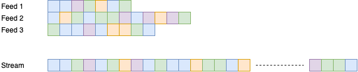
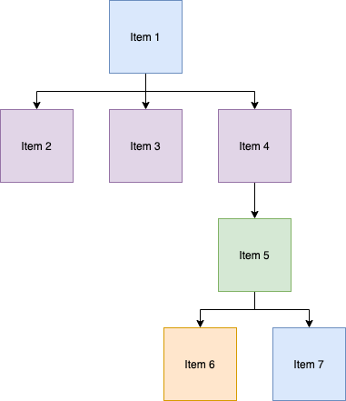

# Data Model

ECHO DB is an eventually consistent database constructed by replicating feeds containing ordered
immutable records. The database enables arbitrarily many peers -- separated in space and time -- to
maintain a logically consistent data sets, which can be used by decentralized applications.

## Definitions

1. Message: Record corresponding to a protobuf schema.
1. Feed: Ordered collection of messages.
1. Party: Collection of messages from multiple Feeds.
1. Item: Logically consistent set of messages.
1. Model: Versioned state machine that determines consistency of messges within a subset of a item.

## Overview

The diagram below represent three feeds (from different peers) that contain all of the messages for a party.

Messages are ordered within a particular feed, but a single message stream may be constructed by linearly
scaanning each feed in any order.

The database consists of arbitrarily many data objects (Items) which may be nested to form a DAG.
Items are internally consistent, governed by different kinds of Models, which implement conflict-free
replicated data types (CRDTs).

Each Party contains a special Item, which forms the root of a DAG.

As messages are read from the message stream, they are routed to a specific Item, which then processes them
to construct a logically consistent data object. These objects may correspond to text documents, spreadsheets,
kanban boards, kanban cards, chess games, or any other record type. The model associated with each Item
manages the consistency guarantees of the Item.

In this manner, we may represent a text document that has embedded within it a kanban that contains many
cards, where each card has a notes field that is itself a text document.

## Mechanism

1. A Party must contain by default a System item.
1. Every item must encode metadata that defines exactly one Model type.
    - If a Model changes (i.e., version is updated) then the item must be tombstoned and forked.
    - The model is required to hydrate/dehydrate the item.
1. The system uses the ObjectModel to encode item metadata (e.g., title, properties).
    - Such messages are tagged with a system label in order to differentiate these data from other messages in
      item that use the ObjectModel for the main payload.
1. Every message (in every Feed) within a Party must have a reference (Party-local ID) to a item (ID).
1. The item metadata enables "dumb" agents (e.g., generic bots) to dynamically load code to process it.
1. Items may be nested; Items within a party form a DAG.
1. Items may include properties that are soft references to other Items (either within the current or external Parties).

## Notes

1. The above considers items to be the domain of consistency (not parties).
1. All messages correspond to exactly on model INSTANCE within a item.
1. This has implications for the current API -- and would motivate having Models defined "up-front"
   rathar than ad-hoc in hook defintions (akin to Apollo GraphQL queries?)
1. This system may allow of queries that range across the party and return collections of Items.
