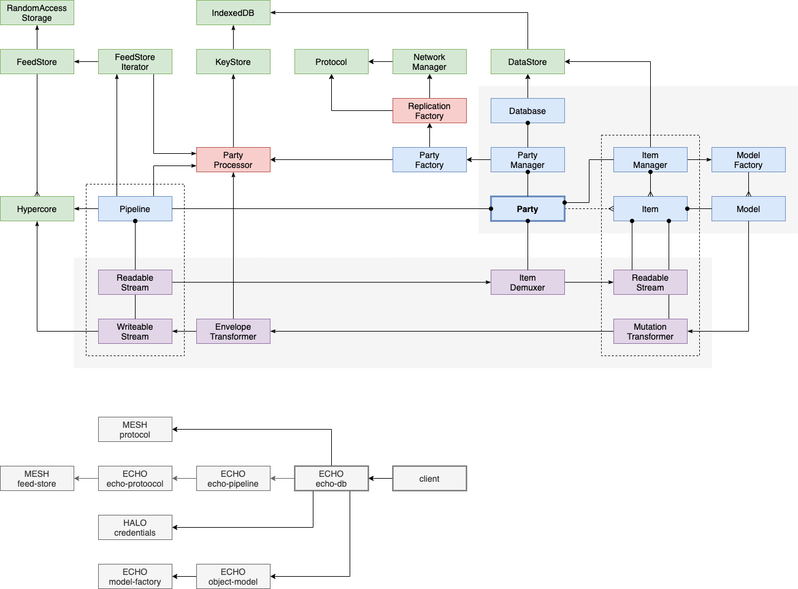

# Database

ECHO DB is an eventually consistent database constructed by replicating feeds containing ordered
immutable records. The database enables arbitrarily many peers -- separated in space and time -- to
maintain a logically consistent data sets, which can be used by decentralized applications.

- TOOD(burdon): Conventions (e.g., capitalize or back-tick classes, etc.)

## Definitions

1. Message: Record corresponding to a protobuf schema.
1. Feed: Ordered collection of messages (hypercore).
1. Party: A shared eventually consistent data set composed from multiple Feeds.
1. Item: An atomic eventually consistent referenceable data structure.
1. Model: A state machine that processes feeds to construct an Item.

## Spec

1. Real-time processing of replicated feeds.
1. Persistent snapshots of data.
1. Persistent metadata for preferences and configuration.
1. Persistent key storage.
1. Hierarchically composable eventual consistency mechanisms.

## Design

### Design Constraints

- Enable high-throughput [systolic](https://en.wikipedia.org/wiki/Systolic_array) processing of messages.
- Enable parallel processing of independent data structures.
- Enable partial processing of message streams (e.g., skip archive or inactive parties and items).
- Minimize in-memory queuing of unprocessed messages.

### Storage

The system maintains the following stores which handle different aspects of the database.

- `FeedStore` stores ordered protocol buffer messages for each feed, indexed by the feed's public key.
- `MetaStore` stores system metadata, which includes:
    - NOTE: This is currently maintained by an `ObjectStore`, which is unnecessary since it doesn't 
      need to handle contention.
    - A map of persistent Feeds (by public key).
        - NOTE: This is currently maintained by `FeedStore` (which bizarrely uses a hypertrie).
    - A set of active Party subscriptions.
- `ItemStore` stores data structures reified by Item Models.
- `KeyStore` stores public keys for external entities and private keys for entities controlled by the local node.

- TODO(burdon): Define ALL data structures.

### Components

- `PartyProcessor` reads messages from the `FeedStore` and streams them to the associated Party.
- `ModelFactory` manages a set of registered `Model` classes and creates instances on demand. 
   In principle, Models may be loaded on demand from the network.

### Mechanism

- The system instantiates a `PartyProcessor` object for each active (or subscribed) Party 
  (determined by the `MetaStore`).
    - `PartyProcessor` objects may be created, paused or deleted at any point.
    - Each `PartyProcessor` maintains a set of active Feeds, with its current block position.

- The `PartyProcessor` is a state machine that constructs the consistent state of the Party.
    - NOTE: Each Party is able to be processed independently.
    - It is responsible for processing all system messages (defined by the `credentials` package).
    - Initially, it cycles through the set of associated Feeds to find the Genesis block.
        - NOTE: The kye of the Genesis Feed may be stored in the `MetaStore`. 
    - Subsequent `PartyAdmit` messages activate the associated feeds.
    - Each `PartyProcessor` has a corresponding `Party` object, which is instantiated with a ReadableStream.
    - Item messages are streamed to the corresponding `Party`.

- Each `Party` maintains a map of `Item` objects.
    - Each `Item` has a Genesis block, which designates the `Model` type (and version).
    - When the Genesis block is read, a Model object is costructed and passed both a ReadableStream and WritableStream.
    - Each `Item` message contains an envelope that contains an `Item` ID. 
    - The `ItemDemuxer` streams each message to the corresponding Item's ReadableStream.

- Each `Model` is a state machine that constructs the consistent state of the Item.
    - Messages are euqueued until they can be processed in the order required by the Model.

- The current state of an `Item` (along with the current feed block positions) may be persistent to the `ItemStore`
    - Items may be rehydrated when a Party is opened, which would allow The `ItemDemuxer` to skip previously
      processed messages.

### Issues

- Party snapshots: ability to "archive" the iniial set of messages across feeds to speed startup and prevent
  the need for the full replication of individual messages (would require `DataStore` blob replication to checkpoint).
- Feeds could be "frozen" and new feeds constructed for each "epoch" since the last snapshot.

## Notes

### Protocol Buffers

- Enforces immutability.
- Provide type safety (esp. via TS generated definitions).
- Prevents the possibility of __meta "expandos".
- Prevents the possibility of structs mutating into objects with methods, etc.
- Allows for persistence (or IPC serialization!) if needed at some point.
- Requires less code (no additional class/interface definitions).
- Makes the intrinsic data model of the system clearer (by inspection of .proto files), 
  esp. since most data type definitions are already defined in proto files.

## Background (Archived)

The diagram below represent three feeds (from different peers) that contain all of the messages for a party.

Data flow

Messages are ordered within a particular feed, but a single message stream may be constructed by linearly
scaanning each feed in any order.

The database consists of arbitrarily many data objects (Items) which may be nested to form a DAG.
Items are internally consistent, governed by different kinds of Models, which implement conflict-free
replicated data types (CRDTs).

Each Party contains a special Item, which forms the root of a DAG.

As messages are read from the message stream, they are routed to a specific Item, which then processes them
to construct a logically consistent data object. These objects may correspond to text documents, spreadsheets,
kanban boards, kanban cards, chess games, or any other record type. The model associated with each Item
manages the consistency guarantees of the Item.

In this manner, we may represent a text document that has embedded within it a kanban that contains many
cards, where each card may have a field that is itself a text document.

## Mechanism

1. A Party must contain by default a System item.
1. Every item must encode metadata that defines exactly one Model type.
    - If a Model changes (i.e., version is updated) then the item must be tombstoned and forked.
    - The model is required to hydrate/dehydrate the item.
1. The system uses the ObjectModel to encode item metadata (e.g., title, properties).
    - Such messages are tagged with a system label in order to differentiate these data from other messages in
      item that use the ObjectModel for the main payload.
1. Every message (in every Feed) within a Party must have a reference (Party-local ID) to a item (ID).
1. The item metadata enables "dumb" agents (e.g., generic bots) to dynamically load code to process it.
1. Items may be nested; Items within a party form a DAG.
1. Items may include properties that are soft references to other Items (either within the current or external Parties).

## Notes

1. The above considers items to be the domain of consistency (not parties).
1. All messages correspond to exactly one model INSTANCE within a item.
1. This has implications for the current API -- and would motivate having Models defined "up-front"
   rathar than ad-hoc in hook defintions (akin to Apollo GraphQL queries?)
1. This system may allow of queries that range across the party and return collections of Items.
