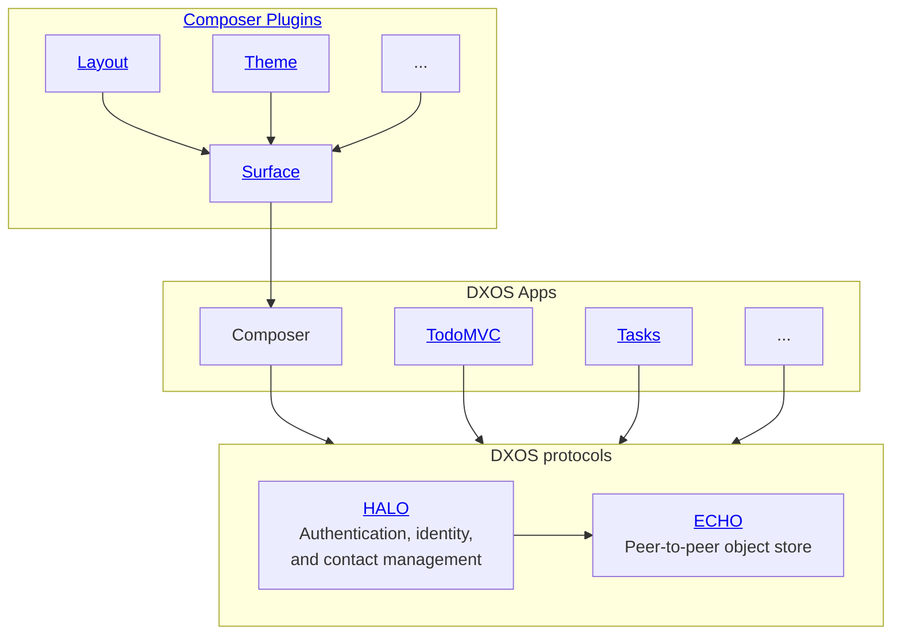

# Introduction

DXOS provides developers with everything they need to build real-time, collaborative apps which run entirely on the client, and communicate peer-to-peer, without servers.

DXOS applications work offline, share state instantly when online, and leave end-users in control of their data and privacy.

:::note
DXOS is under development and will continue to change frequently. Your feedback is most welcome on [GitHub](https://github.com/dxos/dxos/issues) and [Discord](https://discord.gg/eXVfryv3sW).  See our [Contribution Guide](https://github.com/dxos/dxos/blob/main/CONTRIBUTING.md) about contributing code.
:::

DXOS includes a key pair of technologies that work together:

* [ECHO](echo/) - Database and reactive state container for offline-first, real-time, collaborative apps.
* [HALO](halo/) - Identity for decentralized apps.

Compare DXOS applications to client-server web applications:
| | Client-Server Web Apps | DXOS Apps |
| :-- | :-- | :-- |
| How code is served | served by web servers | served by web servers |
| How data is stored | on the **server** | on the **client** |
| How data is exchanged | client to server via HTTP or Web Sockets | peer to peer via WebRTC |
| How identity is established | servers issue session tokens after validating credentials with methods like OAuth | clients generate their own private/public key pairs and use them to sign messages in the database. |

# SDK Documentation Overview

Dependency relationship of some of the technologies covered in the docs:

