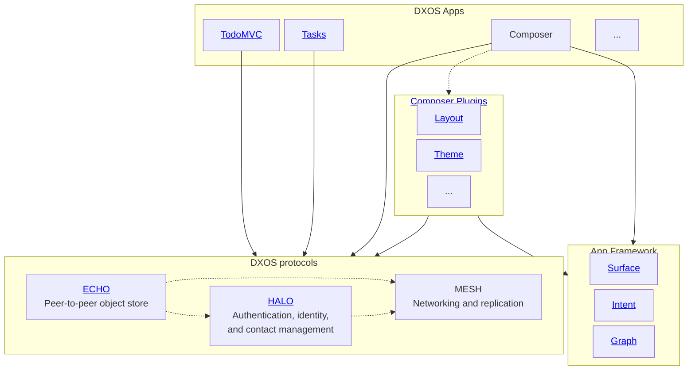

# Introduction

DXOS provides developers with a toolkit to build local-first, collaborative apps which preserve privacy by communicating peer-to-peer.

DXOS applications work offline, share state instantly when online, and leave end-users in control of their data and privacy.

Composer is a collaborative productivity app where developers can build and organize knowledge, extend with custom data and UI, and run private AI against their knowledge locally.

:::note
The DXOS SDK is under active development, however our current focus is building features and functionality that enables the development of [Composer](https://dxos.org/composer). To this end, we're currently only able to provide limited support to developers using the SDK, and will prioritize suggestions and contributions that align with our work on Composer.

If you are interested in working with or contributing to either the SDK or Composer please share feedback on [GitHub](https://github.com/dxos/dxos/issues) or in [Discord](https://dxos.org/discord).
:::

The DXOS SDK includes a key pair of technologies that work together:

- [ECHO](echo/) - Database and reactive state container for offline-first, real-time, collaborative apps.
- [HALO](halo/) - Identity for decentralized apps.

Compare DXOS applications to client-server web applications:
| | Client-Server Web Apps | DXOS Apps |
| :-- | :-- | :-- |
| How code is served | served by web servers | served by web servers |
| How data is stored | on the **server** | on the **client** |
| How data is exchanged | client to server via HTTP or Web Sockets | peer to peer via WebRTC |
| How identity is established | servers issue session tokens after validating credentials with methods like OAuth | clients generate their own private/public key pairs and use them to sign messages in the database. |

# SDK Documentation Overview

Dependency relationship of some of the technologies covered in the docs:

Here solid lines represent direct dependencies and dashed lines pluggable ones.
