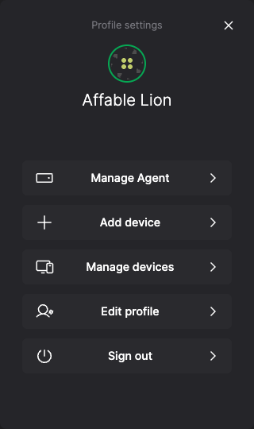
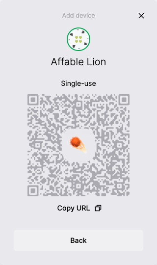
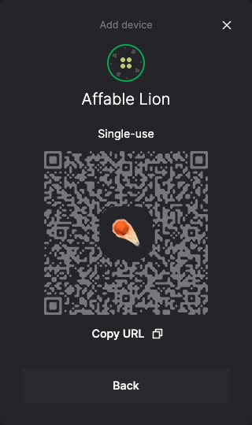

# HALO Identity

HALO is a system of components for implementing decentralized identity designed around privacy, security, and collaboration requirements.

* The HALO **Shell** manages the user's identity and connected devices. It's available as a [component](https://github.com/dxos/dxos/tree/main/packages/sdk/shell).
* The HALO [**SDK**](https://www.npmjs.com/package/@dxos/client) is part of the DXOS client library and provides user authentication, identity, and contact management capabilities.
* The HALO **protocol** supports the verification, transport, and exchange of identity information between networked peers.

## Features

* Public/private key-pair authentication mechanism integrated into ECHO
* Passwordless log in
* Local-first credentials and key storage
* Multi-device synchronization of identities, credentials, ECHO spaces

## Establishing user identity

There are two ways a user can establish their identity (login) with DXOS on any given [device](../glossary#device).

1. Visiting any DXOS-powered application in the browser will immediately initialize a HALO identity for the user.
2. Accepting a [device invitation](#device-invitations) will synchronize the user's identity from another device.

In the future, we plan to support recovering an identity using a [seed phrase](../glossary#seed-phrase), sometimes referred to as paper key recovery.

## Shell

[Shell](https://github.com/dxos/dxos/tree/main/packages/sdk/shell) is a set of components and pre-built workflows for managing [ECHO](../platform) spaces, invitations, and identity.

It runs and renders within an iframe managed by the DXOS client.

The shell can be invoked via the client API.

Scenarios:

* View and edit the user's basic profile
* Invite someone to a space
* Accept an invitation to join another space
* Join another device to the user's HALO identity
* Accept a device invitation to join the current device to an existing HALO identity

You can experiment with the Shell at <https://halo.dxos.org>.

The shell appears overtop the calling UI and looks like a full screen dialog panel.

  
  

  
  

### Device Invitations

Device Invitations allow users to synchronize their identity and data across multiple devices or applications (every app is a separate device, one per domain and browser profile). Invitations are generated by the user's primary device and can be accepted by any other device, including mobile devices and the [DXOS CLI](../cli).

<video controls loop autoplay style="width:100%" src="/images/device-invitations.mp4"></video>

## Next steps

How to use the HALO Shell in code:

* Use [Shell with Typescript](../typescript/shell#installation)
* Use [Shell with React](../react/shell#installation)

How to read the HALO identity in code:

* Use the [`useIdentity` hook in react](../react/identity)
* Use the [`client.halo.profile` field in TypeScript](../typescript/identity)
