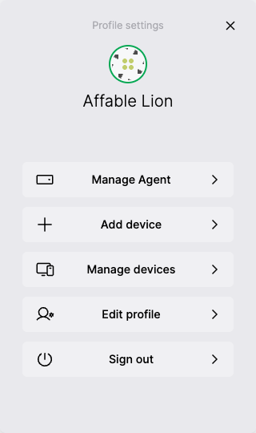

# Shell

The shell is a set of components and pre-built workflows for managing [ECHO](../echo.md) spaces, invitations, and identity.

<div class="shell-images">
  
  
</div>

[Read more about Shell.](../halo.md#shell)

## Installation

```bash
npm i @dxos/shell
```

## Setup

`vite.config.ts`

```ts
export default defineConfig({
  build: {
    rollupOptions: {
      input: {
        main: resolve(__dirname, './index.html'),
        shell: resolve(__dirname, './shell.html'),
      },
    },
  },
});
```

`shell.html`

```html
<!doctype html>
<html lang="en">
  <head>
    <meta charset="UTF-8" />
    <meta
      name="viewport"
      content="width=device-width,initial-scale=1,user-scalable=no"
    />
    <style>
      html,
      body {
        background: transparent !important;
      }
    </style>
    <script>
      function setTheme(darkMode) {
        document.documentElement.classList[darkMode ? 'add' : 'remove']('dark');
      }
      setTheme(window.matchMedia('(prefers-color-scheme: dark)').matches);
      window
        .matchMedia('(prefers-color-scheme: dark)')
        .addEventListener('change', function (e) {
          setTheme(e.matches);
        });
    </script>
  </head>
  <body>
    <div id="root"></div>
    <script type="module" src="/src/shell.ts"></script>
  </body>
</html>
```

`src/shell.ts`

```ts
import '@dxos/shell/style.css';

import { runShell } from '@dxos/shell';

import { getConfig } from './config';

const main = async () => {
  const config = await getConfig();
  await runShell(config);
};

main();
```

## Usage

```tsx file=./snippets/shell.tsx#L5-
import React from 'react';

import { useClient, PublicKey } from '@dxos/react-client';

const Component = () => {
  // requires <ClientProvider/> somewhere in the tree
  const client = useClient();

  return (
    <div
      onClick={async () => {
        // open the profile panel
        await client.shell.open();

        // join another device using an invitation
        const { identity: id1 } = await client.shell.initializeIdentity({
          invitationCode: '<device invitation code>',
        });

        // open the identity creation flow
        const { identity: id2, cancelled } =
          await client.shell.initializeIdentity();

        // invite a new device to join the current identity
        const { device } = await client.shell.shareIdentity();

        // invite new members to join a space
        const { members } = await client.shell.shareSpace({
          spaceKey: PublicKey.from('<space key>'),
        });

        // join an existing space
        const { space } = await client.shell.joinSpace({
          invitationCode: '<invitation code>',
        });
      }}
    ></div>
  );
};
```

See more in the [API documentation](../../api/@dxos/client/classes/Shell.md) for the Shell.
