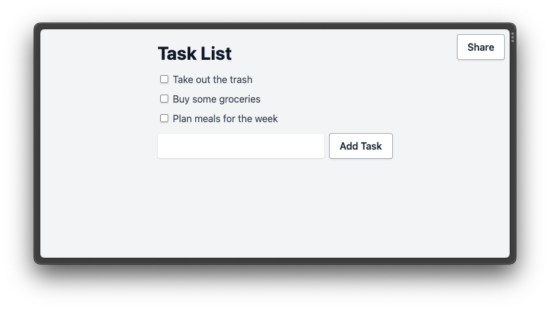
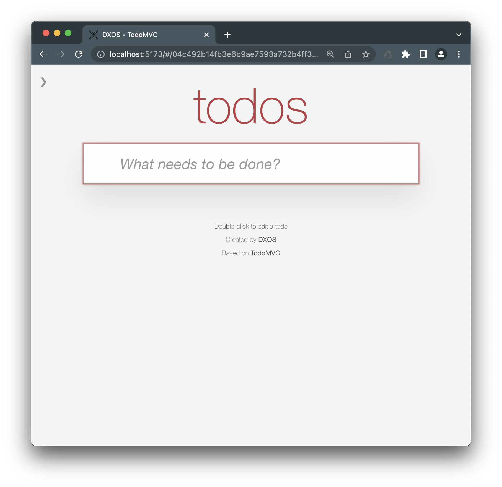

# Example Gallery

## Composer

A collaborative, real-time, offline-first rich-text editor with `dxos`.

* Learn more about [Composer](https://dxos.org/composer)
* Try [Composer](http://composer.dxos.org) on `dxos.org`
* Code on [Github](https://github.com/dxos/dxos/tree/main/packages/apps/composer-app)

## Tasks

A simple todo list app build with `dxos`.

* Code on [Github](https://github.com/dxos/dxos/tree/main/packages/apps/tasks)
* Run [Tasks](http://tasks.dxos.org) on `dxos.org`
  

## TodoMVC

A fork of the [TodoMVC](https://todomvc.com/) sample running on top of `dxos`

* Code on [Github](https://github.com/dxos/dxos/tree/main/packages/apps/todomvc)
  
