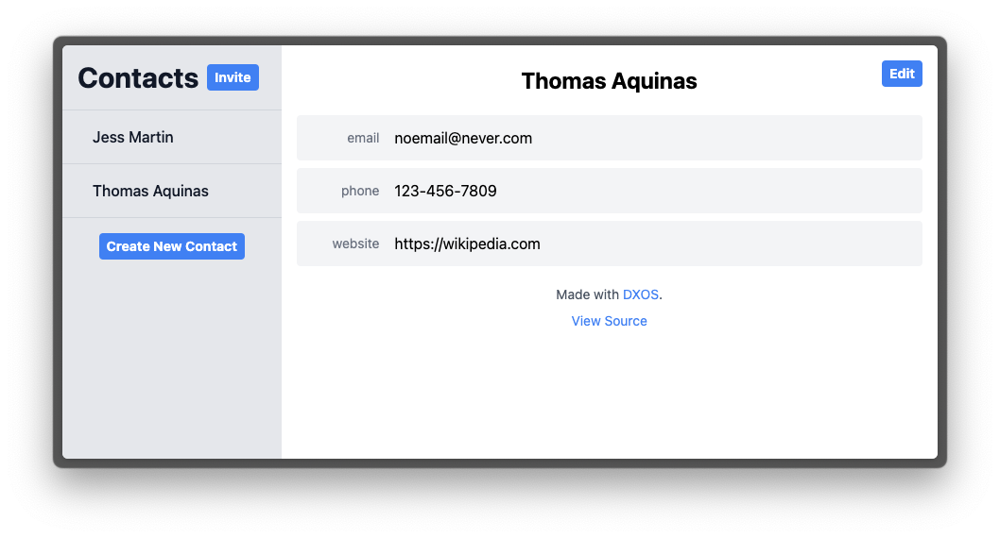
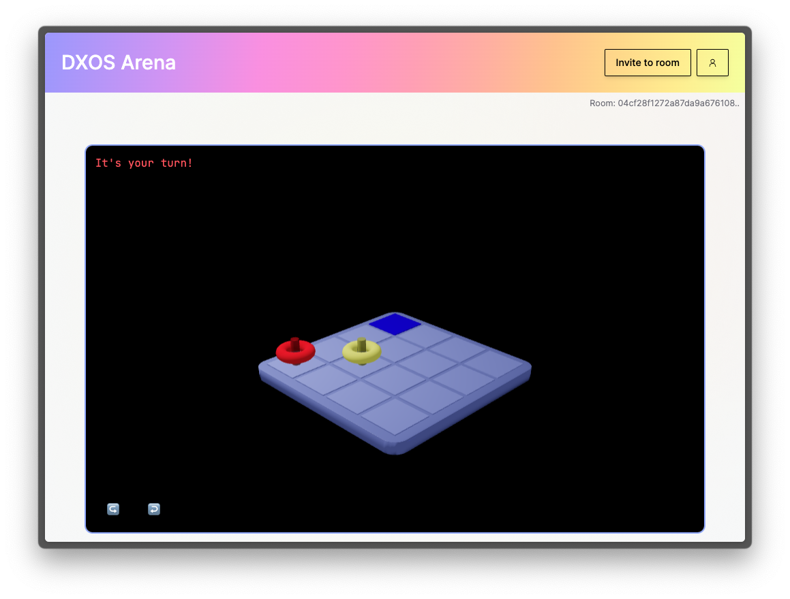

# Example Gallery

## Composer

A collaborative, real-time, offline-first rich-text editor with `dxos`.

- Learn more about [Composer](https://dxos.org/composer)
- Try [Composer](http://composer.space)
- Code on [Github](https://github.com/dxos/dxos/tree/main/packages/apps/composer-app)

## Contacts

Simple contacts manager built with `dxos`.

- Code on [Github](https://github.com/dxos/contacts-app)
- Run [Contacts](http://contacts.dxos.network) on `dxos.network`
  

## Game Arena

Collaborative game arena featuring Chess and 3D Connect 4.

- Code on [Github](https://github.com/dxos/arena-app)
- Play [Arena](http://arena.dxos.network) on `dxos.network`
  

## Tasks

A simple todo list app built with `dxos`.

- Code on [Github](https://github.com/dxos/dxos/tree/main/packages/apps/tasks)
- Run [Tasks](http://tasks.dxos.network) on `dxos.network`
  

## TodoMVC

A fork of the [TodoMVC](https://todomvc.com/) sample running on top of `dxos`.

- Code on [Github](https://github.com/dxos/dxos/tree/main/packages/apps/todomvc)
- Run [TodoMVC](http://todomvc.dxos.network) on `dxos.network`
  
