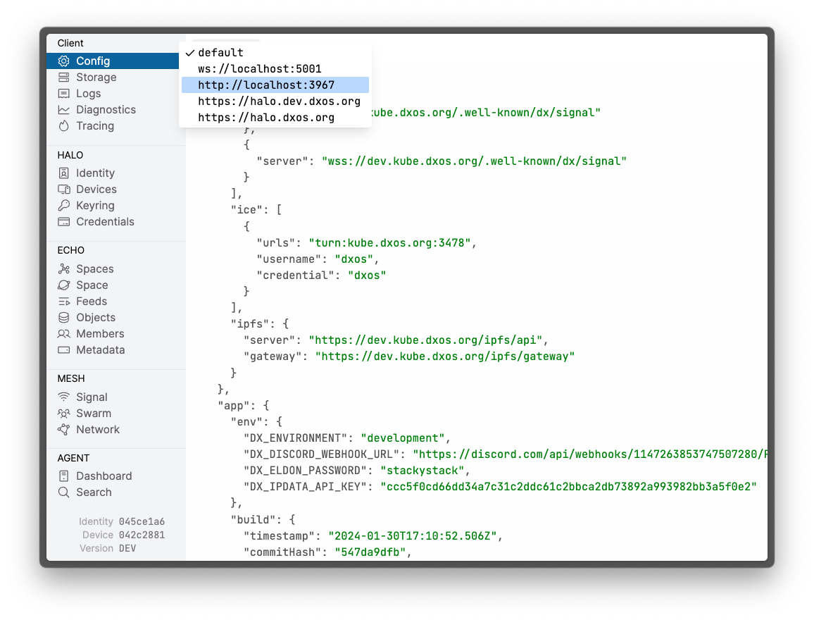
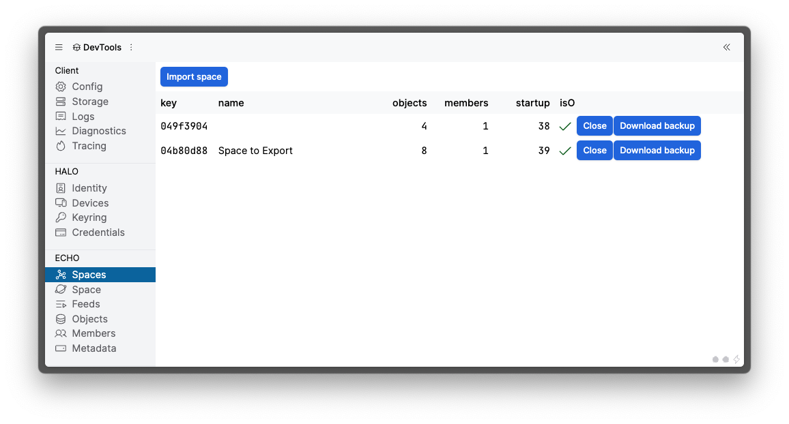
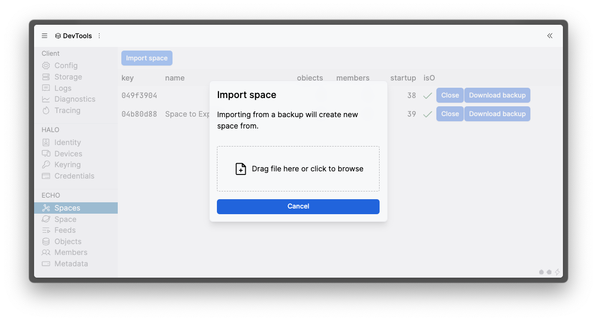

# Developer Tools

Using this tool you can inspect an instance of ECHO to visualize and debug the state of the application.

There are two ways to run the tool:

* Launch the standalone [Developer Tools](https://devtools.dxos.org) as an application and point it to a DXOS application using the `?target=vault:https://...` argument in the URL.
* Install the browser extension [DXOS Client Developer Tools](https://chrome.google.com/webstore/detail/dxos-client-developer-too/ioofnlghmmdbmkadofabikgcgjacnnaf) and it will connect to the vault of the app being debugged in the browser's devtools.

## Backup and Import Spaces

Devtools allows you to download a backup of your spaces and re-import them. This allows you to easily move your spaces between different instances of ECHO.

Backup and Import are especially useful when there are breaking protocol changes and a manual data migration is necessary between different versions of DXOS. We will maintain the ability to generate the backup and parse the import for at least one month from the release of the breaking change version.

The "Download Backup" and "Import Space" buttons can be found under the "Spaces" tab.

## Next Steps

Check out some [Example Applications](../samples.md) created with DXOS.
