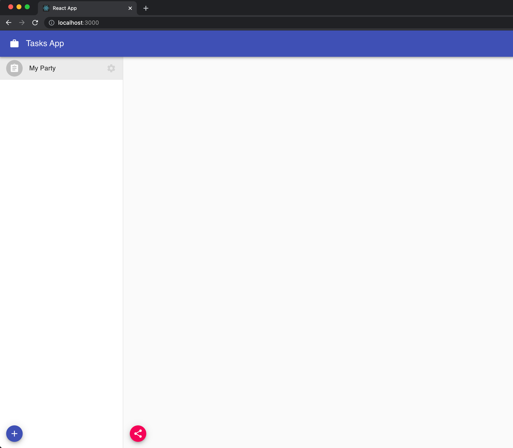

In order to share data we add to the space, we have to invite other peers to it. There are two steps required in this process: creating an invitation and redeeming an invitation.

## Create an Invitation

We have to create an invitation code that we will share with the peer we want to invite. This process is called **interactive** since it requires the invitee to redeem the invitation code that gets generated by the inviter.

We will then create a new component `src/components/TaskList.js` that will handle the invitations process (and the actual app logic in the next section):

```jsx:title=src/components/TaskList.js
import { usespace } from '@dxos/react-client';

const TaskList = ({ space_key }) => {
  const space = usespace(space_key);

  // ...

  const handleCopyInvite = async () => {
    const invitation = await space.createInvitation();
    const invitationText = JSON.stringify(invitation.toQueryParameters());
    await navigator.clipboard.writeText(invitationText);
  };

  return (
    <div>
      {/* ... */}
      <div>
        <Fab size='small' color='secondary' aria-label='invite' title='Invite people' onClick={handleCopyInvite}>
          <ShareIcon />
        </Fab>
      </div>
    </div>
  );
};

export default TaskList;
```

> You can access [this](https://github.com/dxos/tutorial-tasks-app/blob/master/src/components/TaskList.js) link to check the full `TaskList` code.

To create a new invitation we just need to call `space.createInvitation` method and it will return the specific information you need to share with your peer.

Go to your `src/components/Main.js` component and render the `TaskList` component in a main section:

```jsx:title=src/components/Main.js
import TaskList from './TaskList';

const Main = () => {
  // ...

  return (
    <div className={classes.root}>
      {/* ... */}

      <main className={classes.main}>{space_key && <TaskList space_key={space_key} />}</main>
    </div>
  );
};
```

On your browser, when selecting your space from the list, you will see a share button at the bottom of the page. Clicking on it will copy the invitation code to clipboard:



## Redeem Invitation

We now need to give our users the possibility to redeem an invitation so they are able to join the space. Lucky for us, the `@dxos/react-toolkit` package already exports a `JoinspaceDialog` component that we can make usage of.

Let's got now to our `src/components/spaceList.js` component and place the following:

```jsx:title=src/components/spaceList.js
// ...
import { JoinspaceDialog } from '@dxos/react-toolkit';

const spaceList = ({ onSelectspace }) => {
  const [redeemDialog, setRedeemDialog] = useState(false);

  const handleRedeemspace = () => setRedeemDialog(true);

  return (
    <div>
      {/* ... spaceSettings */}

      <JoinspaceDialog open={redeemDialog} onClose={() => setRedeemDialog(false)} />

      {/* ... Spaces */}

      <div>
        {/* ... Create space Button */}

        <Fab size='small' color='secondary' aria-label='redeem' title='Redeem invitation' onClick={handleRedeemspace}>
          <RedeemIcon />
        </Fab>
      </div>
    </div>
  );
};

export default spaceList;
```

We are rendering now the `JoinspaceDialog` and also a button to show it.

If you go to your app in the browser, you will see that button next to the create space button. Go ahead and try it yourself.


## Test it yourself

Open your app in two different browser sessions. It could be an incognito window with a separate session or a different browser.
We will simulate the actions of two users:

- In one window, with a space created, click the **invitation** button to generate a new invite code and copy it to the clipboard.
- In the other browser choose _Redeem invitation_. **Paste the invitation code** and submit.
- After some seconds, you should notice **the newly created space appearing in the lists column of the second browser**.
- That list is now shared between those two users.
