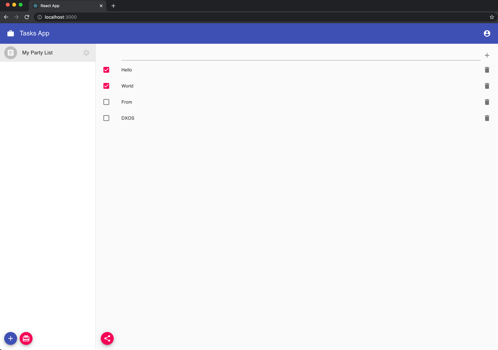
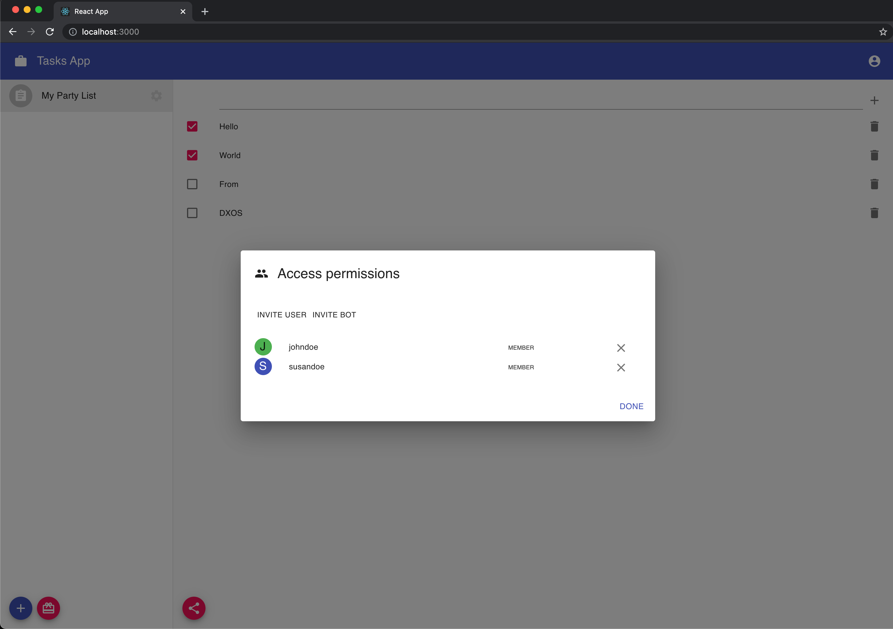

## Create, Check and Delete a Task

Now that you have been able to see how invitations work, let's test it out! Open two different browser sessions at the apps url. We will simulate actions of two users:

- In one window **create a list** and click invitation button. **Invite a user** and copy invitation key to clipboard.
- In another browser choose _Redeem invitation_. **Paste the invitation key**. The app will require a passcode.
- After a while it should appear in Party Sharing Dialog in the first browser.
- Copy and **paste the passcode** in the second browser, and click _Send_. You should notice **the newly created party appeared in lists column of the second browser**.
- That list is now shared between those two users.
- **Add some tasks**, check some of them, and delete some of them on one side and **check that all the changes appear** in another user's browser.

- Click _Invite_ icon button again (no matter at which user). See that there are already **two members of this party**.

