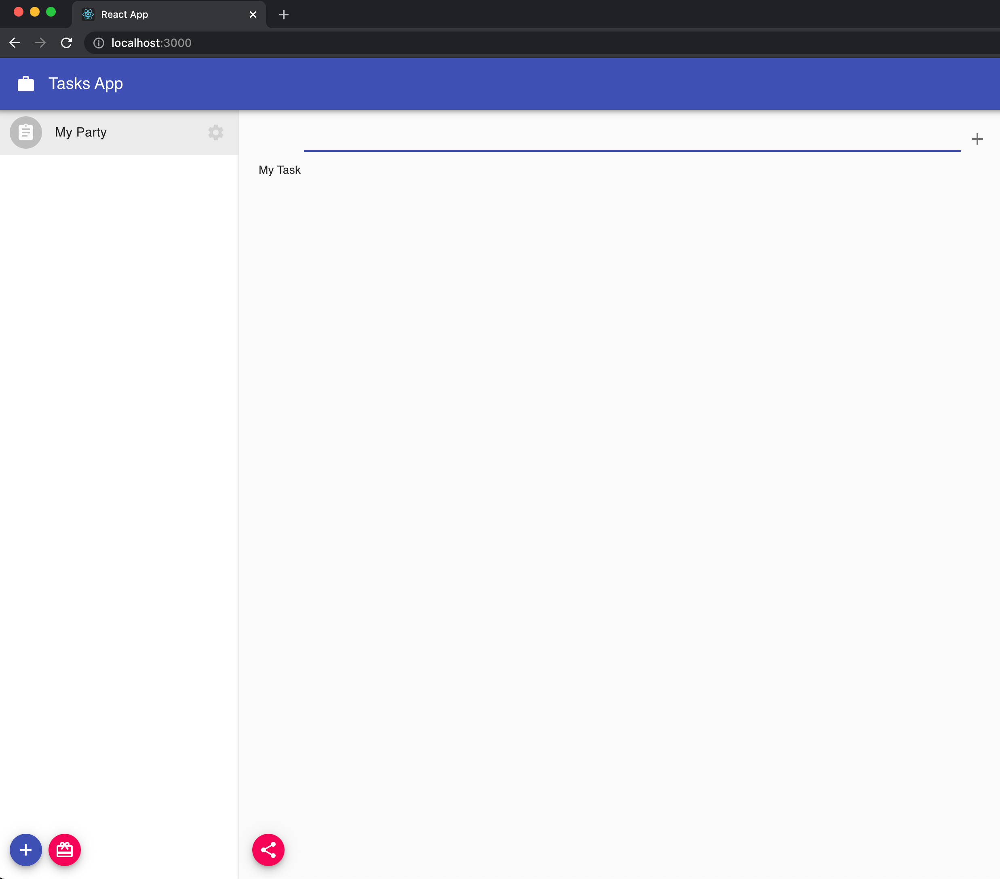
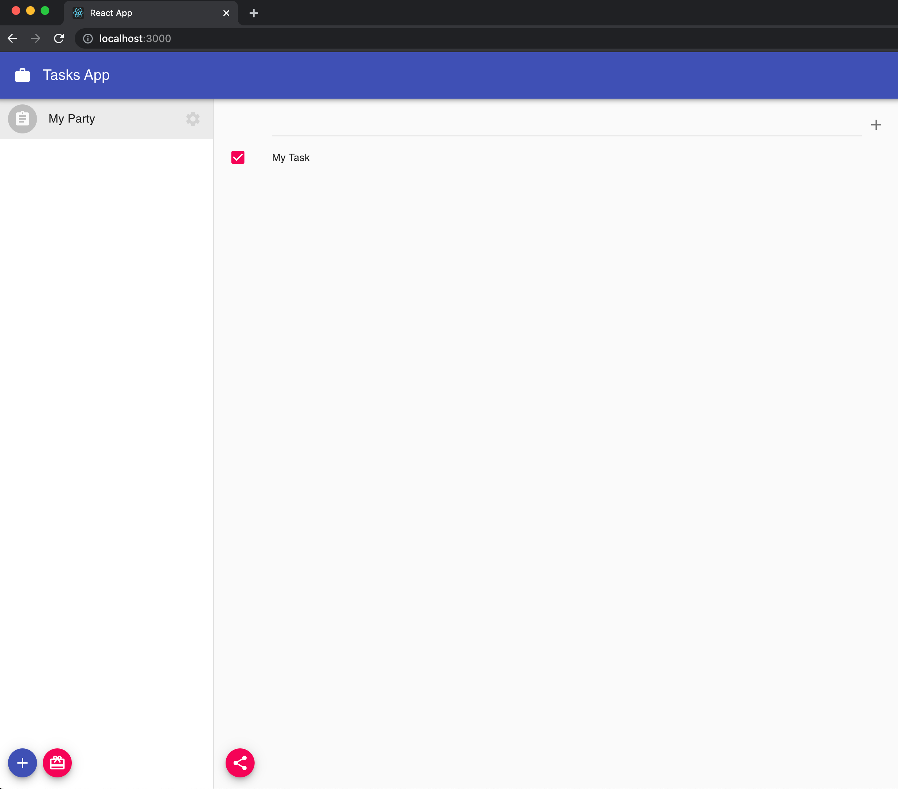

So far, we have been preparing our app to be able to interact with DXOS Stack, but we haven't added any fun logic yet. Let's add some more stuff to our `src/components/TaskList.js` file.

## Create items

On our app the `items` that we are going to create are going to be Tasks. Place the following code in your `TaskList` component and take a look at the function `handleCreateItem`. We are calling to `party.database.createItem` function, sending some required information.

```jsx:title=src/components/TaskList.js
import React, { useState } from 'react';

import { Fab, IconButton, List, ListItem, ListItemIcon, ListItemSecondaryAction, TextField } from '@material-ui/core';
import { makeStyles } from '@material-ui/core/styles';
import { Add as AddIcon, Share as ShareIcon } from '@material-ui/icons';

import { ObjectModel } from '@dxos/object-model';
import { useParty } from '@dxos/react-client';
import { PartySharingDialog } from '@dxos/react-ux';

const useStyles = makeStyles((theme) => ({
  container: {
    flex: 1,
    margin: theme.spacing(1),
    overflowY: 'hidden',
  },
  list: {
    display: 'flex',
    flexDirection: 'column',
    height: '100%',
    overflow: 'hidden',
  },
  fillVertically: {
    flex: 1,
    display: 'flex',
    flexDirection: 'column',
    overflowY: 'hidden',
  },
  actions: {
    margin: theme.spacing(2),
    '& button': {
      marginRight: theme.spacing(1),
    },
  },
}));

const TASK_TYPE = 'example.com/type/task';

const TaskList = ({ partyKey }) => {
  const classes = useStyles();

  const [shareDialog, setShareDialog] = useState(false);
  const [taskTitle, setTaskTitle] = useState('');

  const party = useParty(partyKey);

  const handleShare = () => setShareDialog(true);

  const handleCreateTask = async () => {
    if (!taskTitle.length) {
      return;
    }

    await party.database.createItem({
      type: TASK_TYPE,
      model: ObjectModel,
      props: { title: taskTitle },
    });

    setTaskTitle('');
  };

  if (!partyKey) {
    return null;
  }

  return (
    <div className={classes.fillVertically}>
      {shareDialog && <PartySharingDialog open party={party} onClose={() => setShareDialog(false)} />}

      <div className={classes.container}>
        <List dense className={classes.list}>
          <ListItem>
            <ListItemIcon />

            <TextField
              fullWidth
              autoFocus
              value={taskTitle}
              onChange={(event) => setTaskTitle(event.target.value)}
              onKeyPress={(event) => event.key === 'Enter' && handleCreateTask()}
            />

            <ListItemSecondaryAction>
              <IconButton size='small' edge='end' aria-label='create' onClick={handleCreateTask}>
                <AddIcon />
              </IconButton>
            </ListItemSecondaryAction>
          </ListItem>
        </List>
      </div>

      <div className={classes.actions}>
        <Fab size='small' color='secondary' aria-label='invite' title='Invite people' onClick={handleShare}>
          <ShareIcon />
        </Fab>
      </div>
    </div>
  );
};

export default TaskList;
```

Go to your browser app now. After selecting one of your parties, you should be able to see an input on the main section of the screen, that will handle the creation of a new task.


## List items

We should add now some more code to be able to see the created tasks. For this we will use the `useSelection` hook provided by `@dxos/react-client` that will allow us to filter items by some criteria:

```jsx:title=src/components/TaskList.js
import React, { useState } from 'react';

import {
  Fab,
  IconButton,
  List,
  ListItem,
  ListItemIcon,
  ListItemSecondaryAction,
  ListItemText,
  TextField,
} from '@material-ui/core';
import { makeStyles } from '@material-ui/core/styles';
import { Add as AddIcon, Share as ShareIcon } from '@material-ui/icons';

import { ObjectModel } from '@dxos/object-model';
import { useParty, useSelection } from '@dxos/react-client';
import { PartySharingDialog } from '@dxos/react-ux';

const useStyles = makeStyles((theme) => ({
  container: {
    flex: 1,
    margin: theme.spacing(1),
    overflowY: 'hidden',
  },
  list: {
    display: 'flex',
    flexDirection: 'column',
    height: '100%',
    overflow: 'hidden',
  },
  fillVertically: {
    flex: 1,
    display: 'flex',
    flexDirection: 'column',
    overflowY: 'hidden',
  },
  actions: {
    margin: theme.spacing(2),
    '& button': {
      marginRight: theme.spacing(1),
    },
  },
}));

const TASK_TYPE = 'example.com/type/task';

const TaskList = ({ partyKey }) => {
  const classes = useStyles();

  const [shareDialog, setShareDialog] = useState(false);
  const [taskTitle, setTaskTitle] = useState('');

  const party = useParty(partyKey);

  const items = useSelection(
    party.database.select(
      (s) => s.filter({ type: TASK_TYPE }).filter((item) => !item.model.getProperty('deleted')).items
    ),
    [partyKey]
  );

  const handleShare = () => setShareDialog(true);

  const handleCreateTask = async () => {
    if (!taskTitle.length) {
      return;
    }

    await party.database.createItem({
      type: TASK_TYPE,
      model: ObjectModel,
      props: {
        title: taskTitle,
      },
    });

    setTaskTitle('');
  };

  if (!partyKey) {
    return null;
  }

  return (
    <div className={classes.fillVertically}>
      {shareDialog && <PartySharingDialog open party={party} onClose={() => setShareDialog(false)} />}

      <div className={classes.container}>
        <List dense className={classes.list}>
          <ListItem>
            <ListItemIcon />

            <TextField
              fullWidth
              autoFocus
              value={taskTitle}
              onChange={(event) => setTaskTitle(event.target.value)}
              onKeyPress={(event) => event.key === 'Enter' && handleCreateTask()}
            />

            <ListItemSecondaryAction>
              <IconButton size='small' edge='end' aria-label='create' onClick={handleCreateTask}>
                <AddIcon />
              </IconButton>
            </ListItemSecondaryAction>
          </ListItem>

          <div className={classes.reverseList}>
            {items.map((item) => (
              <ListItem button key={item.id}>
                <ListItemText primary={item.model.getProperty('title')} />
              </ListItem>
            ))}
          </div>
        </List>
      </div>

      <div className={classes.actions}>
        <Fab size='small' color='secondary' aria-label='invite' title='Invite people' onClick={handleShare}>
          <ShareIcon />
        </Fab>
      </div>
    </div>
  );
};

export default TaskList;
```

Check again your browser, you should now see your created tasks.



## Update items

Let's add the possibility to check/uncheck our tasks to mark which ones are already completed. Pay attention to `handleToggleComplete` and you will see how we update a property of an item:

```jsx:title=src/components/TaskList.js
import React, { useState } from 'react';

import {
  Checkbox,
  Fab,
  IconButton,
  List,
  ListItem,
  ListItemIcon,
  ListItemSecondaryAction,
  ListItemText,
  TextField,
} from '@material-ui/core';
import { makeStyles } from '@material-ui/core/styles';
import { Add as AddIcon, Share as ShareIcon } from '@material-ui/icons';

import { ObjectModel } from '@dxos/object-model';
import { useParty, useSelection } from '@dxos/react-client';
import { PartySharingDialog } from '@dxos/react-ux';

const useStyles = makeStyles((theme) => ({
  container: {
    flex: 1,
    margin: theme.spacing(1),
    overflowY: 'hidden',
  },
  list: {
    display: 'flex',
    flexDirection: 'column',
    height: '100%',
    overflow: 'hidden',
  },
  fillVertically: {
    flex: 1,
    display: 'flex',
    flexDirection: 'column',
    overflowY: 'hidden',
  },
  actions: {
    margin: theme.spacing(2),
    '& button': {
      marginRight: theme.spacing(1),
    },
  },
}));

const TASK_TYPE = 'example.com/type/task';

const TaskList = ({ partyKey }) => {
  const classes = useStyles();

  const [shareDialog, setShareDialog] = useState(false);
  const [taskTitle, setTaskTitle] = useState('');

  const party = useParty(partyKey);

  const items = useSelection(
    party.database.select(
      (s) => s.filter({ type: TASK_TYPE }).filter((item) => !item.model.getProperty('deleted')).items
    ),
    [partyKey]
  );

  const handleShare = () => setShareDialog(true);

  const handleCreateTask = async () => {
    if (!taskTitle.length) {
      return;
    }

    await party.database.createItem({
      type: TASK_TYPE,
      model: ObjectModel,
      props: {
        title: taskTitle,
      },
    });

    setTaskTitle('');
  };

  const handleToggleComplete = (item) => async (event) => {
    await item.model.setProperty('complete', event.target.checked);
  };

  if (!partyKey) {
    return null;
  }

  return (
    <div className={classes.fillVertically}>
      {shareDialog && <PartySharingDialog open party={party} onClose={() => setShareDialog(false)} />}

      <div className={classes.container}>
        <List dense className={classes.list}>
          <ListItem>
            <ListItemIcon />

            <TextField
              fullWidth
              autoFocus
              value={taskTitle}
              onChange={(event) => setTaskTitle(event.target.value)}
              onKeyPress={(event) => event.key === 'Enter' && handleCreateTask()}
            />

            <ListItemSecondaryAction>
              <IconButton size='small' edge='end' aria-label='create' onClick={handleCreateTask}>
                <AddIcon />
              </IconButton>
            </ListItemSecondaryAction>
          </ListItem>

          <div className={classes.reverseList}>
            {items.map((item) => (
              <ListItem button key={item.id}>
                <ListItemIcon>
                  <Checkbox
                    edge='start'
                    tabIndex={-1}
                    checked={item.model.getProperty('complete') || false}
                    onChange={handleToggleComplete(item)}
                  />
                </ListItemIcon>

                <ListItemText primary={item.model.getProperty('title')} />
              </ListItem>
            ))}
          </div>
        </List>
      </div>

      <div className={classes.actions}>
        <Fab size='small' color='secondary' aria-label='invite' title='Invite people' onClick={handleShare}>
          <ShareIcon />
        </Fab>
      </div>
    </div>
  );
};

export default TaskList;
```

If you go back to your app, you should now be able to check and uncheck them.



## Delete a Task

To complete the famous CRUD operations, we just need to add a deletion option. Let's add a button to each task to make it happen. As are making a soft-delete of the items, we just need to update it's `deleted` property:

```jsx:title=src/components/TaskList.js
import React, { useState } from 'react';

import {
  Checkbox,
  Fab,
  IconButton,
  List,
  ListItem,
  ListItemIcon,
  ListItemSecondaryAction,
  ListItemText,
  TextField,
} from '@material-ui/core';
import { makeStyles } from '@material-ui/core/styles';
import { Add as AddIcon, Share as ShareIcon, Delete as DeleteIcon } from '@material-ui/icons';

import { ObjectModel } from '@dxos/object-model';
import { useParty, useSelection } from '@dxos/react-client';
import { PartySharingDialog } from '@dxos/react-ux';

const useStyles = makeStyles((theme) => ({
  container: {
    flex: 1,
    margin: theme.spacing(1),
    overflowY: 'hidden',
  },
  list: {
    display: 'flex',
    flexDirection: 'column',
    height: '100%',
    overflow: 'hidden',
  },
  fillVertically: {
    flex: 1,
    display: 'flex',
    flexDirection: 'column',
    overflowY: 'hidden',
  },
  actions: {
    margin: theme.spacing(2),
    '& button': {
      marginRight: theme.spacing(1),
    },
  },
}));

const TASK_TYPE = 'example.com/type/task';

const TaskList = ({ partyKey }) => {
  const classes = useStyles();

  const [shareDialog, setShareDialog] = useState(false);
  const [taskTitle, setTaskTitle] = useState('');

  const party = useParty(partyKey);

  const items = useSelection(
    party.database.select(
      (s) => s.filter({ type: TASK_TYPE }).filter((item) => !item.model.getProperty('deleted')).items
    ),
    [partyKey]
  );

  const handleShare = () => setShareDialog(true);

  const handleCreateTask = async () => {
    if (!taskTitle.length) {
      return;
    }

    await party.database.createItem({
      type: TASK_TYPE,
      model: ObjectModel,
      props: {
        title: taskTitle,
      },
    });

    setTaskTitle('');
  };

  const handleToggleComplete = (item) => async (event) => {
    await item.model.setProperty('complete', event.target.checked);
  };

  const handleDeleteTask = (item) => async () => {
    await item.model.setProperty('deleted', true);
  };

  if (!partyKey) {
    return null;
  }

  return (
    <div className={classes.fillVertically}>
      {shareDialog && <PartySharingDialog open party={party} onClose={() => setShareDialog(false)} />}

      <div className={classes.container}>
        <List dense className={classes.list}>
          <ListItem>
            <ListItemIcon />

            <TextField
              fullWidth
              autoFocus
              value={taskTitle}
              onChange={(event) => setTaskTitle(event.target.value)}
              onKeyPress={(event) => event.key === 'Enter' && handleCreateTask()}
            />

            <ListItemSecondaryAction>
              <IconButton size='small' edge='end' aria-label='create' onClick={handleCreateTask}>
                <AddIcon />
              </IconButton>
            </ListItemSecondaryAction>
          </ListItem>

          <div className={classes.reverseList}>
            {items.map((item) => (
              <ListItem button key={item.id}>
                <ListItemIcon>
                  <Checkbox
                    edge='start'
                    tabIndex={-1}
                    checked={item.model.getProperty('complete') || false}
                    onChange={handleToggleComplete(item)}
                  />
                </ListItemIcon>

                <ListItemText primary={item.model.getProperty('title')} />

                <ListItemSecondaryAction>
                  <IconButton size='small' edge='end' aria-label='delete' onClick={handleDeleteTask(item)}>
                    <DeleteIcon />
                  </IconButton>
                </ListItemSecondaryAction>
              </ListItem>
            ))}
          </div>
        </List>
      </div>

      <div className={classes.actions}>
        <Fab size='small' color='secondary' aria-label='invite' title='Invite people' onClick={handleShare}>
          <ShareIcon />
        </Fab>
      </div>
    </div>
  );
};

export default TaskList;
```

One last time, go back to your app and you should now be able to delete your tasks.


And that's it! You have completed your DXOS application to Create, List, Update and Delete tasks. Congratulations!

## Next steps

On every application, the last step of the development process is making the app available for anyone on the Internet.
You will find out how can you achieve that in the last section of the tutorial, but first, we need to set up the Environment.
