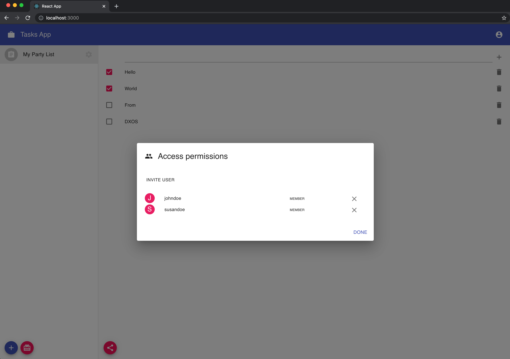

## Create, Check and Delete a Task

Now that you have been able to see how invitations work, let's test it out! Open two different browser sessions at the apps url. We will simulate the actions of two users:

- In one window **create a list** and click the invitation button. **Invite a user** and copy the invitation key to the clipboard.
- In another browser choose _Redeem invitation_. **Paste the invitation key**. The app will require a passcode.
- After a while it should appear in the Party Sharing Dialog in the first browser.
- Copy and **paste the passcode** in the second browser, and click _Send_. You should notice **the newly created party appearing in the lists column of the second browser**.
- That list is now shared between those two users.
- **Add some tasks**, check some of them, and delete some of them on one side and **check that all the changes appear** in the other user's browser.

- Click the _Invite_ icon button again (for either user). See that there are already **two members of this party**.

