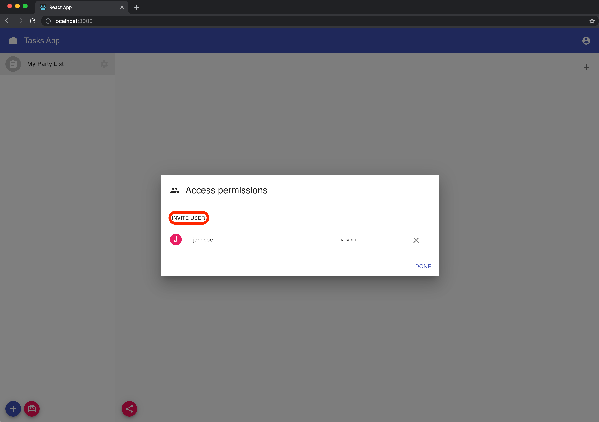
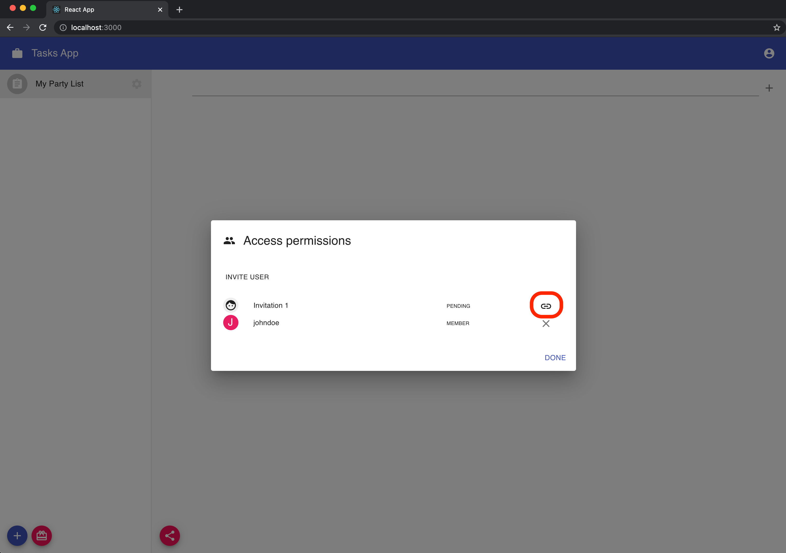
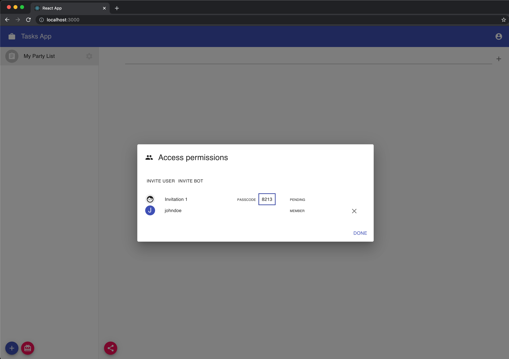
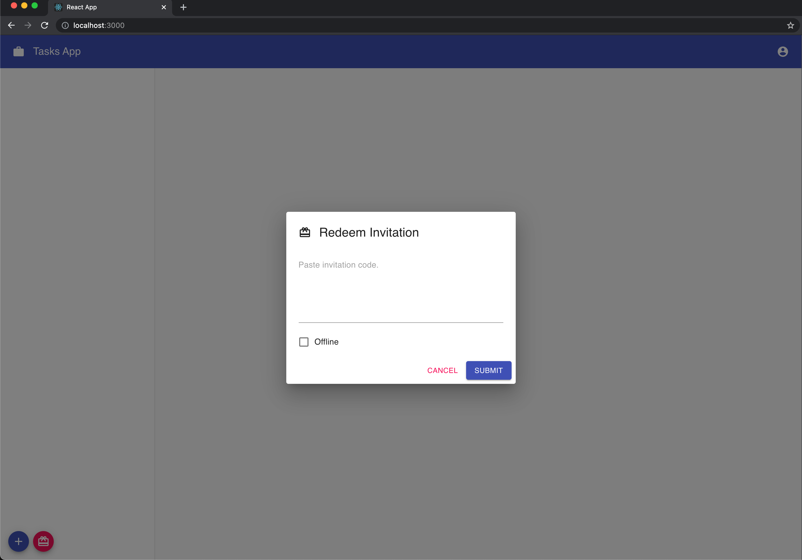
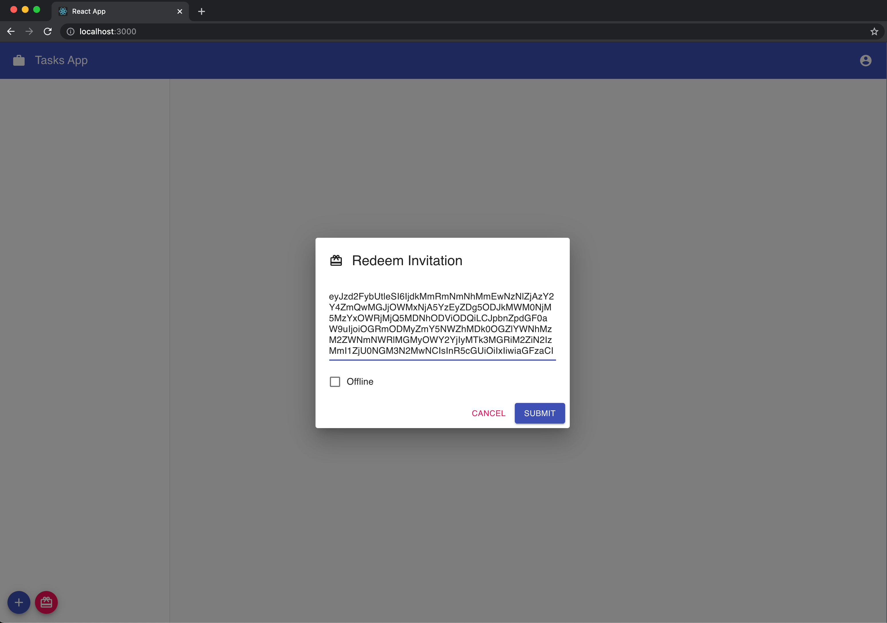
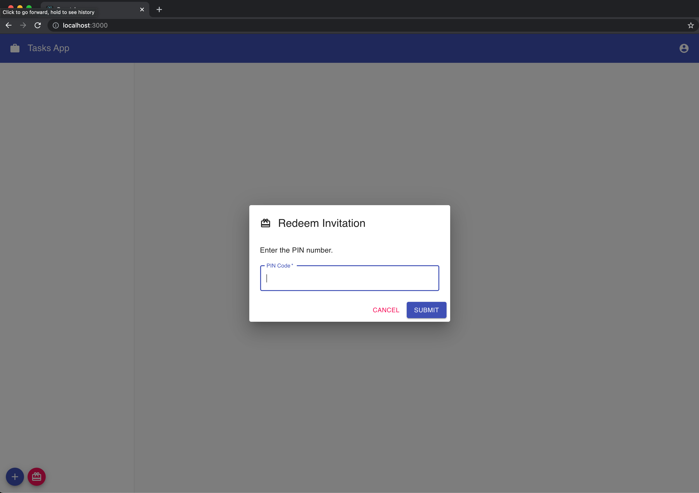

In order to share data we add to the party, we have to invite other peers to it. There are two steps required in this process: creating an invitation and redeeming an invitation.

## Create an Invitation

We have to create an invitation code that we will share with the peer we want to invite. This process is called _interactive_ since it requires the invitee to redeem the invitation code and provide a pin code that will be generated once the invitation code is validated.

We will then create a new component `src/components/TaskList.js` that will handle the invitations process and also the actual app logic:

```jsx:title=src/components/TaskList.js
import React, { useState } from 'react';

import { Fab } from '@material-ui/core';
import { Share as ShareIcon } from '@material-ui/icons';
import { makeStyles } from '@material-ui/core/styles';

import { useParty } from '@dxos/react-client';
import { PartySharingDialog } from '@dxos/react-ux';

const useStyles = makeStyles((theme) => ({
  container: {
    flex: 1,
    margin: theme.spacing(1),
    overflowY: 'hidden',
  },
  fillVertically: {
    flex: 1,
    display: 'flex',
    flexDirection: 'column',
    overflowY: 'hidden',
  },
  actions: {
    margin: theme.spacing(2),
    '& button': {
      marginRight: theme.spacing(1),
    },
  },
}));

const TaskList = ({ partyKey }) => {
  const classes = useStyles();
  const [shareDialog, setShareDialog] = useState(false);
  const party = useParty(partyKey);

  const handleShare = () => {
    setShareDialog(true);
  };

  if (!partyKey) {
    return null;
  }

  return (
    <div className={classes.fillVertically}>
      {shareDialog && <PartySharingDialog open party={party} onClose={() => setShareDialog(false)} />}

      <div className={classes.container}></div>

      <div className={classes.actions}>
        <Fab size='small' color='secondary' aria-label='invite' title='Invite people' onClick={handleShare}>
          <ShareIcon />
        </Fab>
      </div>
    </div>
  );
};

export default TaskList;
```

The `TaskList.js` component renders the `PartySharingDialog` component from `@dxos/react-ux`. This component will present a dialog to create new invitations. It receives a `party` and it generates the invitation code when clicking on the "Invite User" button.

Go to your `src/components/Main.js` component and render the `TaskList` component in a main section:

```jsx:title=src/components/Main.js
import React, { useState } from 'react';

import { AppBar, Drawer, Toolbar, Typography } from '@material-ui/core';
import { makeStyles } from '@material-ui/core/styles';
import { Work as WorkIcon } from '@material-ui/icons';

import { useClient } from '@dxos/react-client';

import PartyList from './PartyList';
import TaskList from './TaskList';

const useStyles = makeStyles((theme) => ({
  root: {
    display: 'flex',
  },
  appBar: {
    zIndex: theme.zIndex.drawer + 1,
  },
  logo: {
    marginRight: theme.spacing(2),
  },
  toolbarShift: theme.mixins.toolbar,
  flexGrow: {
    flex: 1,
  },
  drawer: {
    flexShrink: 0,
    width: theme.sidebar.width,
  },
  drawerPaper: {
    width: theme.sidebar.width,
    overflow: 'auto',
  },
  main: {
    height: '100vh',
    display: 'flex',
    flexDirection: 'column',
    flex: 1,
  },
}));

const Main = () => {
  const classes = useStyles();
  const client = useClient();
  const [partyKey, setPartyKey] = useState();

  return (
    <div className={classes.root}>
      <AppBar position='fixed' className={classes.appBar}>
        <Toolbar>
          <WorkIcon className={classes.logo} />

          <Typography variant='h6' noWrap>
            {client.config.app.title}
          </Typography>

          <div className={classes.flexGrow} />
        </Toolbar>
      </AppBar>

      <Drawer
        variant='permanent'
        className={classes.drawer}
        classes={{
          paper: classes.drawerPaper,
        }}
      >
        <div className={classes.toolbarShift} />
        <PartyList selectedPartyKey={partyKey} onSelectParty={(partyKey) => setPartyKey(partyKey)} />
      </Drawer>

      <main className={classes.main}>
        {partyKey && (
          <>
            <div className={classes.toolbarShift} />
            <TaskList partyKey={partyKey} />
          </>
        )}
      </main>
    </div>
  );
};

export default Main;
```

On your browser, when selecting your party from the list, you will see a share button at the bottom of the page. Clicking on it will open the `PartySharingDialog`, and you will be able to invite new users:





To create an invitation, the component makes use of the `useInvitation` hook provided by `@dxos/react-client`:

```jsx:title=@dxos/react-ux/PartySharingDialog.js
// You don't need to add this to your code. It's already provided by this component.

import { useInvitation } from '@dxos/react-client';

//...

const [inviteCode, pin] = useInvitation(party.key, {
  onDone: () => onInvitationDone(newInvitation.id),
  onExpiration: newInvitation.expiration && () => setExpired(true),
  expiration: newInvitation.expiration,
});
```

At this point, clicking on the "link" icon we can copy to clipboard the `inviteCode` which is the code we have to share with the peer we want to invite.



As mentioned before, this process is interactive. Once the code is redeemed by the peer, we will get notified and the `pin` value, provided by the `useInvitation` hook, will be available. The peer will be required to enter the `pin` value to finish the invitation process.

The `PartySharingDialog` component shows the `inviteCode` until the `pin` is available and then switch to display the `pin` code.



## Redeem Invitation

We now need to give our users the possibility to redeem an invitation so they are able to join the party. Lucky for us, the `@dxos/react-ux` package already exports a `RedeemDialog` component that we can make usage of.

Let's got now to our `src/components/PartyList.js` component and place the following:

```jsx:title=src/components/PartyList.js
import React, { useState } from 'react';

import {
  Avatar,
  Fab,
  IconButton,
  List,
  ListItem,
  ListItemAvatar,
  ListItemSecondaryAction,
  ListItemText,
} from '@material-ui/core';
import { makeStyles } from '@material-ui/core/styles';
import {
  Add as AddIcon,
  Assignment as PartyIcon,
  Redeem as RedeemIcon,
  Settings as SettingsIcon,
} from '@material-ui/icons';

import { useParties } from '@dxos/react-client';
import { RedeemDialog } from '@dxos/react-ux';

import PartySettings from './PartySettings';

const useStyles = makeStyles((theme) => ({
  root: {
    display: 'flex',
    flexDirection: 'column',
    flex: 1,
  },
  grow: {
    flex: 1,
  },
  listItem: {
    '& .actions': {
      opacity: 0.2,
    },
    '&:hover .actions': {
      opacity: 1,
    },
  },
  listItemText: {
    overflow: 'hidden',
    textOverflow: 'ellipsis',
    whiteSpace: 'nowrap',
  },
  actions: {
    margin: theme.spacing(2),
    '& button': {
      marginRight: theme.spacing(1),
    },
  },
}));

const PartyList = ({ selectedPartyKey, onSelectParty }) => {
  const classes = useStyles();
  const [redeemDialog, setRedeemDialog] = useState(false);
  const [{ settingsDialog, settingsPartyKey }, setSettingsDialog] = useState({});
  const parties = useParties();

  const handleCreateParty = () => setSettingsDialog({ settingsDialog: true });

  const handleRedeemParty = () => setRedeemDialog(true);

  return (
    <div className={classes.root}>
      {settingsDialog && (
        <PartySettings
          partyKey={settingsPartyKey}
          onClose={({ partyKey }) => {
            setSettingsDialog({});
            if (partyKey) {
              onSelectParty(partyKey);
            }
          }}
        />
      )}

      {redeemDialog && <RedeemDialog onClose={() => setRedeemDialog(false)} />}

      <List disablePadding>
        {parties.map((party) => (
          <ListItem
            button
            key={party.key}
            selected={selectedPartyKey === party.key}
            onClick={() => onSelectParty(party.key)}
            classes={{ container: classes.listItem }}
          >
            <ListItemAvatar>
              <Avatar>
                <PartyIcon />
              </Avatar>
            </ListItemAvatar>

            <ListItemText
              primary={party.getProperty('title')}
              classes={{
                primary: classes.listItemText,
              }}
            />

            <ListItemSecondaryAction className='actions'>
              <IconButton
                size='small'
                edge='end'
                aria-label='settings'
                title='Settings'
                onClick={() => setSettingsDialog({ settingsDialog: true, settingsPartyKey: party.key })}
              >
                <SettingsIcon />
              </IconButton>
            </ListItemSecondaryAction>
          </ListItem>
        ))}
      </List>

      <div className={classes.grow} />

      <div className={classes.actions}>
        <Fab size='small' color='primary' aria-label='add' title='Create party' onClick={handleCreateParty}>
          <AddIcon />
        </Fab>

        <Fab size='small' color='secondary' aria-label='redeem' title='Redeem invitation' onClick={handleRedeemParty}>
          <RedeemIcon />
        </Fab>
      </div>
    </div>
  );
};

export default PartyList;
```

We are rendering now the `RedeemDialog` and also a button to show it.

If you go to your app in the browser, you will see that button next to the create party button. Go ahead and try it yourself.



The redeem process consists of 2 steps: redeeming the code and validating the pin number. The dialog displays a simple form with a text area to introduce the invitation code.

The `RedeemDialog` component uses a `useInvitationRedeemer` hook from `@dxos/react-client` to handle the process.

```jsx:title=@dxos/react-ux/RedeemDialog.js
// You don't need to add this to your code. It's already provided by this component.

import { useInvitationRedeemer } from '@dxos/react-client';

//...

const [redeemCode, setPin] = useInvitationRedeemer({
  onDone: () => handleDone(),
  onError: (ex?: string) => handleInvitationError(String(ex)),
  isOffline,
});
```

Once the user submits the `invitationCode`, it will be sent to the `redeemCode` function and it will make available the `pinCode` on the other peer screen.

We then switch to the next step and display an input field to provide the pin number. Once the user presses the send button, we call the `setPin` passing the `pinCode` value. If everything goes well, then `onDone` will be called.



## Test it yourself

Open your app in two different browser sessions. It could be an incognito window with a separate session or a different browser.
We will simulate the actions of two users:

- In one window, with a party created, click the invitation button, **invite a user** and copy the invitation code to the clipboard.
- In the other browser choose _Redeem invitation_. **Paste the invitation code** and submit. The app will require a passcode.
- After some seconds it should appear in the Party Sharing Dialog of the first browser.
- Copy the passcode from the first, complete it in the second browser, and click _Send_. You should notice **the newly created party appearing in the lists column of the second browser**.
- That list is now shared between those two users.
