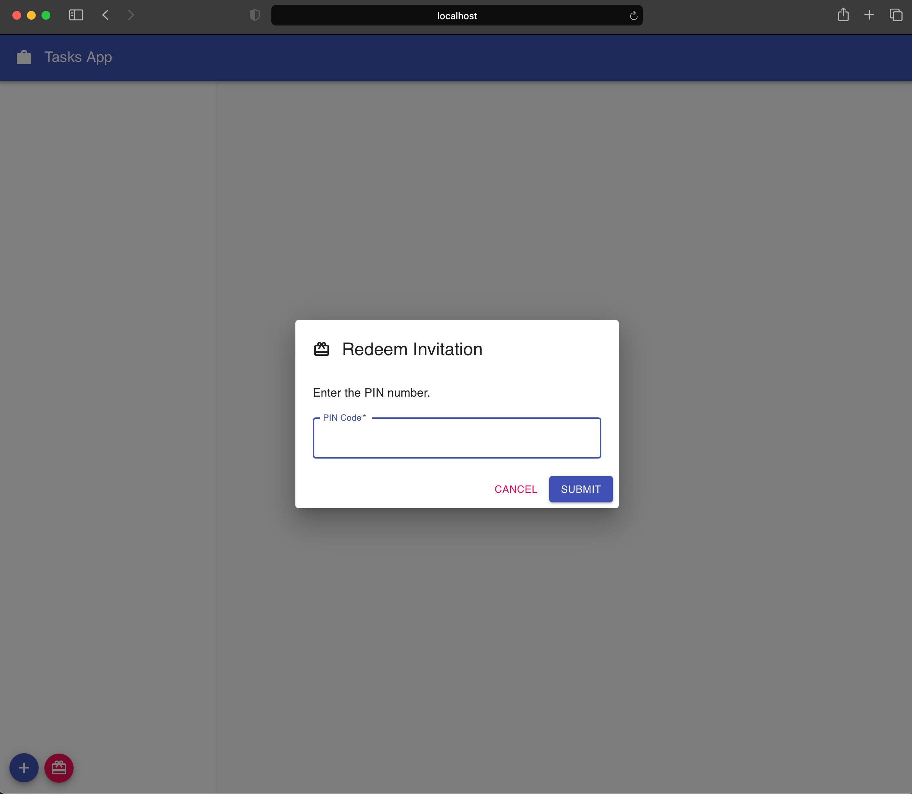

Before we can share the data we create in a party, we have to invite or grant access to other peers into the party. There are two steps required in this process: creating an invitation and redeeming it.

## Create Invitation

We have to create an invitation code that we will share with the peer we want to invite. This process is called _interactive_ since it requires the invitee to redeem the invitation code and provide a pin code that will be generated once the invitation is redeemed.

The `TaskList.js` component renders the `PartySharingDialog` component from `@dxos/react-client`. This component will present a Dialog to create new invitations. The component receives the `party` and it generates the invitation code when clicking on the "Invite User" button.


To create an invitation, the component makes use of the `useInvitation` hook provided on `@dxos/react-ux`:

```js:title=PartySharingDialog.js
import { useInvitation } from '@dxos/react-client';

//...

const [inviteCode, pin] = useInvitation(party.key, {
  onDone: () => onInvitationDone(newInvitation.id),
  onExpiration: newInvitation.expiration && () => setExpired(true),
  expiration: newInvitation.expiration,
});
```

At this stage, clicking the "link" icon we can copy to clipboard the `inviteCode` which is the code we have to share with the peer we want to invite.


The copy to clipboard functionality is achieved through the `CopyToClipboard` component from `react-copy-to-clipboard`:

```js:title=PendingInvitation.js
import { CopyToClipboard } from 'react-copy-to-clipboard';

<CopyToClipboard text={inviteCode} onCopy={handleCopy}>
  <IconButton size='small' color='inherit' aria-label='copy to clipboard' title='Copy to clipboard' edge='start'>
    <LinkIcon />
  </IconButton>
</CopyToClipboard>;
```

As mentioned before, this process is interactive. Once the code is redeemed by the peer, we will get notified and the `pin` value, provided by the `useInvitation` hook, will be available. The peer will be required to enter the `pin` value to finish the invitation process.

In the code, we show the `inviteCode` until the `pin` is available and then switch and display the `pin` code.


## Redeem Invitation

The `PartyList.js` component renders a `RedeemDialog` component also from `@dxos/react-ux`. The redeem dialog is responsible for the logic to claim the invitation and be able to join the party.

The redeem process consists of 2 steps: redeeming the code and validating the pin number. The Dialog displays a simple form with a text area to introduce the invitation code which is saved in a state variable `invitationCode`.


The `RedeemDialog` component uses a `useInvitationRedeemer` hook from `@dxos/react-client` to handle the process.

```js
import { useInvitationRedeemer } from '@dxos/react-client';

//...

const [redeemCode, setPin] = useInvitationRedeemer({
  onDone: () => handleDone(),
  onError: (ex?: string) => handleInvitationError(String(ex)),
  isOffline,
});

// ...

const handleEnterInvitationCode = async () => {
  if (isProcessing) {
    return;
  }

  redeemCode(invitationCode);
  setStep(1);
};
```

The `handleEnterInvitationCode` is attached to a click button. The user enters the code provided by the other peer and presses the send button. The `invitationCode` is passed to `redeemCode` function.


After that we switch to the next step and display an input field to provide the pin number and store it in the `pinCode` state variable. Once the user presses the send button, we call the `setPin` passing the `pinCode` value. If all goes well, then `onDone` will be called.


