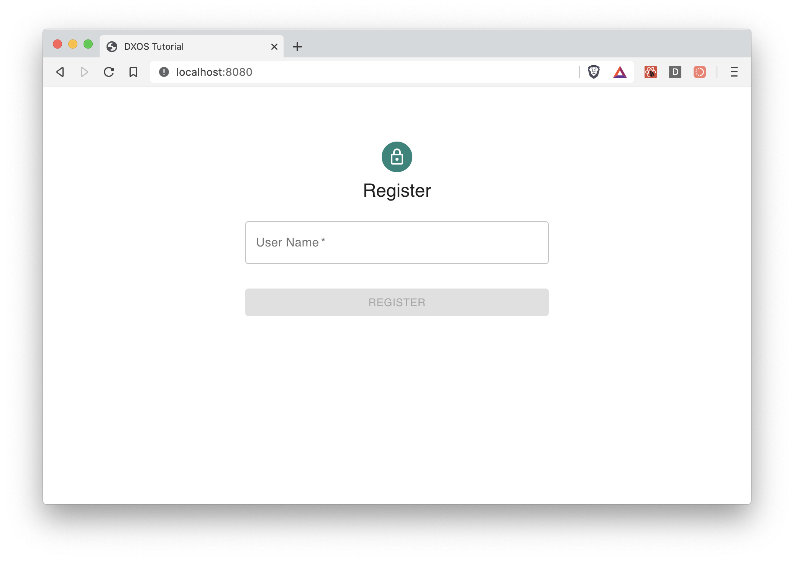

Once we connected our client into our React Application, the very first step is to create a User Profile.

This is very similar to a login or signup page. The Client holds the profile for you, so you can easily check if the user created a profile by using the react hook `useProfile` as you can see in the `App.js` file:

```js
import React from 'react';

import { useProfile } from '@dxos/react-client';

import SignUp from './containers/SignUp';
import Main from './containers/Main';

export default function App () {
  const profile = useProfile();

  return (!profile ? <SignUp /> : <Main />);
}

```

Here we decide to show the `SignUp` component if there is no profile in the system yet.

## Create a Profile

Jump into `containers/SignUp.js`. This component is a very simple Sign up form. The user have to provide a username in order to create a profile. The input element will save the state in the `username` variable and then `handleSignUp` is the invoked method when the user clicks on the `Sign Up` button.



The `handleSignUp` generates a `keypair` and sets the profile using the client. The client is retrieved by the react hook `useClient`.

```js
export default function SignUp() {
  const client = useClient();
  const [username, setUsername] = useState('');
  
  const handleSignUp = async (username) => {
    const { publicKey, secretKey } = createKeyPair();
    await client.createProfile({ publicKey, secretKey, username });
  }

  return (
    // ... 
  );
```
 