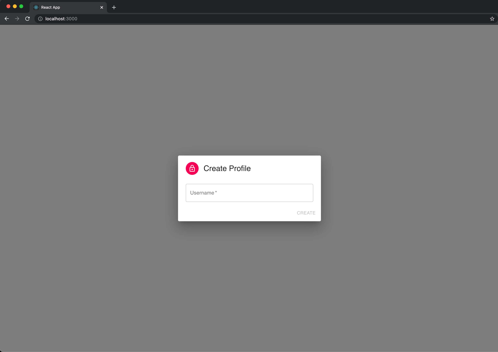

After we connect our Client to our React Application, the very first step is to get the created user's profile.

## Check If a Profile Is Created

The Client stores the profile for you. You can easily check if the user created a profile by using the react hook `useProfile` provided by `@dxos/react-client` in the `Root.js` file:

```js
import React from 'react';
import { useClient, useProfile } from '@dxos/react-client';

import Main from './Main';
import ProfileDialog from './ProfileDialog';

const Root = () => {
  const client = useClient();
  const profile = useProfile();

  if (!profile) {
    return <ProfileDialog open />;
  }

  return <Main />;
};
```

Here we decide to show the `ProfileModal` component if there is no profile in the system yet, to ask the user to create one.

## Create a Profile

This is very similar to a login or a sign up page. Jump into `ProfileModal.js`. This component is a very simple sign up form. The user has to provide a username in order to create a profile. The input element will save the state in the `username` variable and then `handleRegistration` is the invoked method when the user clicks on the `Create` button.



`handleRegistration` generates a `keypair` and sets the profile using the client. The client is retrieved by the react hook `useClient`.

```js
import React from 'react';
import { createKeyPair } from '@dxos/crypto';
import { useClient, useProfile } from '@dxos/react-client';

import Main from './Main';
import ProfileDialog from './ProfileDialog';

const Root = () => {
  const client = useClient();
  const profile = useProfile();

  if (!profile) {
    const handleRegistration = async ({ username }) => {
      if (username) {
        const { publicKey, secretKey } = createKeyPair();
        await client.createProfile({ publicKey, secretKey, username });
      }
    };

    return <ProfileDialog open onClose={handleRegistration} />;
  }

  return <Main />;
};
```
