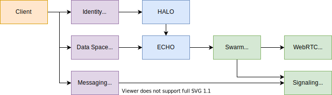
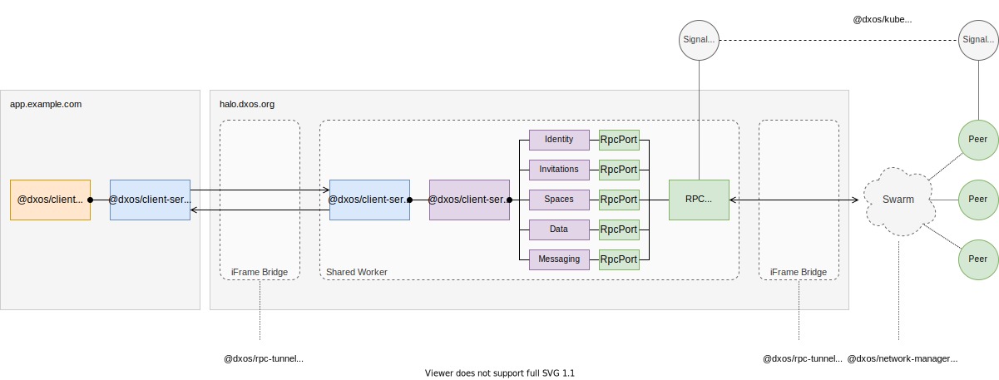
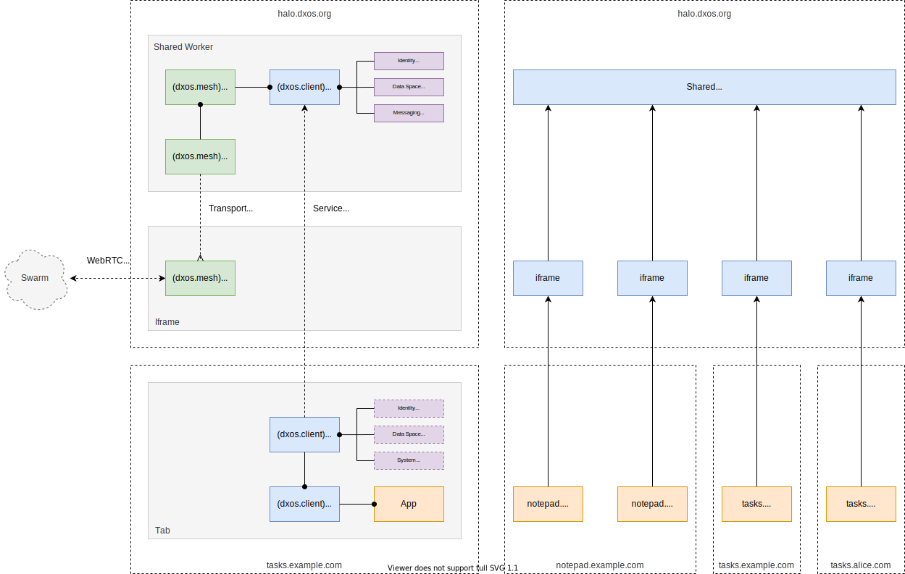

# Client Spec <!-- omit in toc -->

<!-- @toc -->

- [1. Introduction](#1-introduction)
- [2. Specification](#2-specification)
  - [2.1. Identity and Device Management](#21-identity-and-device-management)
  - [2.2. Circles and Collaboration](#22-circles-and-collaboration)
  - [2.3. Branespace Exploration](#23-branespace-exploration)
- [3. Design Overview](#3-design-overview)
  - [3.1 Client Services](#31-client-services)
  - [3.2 Service Proxies](#32-service-proxies)
  - [3.3 Message Routing within the Browser](#33-message-routing-within-the-browser)
  - [3.4 Cross-domain Routing](#34-cross-domain-routing)
- [4. Reference](#4-reference)

## 1. Introduction

The DXOS Client is part of the core DXOS Typescript API.
It is the root class used to implement decentralized applications that run on the DXOS network.
These applications can run as Progressive Web Apps (PWA) in browsers and mobile devices, as native desktop apps, long running Web services, and command line interfaces (CLIs).

## 2. Specification

The Client should implement the following features:

### 2.1. Identity and Device Management

*   Create a new HALO identity.
*   Recover an existing HALO identity.
    *   Using a seed phrase.
    *   Using a credential issued from another device.
*   Display and edit metadata relating to the user's profile.
*   Securely store the user's HALO using password protected encryption.
*   Securely uninstall the client erasing all local information.
*   Manage multiple client instances installed on other devices and platforms.
    *   Authenticate new clients.
    *   Revoke existing clients.
    *   View the set of existing clients.
    *   Initiate the installation of other platform clients:
        *   Terminal opens a PWA in the browser and initiates client authentication.
    *   Support multiple isolated instances in the CLI (e.g., via ENV variable).
    *   Support installation from a KUBE node (e.g., via a URL).

### 2.2. Circles and Collaboration

*   Provide a discovery key that can be presented to other users running the client.
*   Manage a set of contacts (user profiles).
*   Send and receive ephemeral messages to other users.
*   Publish profile to DXNS.
*   Manage HALO credentials and keychain.
    *   Store and use KUBE credentials to manage KUBE nodes.

### 2.3. Branespace Exploration

*   List Brane Spaces.
*   Query/navigate/visualize Space graph.

## 3. Design Overview

### 3.1 Client Services

DXOS applications are peer-to-peer applications that synchronize state over a network swarm. 
The Client uses the WebRTC transport in order to stream data and achieve NAT traversal.

The application stack includes a replicated database that stores the user's identity (HALO) and data spaces (ECHO).
Applications share these resources, which must be kept consistent across concurrently running application instances.

### 3.2 Service Proxies

The client accesses these resources via async RPCs defined as protobuf services, which may access the `NetworkManager`. 
The `ServiceHost` is an in-memory endpoint for multiple services, which may be accessed through the Client API via the `ServiceProxy`.

### 3.3 Message Routing within the Browser

In the browser, the main application stack runs within a long running [Shared Worker](https://developer.mozilla.org/en-US/docs/Web/API/SharedWorker),
while the application client and UX run within a browser tab.
In this manner, different applications running in multiple tabs share the same core stack and database.

Client instances running in the tab include a `ServiceProxy` that provides access to shared modules that are defined by protobuf service APIs (HALO, ECHO, etc.) The `ServiceProxy` communicates with a `ServiceHost` in the shared worker via [window messaging](https://developer.mozilla.org/en-US/docs/Web/API/Window/postMessage).

Unfortunately, shared workers do not support WebRTC [^1].
As a consequence, the client stack running in the tab implements a WebRTC proxy that is used by a WebRTC router running in the shared worker.
This proxy/router mechanism implements the transport abstraction defined by the `NetworkManager`, which is used by services running in the shared worker.

When multiple applications are running concurrently (in multiple tabs), the WebRTC router elects a proxy instance to be a gateway to a given swarm.
As tabs are opened and closed, the router may dynamically elect a new instance to become the gateway.

NOTE: The router may elect different tabs to provide WebRTC connectivity to different swarms at the same time (e.g., where swarms correspond to different ECHO Spaces.)

[^1]: [WebRTC in SharedWorker](https://hackmd.io/@gozala/S1d2O_ecU)

### 3.4 Cross-domain Routing

Shared workers are available across tabs (windows) loaded from the same domain.
However, users may wish to use their same HALO identity across multiple applications loaded or installed from different domains.

> TODO(wittjosiah): Please validate below.

In this case, the user would install a special HALO application from a given domain (say, `dxos.org`), then applications loaded from other domains would be able to access the HALO application via transport proxies loaded into associated iframes.

## 4. Reference

The following developer tools projects use the DXOS client.

*   [Kodama CLI](https://github.com/dxos/protocols/tree/main/packages/demos/kodama)
*   [HALO wallet browser extension](https://github.com/dxos/protocols/tree/main/packages/wallet/wallet-extension)
*   [Devtools browser extension](https://github.com/dxos/protocols/tree/main/packages/devtools/devtools-extension)
*   [DX CLI](https://github.com/dxos/cli)

