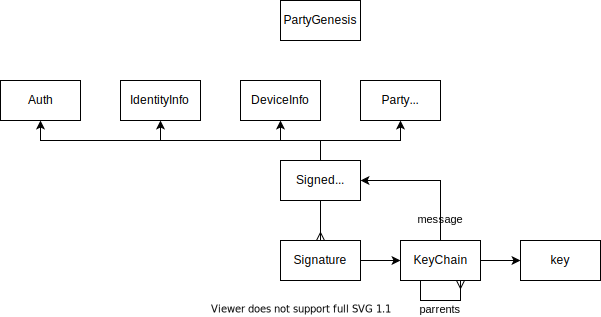

# Credentials




## Questions

- Key chain
  - How is the chain of authority established? Who validates the signed messages that are a part of the keychain?
  - Is it conflating party credentials (member admit) with profile credentials (device admit)?
- How does this relate to member authentication?
  
  Conceptually there must be a verification function in the form of:
  ```
  verify(partyState, credentials, presentation)
  ```

  where:
  
  `partyState` - closure of all party credential messages that were recoded.
  `credentials` - additional credential messages that establish the chain-of-authority for the member that is being verified.
  `presentation` - one-time presentation with a challenge.

  Example:

    Party state: 
      - `admitToParty(to=party-1, member=identity-1)`

    Credential:
      - `admitToProfile(to=identity-1, member=device-1)`

    Presentation:
      A challenge signed by `device-1` key.
