# Meta Graph Design Document

This document presents the design of the Decentralized Meta Graph (DMG).

<!-- @toc -->

- [Meta Graph Design Document](#meta-graph-design-document)
  - [1. Terminology](#1-terminology)
  - [2. Basic Concepts](#2-basic-concepts)
    - [2.1. Graph](#21-graph)
      - [2.1.1. Resources](#211-resources)
      - [2.1.2. Computation](#212-computation)
      - [2.1.3. Issues](#213-issues)
    - [2.2. Subnets](#22-subnets)
  - [3. Architecture](#3-architecture)
    - [3.1. KUBE Services](#31-kube-services)
    - [3.2. KUBE Architecture](#32-kube-architecture)
    - [3.3. Service Monitoring and Scale](#33-service-monitoring-and-scale)
  - [4. Notes](#4-notes)

## 1. Terminology

**Credential** - Verifiable credential that enables decentralized access control within the Subnet (e.g., administrative, read/write, replication, control).
Each KUBE maintains a secure Credential store.

> *   Conceptually part of HALO, but may be implemented via TLS.
> *   TODO: Disambiguation TLS certificates from credentials (vs. CA/DNS).
> *   TODO: Connect Pierre with Ben Laurie!

**DNS** - Global authority for domain records.

**KUBE** - Individual Host (Subnet Node) running the KUBE daemon.

> *   TODO: Consider renaming but used `kube` until determined.

**Realm** - Logical partition of the federated DMG consistent across the Subnet.

**Root CA** - Root Certification (for the Subnet). Used to enroll KUBEs into the Subnet and is the root for other Credentials used within the Subnet.

**Subnet** - A cluster of KUBE nodes under local authority.

## 2. Basic Concepts

*   DMG is a decentralized federated graph.
*   It consists of locally controlled subnets that are made up of KUBE nodes.

### 2.1. Graph

Each DMG subnet consists of a graph of Records called Nodes.
Nodes are typed protocol buffer encoded data structures.
Different Record types represent different Graph resources and may be handled differently by the KUBE Web server in a manner similar to [MIME types](https://mimetype.io/all-types).

#### 2.1.1. Resources

The KUBE server contains a Web server that maps conventional HTTP requests onto files represented within the graph.

DMG Records may be mapped onto URLs as follows:


| Part       | Description                                                                  |
| ---------- | ---------------------------------------------------------------------------- |
| `scheme`   | The KUBE server manages wildcard TLS certs.                                  |
| `realm`    | Subdomains are used to demark DMG partitions called Realms.                  |
| `subnet`   | Each subnet is mapped onto a DNS domain name.                                |
| `record`   | Part of the URL path maps onto a DMG record.                                 |
| `resource` | The remainder of the path maps onto a resource determined by the DMG record. |

Realms represent a logical partition of the KUBE subnet's DMG.
They map directly onto a root folder within the graph.

The URL's `path` components is split into `record` and `resource` parts.
The `path` is used to traverse the DMG graph from the root associated with the `realm` until a DMG Record is found.
The remainder of the `path` is then considered to be a `resource` path within the associated record.



The DMG record can be retrieved as JSON objects by passing appropriate [Accept](https://developer.mozilla.org/en-US/docs/Web/HTTP/Headers/Accept) and [Authroization](https://developer.mozilla.org/en-US/docs/Web/HTTP/Headers/Authorization) headers.

**Example**

The following example illustrates a DMG Record that represents a Web application.

```json
{
  "type": "schema.dxos.org/dmg/webapp",
  "manifest": {
    "default": "index.html",
    "files": [
      "index.html",
      "main.js",
      "img": [
        "logo.png"
      ]
    ]
  }
}
```

> - TODO: DMG Record protocol buffer schema.

The DMG Record can be retrieved as a JSON document via a TCP or HTTP request:

```bash
> curl -H "Accept:application/json" -H "Authorization:TOKEN" https://beta.example.com/app/notepad | jq
```

The `type` field references a DMG Record that represents a protocol buffer schema definition.
Note: DMG references may point to Records defined in another Subnet.

Given the Example above, the following are all valid requests that return a resource located within a DMG Record's bundle.

```bash
curl https://beta.example.com/app/notepad
curl https://beta.example.com/app/notepad/index.html
curl https://beta.example.com/app/notepad/main.js
```

#### 2.1.2. Computation

DMG Records may also reference serverless compute endpoints that can be invoked by HTTP requests.

**Example**

The following example, defines a script.

```json
{
  "type": "/dxos/schema/webapp",
  "manifest": {
    "exec": [
      "data": {
        "method": "POST",
        "entry": "exec.js"
      }
    ]
  }
}
```

The script can be invoked by making an HTTP POST request.

```bash
curl -X POST -H "Accept:application/json" https://beta.example.com/app/notepad/data
```

#### 2.1.3. Issues

*   Realms, Subnets, Domains, Logical partitions, mapping
*   Hierarchical records (e.g., /app/notepad, /app/notepad/beta)
*   Lambda and other compute (e.g., invoking other platforms)
*   IPLD? DXLD?

### 2.2. Subnets


## 3. Architecture

### 3.1. KUBE Services



### 3.2. KUBE Architecture


### 3.3. Service Monitoring and Scale



*   Monitoring
*   Autoscale
*   Subnet resource management

## 4. Notes

*   Each KUBE runs a Web server that handles HTTP request.
    *   The host (example.com) is a subnet (DNS may be managed by the subnets own DNS servers).

*   Example URL:
    *   <https://dev.example.com/office/notepad>
    *   <https://example.com/dev/office/notepad>
    *   <https://example.com/office/notepad/dev>

*   The Web server resolved \['/dev', '/office/notepad'] to a DMG record (which is represented by a git ref)
    *   ISSUE: Is the subdomain special -- e.g., should it represent a "Realm"?
        *   Realm is a unit of organization of files (users can have an unlimited number)
        *   Possible to map local subnet Realms onto other Realms? (e.g., live.rich.com/app => beta.example.com/app)
        *   If not, then the first 2 URLs above would be equivalent?
        *   ISSUE: Browser subdomain isolation
        *   ISSUE: Browser will resolve files relative to URL (not to contents of record)
    *   The DMG record is a typed record (protobuf) that defines the resource
    *   The record may reference other files within the DMG (e.g., PNG, JSON document, index.html, javascript, Android PDK)
    *   Based on the record type, the web server returns the associated content

        <https://dev.example.com/office/notepad>
        \=> DMG Record{ mime: 'text/html', path: 'index.html', ref: tree-ish, ...meta }
        <https://dev.example.com/office/notepad/index.html>   => tree-ish/index.html
        <https://dev.example.com/office/notepad/main.js>      => tree-ish/main.js

        `curl https://dev.example.com/office/notepad => index.html`
        `curl -H "Accept:application/dmg" https://dev.example.com/office/notepad | jq`
        \=> JSON DMG record (represents the app bundle)

        (NOTE: tree-ish == SHA)

        curl <https://dev.example.com/office/notepad/main.js> => main.js

        *   Path requests are relative to the nearest ancestor representing a DMG record

        *   E.g., HTTP GET `https://dev.example.com/office/notepad/main.js` is handled by the Web server
            *   First we request the DMG record associated with the nearest ancestor (i.e., `dev::office/notepad`)
                *   (This is equivalent to `curl -H "Accept:application/dmg" -H "Authorization:xxx" https://dev.example.com/office/notepad`)
            *   The DMG record references a SHA and path
            *   The relative path from this entry point is then used to serve an individual file

        *   ISSUE: One repo per Realm?

        *   ISSUE: Are we overloading browser isolation with Realm organization?

        *   ISSUE: DMG record can map subpath onto Lambda

*   Each KUBE Node creates a single local repo named `dmg` (`~/.kube/dmg.git`).

*   Suppose we have a Subnet controlled by `alice` with three KUBE Nodes (`a1`, `a2`, `a3`).
    Each local repo has a `remote`, which references the other Nodes on the Subnet.

*   All changes to the repo are replicated (pushed) to other Nodes.

*   The Subnet maintains a locally consistent repo.

2022-07-26 \[RB, Zhenya]

*   ISSUE: Mapping URLs onto records (e.g., significance of subdomain and path)?
*   ISSUE: Management of records (e.g., into Realms)

2022-07-24 \[RB, Pierre]

*   What are the relationships between URL => Realm => Refs (and the implied mapping)?
*   Of course URL => Subnet, but the part of the URL that isn't just the host (i.e., subnet) consists of (possibly) a subdomain name (alice.example.com) and a path (/notepad).
*   That's what i'm calling a "name" or DXN (i.e., alice/notepad).
*   So a URL identifies both a Subnet and a resource Name (DXN).
*   Names (DXNs) contain both a Realm and a Resource (path). E.g., "alice.notepad" references the Realm "alice" and the Resource "notepad".
*   Questions:
*   1.  Can Realms be hierarchical (e.g., dxos.devnet vs. alice).
*   2.  Are Realms fixed to Subnets? Are they fixed to Domain names? (What if I don't have a domain name? What if I want to transfer them?). I don't think they are.
*   3.  But if not, then how do we have globally unique Realm names?
*   4.  DMG maintains the map between the name and the refs -- what is the model for this? Each subnet is responsible for maintaining it's own map -- since each subnet is the AUTHORITY (with different forms of consensus) for it's SET of realms.

<!---->

        alice (alice.com) :: [a1, a2, a3]
            /alice/notepad
            /alice/tasklist
            /bob/notepad
                /pub

        bob (bob.com) :: [b1]
            /bob/notepad
                /dev
                /pub

        Browser
            https://dxos.org/.well-known
                                /status
                                /ipfs/Qx28237982374982

            https://dxos.org/alice/notepad

                            => App Service running on the dxos.org cluster (resolved by DNS)
                                /alice/notepad 
                                    => /refs/dxos.org/alice/notepad/prod => { dx.yml, index.html, indes.js }

            DXNS (runs on every Subnet)
                - Maps DXN path/name (embedded within URL and subdomain) to git ref; App server then retrieves and serves these files.
                - Allows publishing via either:
                    - Blockchain based authority (which dxos.org runs, and rich.com also chooses to run) has on-chain map.
                        - Trust based on account
                    - Local (running on pcarrier.com) authority based on ssh keys and mapping within git.


        On Alice's workstation

            /refs/heads/alice/notepad

        Publishing to dxos.org

            1. Create DX account for DXNS (since dxos.org is running the DXNS service).
            2. Create authority `alice` by staking DX tokens (required by DXNS service).
            3. Publish 
                - create empty signed commit (aka release branch)
                - push commit to local repo then replicate to dxos.org

        Publishing locally

            [DNS domain subnet]/[authority]]/[resource]

