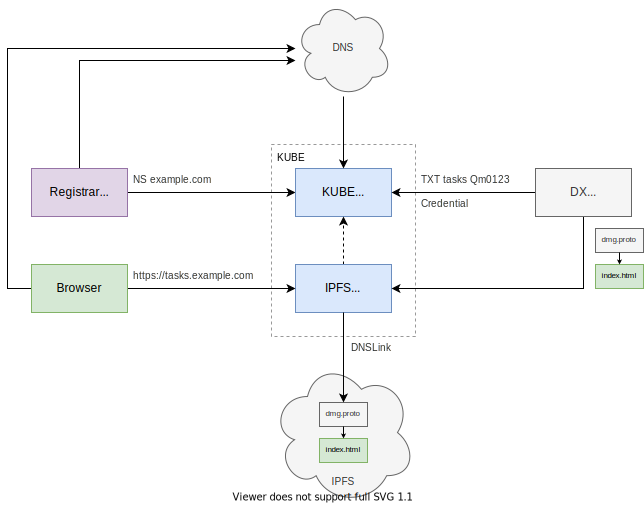

# DNS

- TLS
  - Requires root CA; pubkey pre-installed in OS (and accessible to browser); uses to validate certificate chain.
  - Could proxy via centralized server (dxos.org); but: a) performance; b) man-in-the-middle.
  - 302 redirect would require redirected server to provide cert.

- Wilcard cert
  - letsencrypt
  
- TLS CSR
  - https://letsencrypt.org/how-it-works
  - https://www.globalsign.com/en/blog/what-is-a-certificate-signing-request-csr

**Hostname resolution**

- `scutil --dns` list of resolvers (e.g., mDNS, loopback, search domains).

- DNS
  - https://developer.mozilla.org/en-US/docs/Glossary/DNS

- mDNS
  - DNS over multicast protocol (layer 3)
  - LAN might defeat broadcast

- NAT

- VPN
  - [Tailscale](https://tailscale.com/kb) (zero config VPN)
    - Github app for DXOS

- `/etc/hosts`
  - Requires root to configure mutiple subdomains to reference localhost.

- loopback
  - Avoid TLS issue
  - Configure 256 different IP addresses `127.0.0.x` for domain isolation

- Search domains
  - E.g., Configure `bar.com` as search domain; `ping foo` would resolve to `foo.bar.com` if it exists.
  - See `resolved.conf` [#433](https://github.com/dxos/protocols/issues/433)

- DXOS.org wildcard cert
  - Possibly to create dynamically for deeper subdomains

- Custom DNS server

- Custom browser

- Custom KUBE hardware

- `srv.us`

## Design

## Resources

- https://www.abetterinternet.org

### Secure hosting/delivery of software to browser

- Development
- Local subnet
- Public

### Solution Candidate

- Secure installation of HALO core app from dxos.org or trusted server
  - HALO app mediates connections to "untrusted" apps in separate tabs.
- Dynamically install client apps from server
  - HTML Script integrity check
    - https://developer.mozilla.org/en-US/docs/Web/HTML/Element/script#attr-integrity
  - HALO validates integrity using credential presentation in custom header

