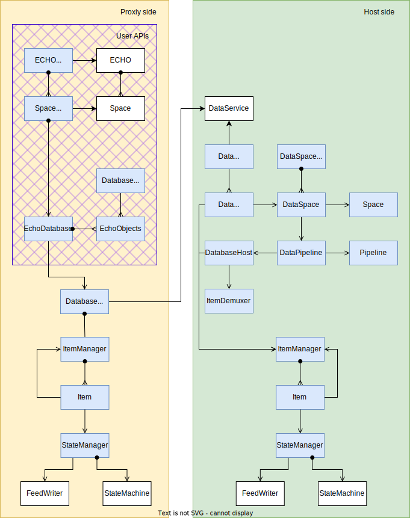

# ECHO Spec

<!-- @toc -->

## 1. Introduction

ECHO (The **E**ventually **C**onsistent **H**ierrarhical **O**bject store) is a peer-to-peer graph database.

## 1.2. Terminology

***Atom*** -

***Party*** -
Context for collaboration and data replication.

***Epoch*** -

***Feed*** -
Append-only hash-linked datastructure containing immutable messages.

***Item*** -
Globally addressable data object.

***Link*** -

***Model*** -
Type-specific API associated with a data Item.

***Timeframe*** -
Monotonic sequence number used to order messages across multiple feeds.

## 1.3. Basic Concepts

ECHO is a decentralized graph database. 

The diagram below illustrates the data processing pipeline.

## 1.4. Design

### 1.4.1. Message Ordering

#### 1.4.1.1. Timeframes

- Messages are written with the peer's current timeframe. This creates a partial order.
- Message ordering is determined by available feeds and the timeframes associated with messages.
- Clients may process messages in different order (potential discrepancies are rectified downstream by the models).
- DAG; require party key and first feed key.

TODO(burdon): Diagram.

### 1.4.2. Object Graph

- Identity
- Hierarchy

### 1.4.3. Links

### 1.4.4. Models and State Machines

- Pipeline fan-in/out

### 1.4.5. Schema

### 1.4.6. Queries

- Traversal
- Filtering
- Subscriptions

### 1.4.7. Branes

### 1.4.8. Epochs

Epochs are blocks of contiguous messages spanning all peers within a party.
They enable compression for quicker startup, and provide "sync" points for consensus and consistency.

Timeframes provide a common reference point for mutations across the feeds within a party.
However, when peers are partitioned, they start to diverge from each other.
TODO(burdon): Write up branch anaolgy.

#### 1.4.8.1. Control feeds

- Split out HALO and other control messages (like epoch genesis) into own set of feeds.
- Each peer has a writable control feed in addition to its data (ECHO) feed.
- Control feeds can be read and processed independently from data feeds.
- They are piped into PartyStateMachine.

#### 1.4.8.2. Epoch genesis

- When a peer wants to start a new epoch they write an `EpochGensisMessage` into the control feed.
- It contains the timeframe of when the new epoch starts and CID of the data snapshot at that timeframe.

#### 1.4.8.3. Snapshots

- Snapshots allow peers to bootstrap the ECHO state machine from that point in time without reading feed messages before it.
- Snapshots are content-addressed blobs consisting of a hierarchical set of reified HALO and ECHO models.
  - HALO snapshots will be removed once control feeds are implemented.
  - Each items outputs a snapshot from its corresponding model.
  - If the model doesn't override the snapshot, then the list of messages is output.
- They allow compression by removing history.
  - The ObjectModel will just save the current state instead of the list of mutations.
- Peers participate in snapshot exchange protocol, similar to BitTorrent.
  - Based on party policy a particular peer may be authorized to declare snapshots (e.g., a bot); otherwise a peer election may be implemented.
- Snapshots can be split into a tree of blobs as an optimization for more efficient storage/replication.
  - This enables items to restore their models on demand (or for parties to only partially hydrate specific items).
- Snapshots reference the hash of a previous snapshot, which may contain additional historical data.
  - Certain models may decide to discard information when creating a snapshot.
    - Examples: the MessengerModel may discard old messages; the ObjectModel may discard deleted objects.
  - It may be possible for models to asynchronously load previous snapshots to retrieve historical information.
- Snapshots may be analogous to blocks in a blockchain.
- At the beginning of an epoch each model may decide to discard information (e.g., deleted items beyond a TTL); 
  i.e,. that the snapshot currently being created omits certain data.
- Bots may become file storage servers for large data sets, e.g., implementing proxy models (for thin clients).

## 1.5. Milestones

### 1.5.1. V0

- [ ] Each model implements to/from snaphost (defined by protobuf).
  - [ ] Models may decide to discard information.
- [ ] Party creates tree of item snapshots.
- [ ] Party records snapshot file, referenced by CID, which contains the following metadata:.
  - Timeframe
  - Datetime
  - Previous snapshot CID
  - Model versions
- [ ] The epoch generator peer writes an epoch genesis message to its feed.
- [ ] When peers process the epoch genesis message they create the corresponding snapshot and store it locally.
- [ ] When peers join a party they may request the snapshot for a particular epoch.
- [ ] Each peer stores the latest epoch genesis message for each party; this is used to bootstrap (and will be replaced later by the control feed).
- [ ] Ability to simulate multi-peer paries with epoch generation.

ISSUES
- [ ] Who initiates an epoch? E.g., leadership election; hardcoded (bot)?
- [ ] What happens if peers join, but get "stale" messages from peers that have not yet joined the epoch?
- [ ] What if the code changes for models.

    

# 2. Deprecated

Processes mutations and snapshots to maintain a set of items and links with models.
ECHO is a hierrahical graph database where items a stored in a tree structure, connected by links.
Each item or link has state-machine and a model.

- TODO: Set-out basic design-doc process and structure
- TODO: Notes from White paper Google doc
- TODO: Packlets to enforce layer isolation?
  - Factor out ECHO/HALO dispatch (e.g., make PartyManager, Database pluggable)

- Party Manager
  - DAG of feeds
  - DAG of user claims

- Describe basic 3-stage pipeline
  - Disambiguation ECHO, HALO, MESH

- Genesis feed
  - Control feeds
  - Credentials (transitive claims)
  - Separate wholistic tests

- Snaphosts/Epochs

- Time travel/Undo
  - Git/blockchain analogies

- HALO groups

- Light-weight parties (isolation, esp. relating to epochs/undo)
  - Consider party with 1 chess game and 100 coordinated items

- Cross-party linking

- Typed Object models (schema as first-class entities)

- ECHO store without HALO?

- Async client/service architecture
