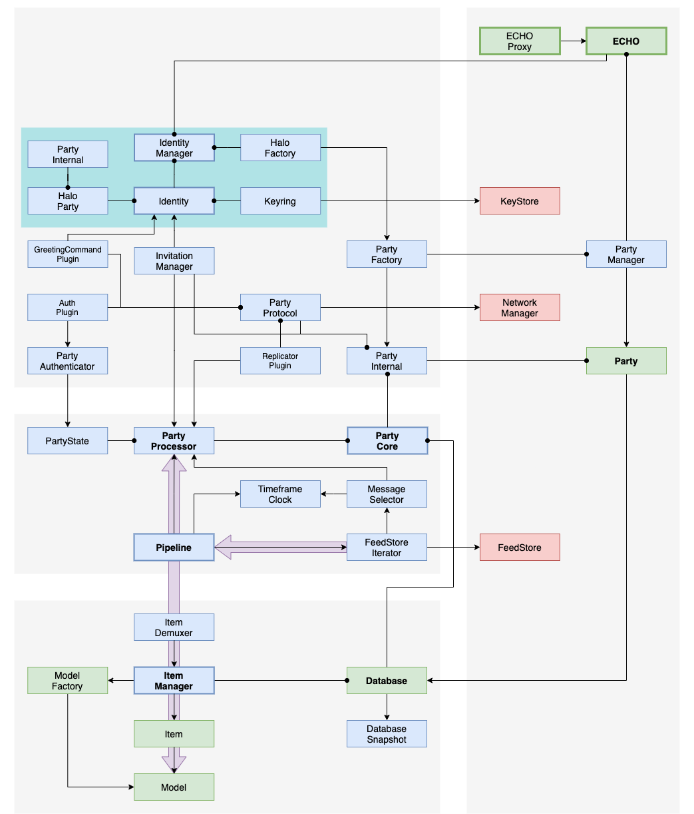

# ECHO

## Database

Root object for an ECHO database.

Hosts the set of items and links.
Allows users to perform queries using the selection API.
The access control and network features are delegated to the `Party` that holds this database.

