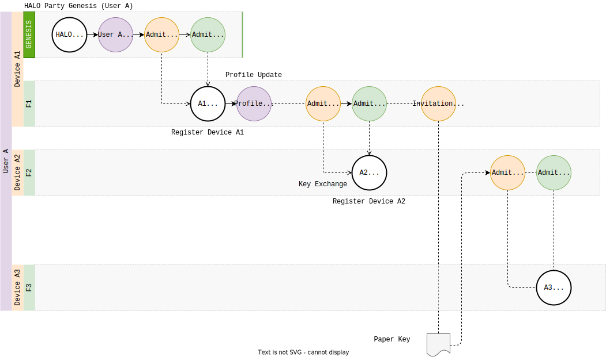
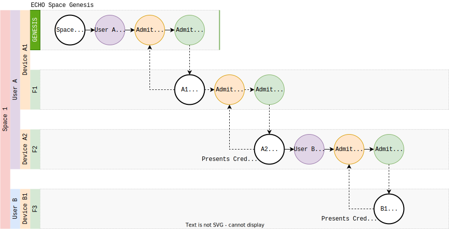

# HALO Spec

<!-- @toc -->

*   [1. Introduction](#1-introduction)
*   [2. Terminology](#2-terminology)
*   [3. Specification](#3-specification)
*   [4. Design](#4-design)
    *   [4.1. HALO](#41-halo)
        *   [4.1.1. Protocol Definitions](#411-protocol-definitions)
        *   [4.1.2. Credentials](#412-credentials)
        *   [4.1.3. HALO Genesis](#413-halo-genesis)
        *   [4.1.4. Device Authorization and Authentication](#414-device-authorization-and-authentication)
        *   [4.1.5. HALO Recovery](#415-halo-recovery)
        *   [4.1.6. Profiles](#416-profiles)
        *   [4.1.7. Circles](#417-circles)
        *   [4.1.8. DID Documents](#418-did-documents)
    *   [4.2. ECHO Spaces](#42-echo-spaces)
        *   [4.2.1. Protocol Definitions](#421-protocol-definitions)
        *   [4.2.2. Genesis](#422-genesis)
        *   [4.2.3. Agent Authorization](#423-agent-authorization)
        *   [4.2.4. Device Authentication](#424-device-authentication)
    *   [4.3. Design Issues](#43-design-issues)
*   [5. Implementation Details](#5-implementation-details)
    *   [5.1. Credential message](#51-credential-message)
    *   [5.2. Keychain](#52-keychain)
    *   [5.3. HALO creation](#53-halo-creation)
    *   [5.4. ECHO Space creation](#54-echo-space-creation)
*   [6. Security Concerns](#6-security-concerns)
    *   [6.1. Aspects of Trust](#61-aspects-of-trust)
    *   [6.2. Trust Models](#62-trust-models)
*   [7. References](#7-references)
*   [8. Appendix](#8-appendix)
    *   [8.1. Protocol Schema](#81-protocol-schema)
    *   [8.2. Example](#82-example)

## 1. Introduction

HALO is a set of protocols and components used to secure decentralized networks.
The HALO protocols enable self-sovereign identity, decentralized identifiers, verifiable credentials, and other mechanisms relating to the security of decentralized systems.
HALO is implemented useing cryptographically secure, privacy respecting, and machine-verifiable messages.

Users and other network participants (Agents) maintain a HALO, which encompasses their identity, digital address book, and access control rights to digital assets withint the DXOS ecosystem.

## 2. Terminology

The following terms are capitalized when referenced in the document.

***Agent*** -
Participant (i.e., bot or user) in the peer-to-peer network.

***Authentication*** -
Mechanism to determine the identity of a given Agent.

***Authorization*** -
Mechanism to specify or determine the capabilities of a given Agent.

***Chain of Trust*** -
Credentials contain the public keys of both the Issuer and Subject and can be trivially verified by the recipient.
Messages may contain a DAG of Credentials where parent Credentials provide evidence of the validity of child Credentials.
For example, a Root Credential may assert a Claim that a given Subject (A) has ownership of a particular asset;
A subsequent Credential may then assert that a different Subject (B) has a different right conferred by the owner (A) of the asset.

***Circle*** -
A set of keys and metadata relating to a set of network Agents known to a given Agent.

***Claim*** -
An assertion made about a subject.
Claims may represent ownership of digital assets, access control, status, and other properties determined by the Issuer.

***Credential*** -
A set of verifiable Claims issued by an Issuer to a Subject, typically used during requests to third-Space services.
Credentials are signed by the Issuer to prove their validity.
Typically the Subject signs the Credential to prove the validity of the request.

***Device*** -
Peer belonging to an Agent that belongs to a HALO Space.

***DID*** -
W3C specification for a Decentralized Identifier which can be used to authenticate an Agent.

***DXNS*** -
A Federated Decentralized Naming Service that resolved structure document by an associated public key, DXN, DID, Peer DID, or domain name.

***ECHO Space*** -
Decentralized graph database instance secured by the HALO protocols.

***Feed*** -
Hash-linked append-only signed log of immutable messages.

***Feed DAG*** -
Graph formed by feeds admitting other feeds via FeedAdmit messages.

***HALO Space*** -
Decentralized credentials database.

***Identity key*** -
Public/private key pair for agents.

***Invitation*** -
The process (sometimes interactive) of admitting a new Agent to a Space (ECHO or HALO).

***Issuer*** -
Entity that creates Credentials for a given Subject.

***KUBE*** -
DXOS network devices running the KUBE daemon process and services.

***MESH*** -
Peer-to-peer network supported by KUBE nodes.

***Keychain*** -
Set of credential messages establishing a linear chain of trust between credentials.
TOOD: Example.

***Keyring*** -
Storage for keys (on disk or in-memory).

***Party*** -
Set of Agents that can access a digital resource (such as an ECHO Space).

> **Note:** Party was the old term for a Space.

***Presentation***
Message containing a Credential that is signed by the Subject.

***Profile*** -
Set of metadata associated with an Agent.

***Space*** -
Shared collaborative data graph implemented by the ECHO protocol and secured by HALO.

***Subject*** -
Entity about which Claims are made.

***Verifier*** -
Entity that is able to verify a Credential (or Presentation).

## 3. Specification

A HALO is a secure, replicated, peer-to-peer database containing an Agent's decentralized credentials.
The HALO is used to manage identity, credentials, Devices, and the Agent's Circle.

The HALO protocols are implemented by components that form part of smart clients that can run securely  cross-platform (e.g., Web browser, Mobile app, Terminal client, backend service.)

1.  ***Identity***
    *   Agents can create and manage multiple identities.
    *   Agents can recover an identity from a 24-word seed phrase.
    *   Identities can be used across Devices without sharing private keys.
    *   Agents can manage and use multiple isolated identities on a single Device.
    *   Agents have a public decentralized identifier that can be shared with others.
    *   Identities can be used to establish connections between Devices belongong to Agents on the MESH network.

2.  ***Profiles***
    *   Agents can manage a globally accessible public document that contains metadata they wish to share (e.g., display name).
    *   Profiles can be discovered across the network by the agent's public identifier.

3.  ***Credential Management***
    *   Entities can create and share credentials that can represent an extensible set of verifiable claims.
    *   Agents can manage a decentralized set of credentials.

4.  ***Device Management***
    *   Agents can manage a set of verified Devices.
    *   Devices can be revoked.
    *   Devices can be used to recover identity.

5.  ***Circles***
    *   Agents can maintain a decentralized set of contacts and profile documents for other agents across the network.

## 4. Design

### 4.1. HALO

The HALO consists of a secure Device-local key store and a peer-to-peer replicated graph database implemented by the ECHO protocols.

The HALO contains:

*   A set of Credentials that represent various decentralized claims (e.g., Blockchain accounts, KUBE access control, ECHO Spaces, external Web2 tokens).
*   A set of Device public keys (and other metadata).
*   A set of third-party Agent public keys and metadata (e.g., cached DID Profile documents) representing the Agent's Circle.

#### 4.1.1. Protocol Definitions

The HALO protocol definitions are defined in the [References](#8-appendix) section.

> *   TODO(burdon): Reorganize below with respect to examples (extract process descriptions from features.)

#### 4.1.2. Credentials

*   Credentials are represented by a schema defined by the HALO protocol.
    The schema format is inspired by the [W3C Verifiable Credentials](https://www.w3.org/TR/vc-data-model).
*   Claims may represent ownership or access to digital assets, including KUBE nodes and ECHO Spaces.

<!-- @code(./refs/credentials.proto#Credential) -->

```protobuf
message Credential {
  optional PubKey id = 1;
  optional PubKey issuer = 2;
  optional Timestamp issuanceDate = 3;
  optional Timestamp expirationDate = 4;
  optional bytes expirationRef = 5;
  optional Claim subject = 10;
  optional Proof proof = 11;
}
```

#### 4.1.3. HALO Genesis

1.  Agents first create an Ed25519 key pair that represents an Identity key.
2.  The key pair can be recovered from a \[TODO: 24-word] seed phrase.
3.  The key pair is used to construct a special ECHO Space, which implements the Agent's HALO.
4.  A second key pair is generated for the Space and both this key and the Identity are used to sign Genesis messages (see below).
5.  A hash of the Space public key is used as a discovery key (or topic) to locate other peers that belong to the Halo.
6.  **NOTE**: The identity private key is only used to generate the HALO and to recover an identity.

#### 4.1.4. Device Authorization and Authentication

1.  Each Device creates a Ed25519 key pair and maintains a secure key store.
2.  The key store is encrypted and optionally protected by a password and/or second factor authenticator.
3.  Devices must be authorized and authenticated before joining a HALO.
4.  Devices may only join one HALO.
5.  Authorization requires a peer-to-peer session where the existing and joining Devices exchange public keys. This handshake may require a second factor authentication.
6.  The existing Device writes a `Device Auth` message to the HALO that includes the joining Device's public key.

*   The `Device Auth` message may contain permissions that scope the capabilities of the Device (e.g., Admin, Write, Read), and an expiration time that necessitates re-authorization later on.

1.  The joining Device authenticates by presenting a signed message using the Device key corresponding to the `Device Auth` message.

*   The message contains the Device's feed keys; the existing Device writes a `Feed Admit` message containing these keys to the HALO.
*   This determines which feeds replicated by each Device peer.

1.  Devices may write revocation messages to the HALO, which cancel prior authorizations.

*   ISSUE: There is the potential for a race, whereby two Devices may attempt to revoke access to the other. Revocation may require a multi-Device "vote" or a second factor authentication method.

The diagram below illustrates the chain of trust formed when a HALO is constructed and the Agent authorizes and authenticates a second device.



> **NOTE**: Device Authorization and Authentication does not itself ***require*** Credentials.
> Authorized Devices write `Device Auth` authorization messages to their corresponding feed
> and Devices present authentication messages when joining the swarm.
> However, Credentials ***are*** written to the HALO so that they can be presented to ECHO Spaces to demonstrate a chain of trust for authorized Devices (see below).

#### 4.1.5. HALO Recovery

*   New Decices can be admitted to the Halo using the authorization mechanism below.
*   Alternatively, Agents with the recovery key can self-admit a Device to the Halo.
*   The Identity private key can be used to create an `Device Auth` message allowing the Device to connect to the Halo swarm.
*   Another Device can then issue a `Feed Admit` message to enable replication to begin.

#### 4.1.6. Profiles

*   Agents can create and update a content addressable Profile Document that conforms to a HALO protocol buffer schema.
*   Profile Documents contains standard meta data (e.g., display name) as well as custom properties that can be set by the user and decentralized applications.
*   Profile Documents are stored by a KUBE-supported IPFS network and accessed via DXNS.
*   **NOTE**: IPNS is impractical since it only support single private-key access.

#### 4.1.7. Circles

*   The HALO database contains a set of records representing third-party agents.
*   These records contain Agent keys (e.g., DIDs) and other metadata (e.g., cached Profiles).
*   The HALO may also contain claims relating to other Agents.

#### 4.1.8. DID Documents

*   Agents may publish a [DID Document](https://www.w3.org/TR/did-core/#abstract) that can be used by external systesm to authenticate the Agent.
*   DID Documents may be resolved by the assosicated DID via a decentralized DID controller (e.g., blockchain) or a trusted peer-to-peer network (e.g., KUBE).

### 4.2. ECHO Spaces

An ECHO Space is a collaborative peer-to-peer graph database secured by the HALO protocols.
Internally ECHO Spaces are used to create decentralized HALO databases.

#### 4.2.1. Protocol Definitions

The ECHO protocol definitions are defined by [protobuf schema](https://github.com/dxos/protocols/tree/main/packages/common/protocols/src/proto/dxos/echo).

TODO: Add table describing messasges.

#### 4.2.2. Genesis

*   Spaces are created on an Agent's Device.
*   On creation, a temporary key pair is generated and used to sign a set of `Genesis` messages.
*   The Genesis messages include access control and Device authorization for the originating Agent.
*   After Genesis, the private key is destroyed.
*   The public key (or hash) may be used as a discovery key to advertise or locate a Space on the peer-to-peer MESH network.

#### 4.2.3. Agent Authorization

*   Spaces contain a DAG of `Agent Auth` messages that determine the capabilities of any ***Device*** controlled by the specified Agent.
*   These messages are written to control feeds by a previously authorized Device and contain the public identity key of the given Agent.
*   The authorization process may be initiated by sending an invitation token to the invitee.
    *   The token contains the Space's discovery key, which is used to connect the inviter and joining Devices via the MESH network.
    *   This initiates a handshake where joining Agent's Identity public key is sent to the inviting Device.
    *   If the invited Agent's Identity key is already know to the inviter (e.g., via the Agent's Circle), then the `Agent Auth` message can be written "offline", allowing the joining Device to authenticate at a later time.

#### 4.2.4. Device Authentication

*   On joining a Space, the Device presents a Credential containing a claim that it is authorized to act on behalf of a given Agent.
*   This Credential must be signed using either the Agent's Identity private key, or an authorized Device's private key.
*   The verifying Device requires a chain-of-trust that demonstrates that the joining device belongs to the Agent.
    *   The joining Device may, therefore, present a set of Credentials (from its corresponding HALO) that demonstrate transitive authorization (e.g., Agent A authorizes Device 1, which was used to authorize Device 2).
    *   On successful authorization the verifying Device writes a `Feed Admit` message to its control feed similar to the HALO Device authorization process above.
*   **NOTE**: After the inviting Device has written the `Agent Auth` message, ANY Device belonging to ANY previously authorizated Agent (with invitation permissions) may complete the authentication and `Feed Admit` process.

The diagram below illustrates the chain of trust formed when a Space is constructed and the Agent authorizes and authenticates a second device, then invites a second Agent to the Space.



### 4.3. Design Issues

*   TODO: DXNS
    *   hybrid/federated KUBE p2p/blockchain.
    *   maintains a map of name (DXN) => Document (typed record) with a set of Credentials (that contains a set of public keys that have Issuer over the document).
    *   DNS resolver? Subnets?
    *   DID controller?
*   TODO: Use blockchain hash as timestamp for revocation messages. Finality?
*   TODO: Peer DID resolution?
*   TODO: Optionally publish Github credential (claim) to HALO as backup-recovery?
*   TODO: Consider integration with hardware wallets?

## 5. Implementation Details

> *   TODO(burdon): Add UML and state machine diagram.

### 5.1. Credential message

A Credential message consists of:

*   Signed part:
    *   Timestamp of credential creation.
    *   Nonce as a randomly generated by string. \[Allow different signatures to have different nonces, allowing for more efficient presentation]
    *   Dynamically typed payload encoded via `google.protobuf.Any`.
*   List of signatures, each having:
    *   The signing public key.
    *   The signature itself.
    *   Optional KeyChain.

Ed25519 curve is used for signatures via [hypercore-crypto](https://www.npmjs.com/package/hypercore-crypto) package.

### 5.2. Keychain

> See packages/common/protocols/src/proto/dxos/halo/keys.proto

A set of credential messages that establishes a chain of trust between the signing key and the trusted keys.
Allows for delegation of Issuer.

KeyChain is stored in a tree-like data structure.
Each entry consists of:

*   Public key being described.
*   A signed credential message where the public key is the subject of the credential.
*   Zero or more parent KeyChains establishing the trust of the keys that signed the credential.

Example:

Parties admit identity keys as members. When a Device signs a credential, it produces a signature using it's own Device key and attaches a KeyChain containing a KeyAdmit message, admitting the Device key to the HALO.

> Q: What's the difference between including KeyChain as a parent of a different KeyChain vs having the credential message of that KeyChain entry be signed with the first KeyChain.

> TODO: It seems only the signatures of credential messages are verified and the claims are ignored.

### 5.3. HALO creation

> *   TODO(burdon): Reconcile with above.

1.  Generate identity key-pair.
2.  Generate Device key-pair.
3.  Generate feed key-pair.
4.  Write HALO SpaceGenesis credential:
    *   Establishes the genesis of the HALO Space.
    *   Admits the Device key.
    *   Admits the feed.
    *   Identity key is used as the HALO Space key so it is automatically admitted. \[use hash of identity key as Space key?, key rotation?]
    *   Signed by: identity key, Device key, feed key. \[why?]
5.  Write IdentityGenesis (KeyAdmit) message.
    *   Admits identity key.
    *   Signed by: identity key.
6.  Write IdentityInfo message
    *   Contains the identity display name string.
    *   Skipped if there's no display name for this identity.
    *   Signed by: identity key. \[sign by Device key instead?]
7.  Write DeviceInfo message
    *   Contains the Device display name string.
    *   Skipped if there's no display name for this Device.
    *   Signed by: Device key.
8.  Create initial set of metadata items in HALO Space database.
9.  Destroy the secret key of identity key.

> TODO: Device key chain is formed after the HALO is created. Explain the process.

> Genesis feed

### 5.4. ECHO Space creation

> *   TODO(burdon): Reconcile with above.

1.  Generate Space key-pair.
2.  Generate feed key-pair.
3.  Write SpaceGenesis credential message
    *   Admits the feed key.
    *   Admits the Space key.
    *   Signed by: Space key, feed key.
    *   \[With genesis feed Space-key=feed-key so we wouldn't have to admit them]
4.  Wrap and write the IdentityGenesis message.
    *   Copied from HALO Space.
    *   Additionally signed by the Space key.
    *   \[is the original service (i.e., HALO Space) of the IdentityGenesis message important?]
5.  Write FeedAdmit message
    *   Admits the feed key.
    *   Signed by the Device key-chain.
6.  Copy the IdentityInfo message from the HALO Space.
    *   May be skipped if doesn't exist.
    *   Additionally signed by Device key-chain.
7.  Create Space metadata item in the database.
8.  Destroy the secret key for the Space key.

> *   TODO: Difference between KeyAdmit and FeedAdmit messages.
> *   TODO: Separate feed keys into their own domain, disallow feed keys to sign credentials.

## 6. Security Concerns

> *   TODO: Privacy, Trust Models, and Threats
> *   TODO(pierre): Privacy review (for Spaces and Peer signaling).
> *   ISSUE: A time-salted hash of the associated Public key may be used to discover the Space (i.e., MESH discovery key).
> *   This hash may be transmitted publicly (e.g., as a discovery key for signaling) and provides one degree of privacy.

### 6.1. Aspects of Trust

| Aspect                 | Description                                                    |
| ---------------------- | -------------------------------------------------------------- |
| Availability           | Can the information be found from any node within the network? |
| Correctness            | Is the information tamper-resistent and verifiable?            |
| Consensus and Finality | Can agreement across all peers be determined (and when)?       |
| Privacy                | Can the information be seen by others on a public network?     |
| Censorship Resistance  | Is all current information visible?                            |

> *   TODO: Find another reference for this?

### 6.2. Trust Models

| System | Description                                                            |
| ------ | ---------------------------------------------------------------------- |
| KUBE   | Trusted server controlled by authenticated and authorized Agent.       |
| ECHO   | Trustless peer-to-peer network controlled by HALO.                     |
| MESH   | Trusted subnet or decentralized network (e.g., DXOS).                  |
| IPFS   | Trusted subnet of blockchain controlled network (e.g., Filecoin, DXOS) |
| DXNS   | Trusted subnet or decentralized network (e.g., DXOS).                  |
| DNS    | Trusted subnet or global network controlled by root servers.           |

> *   TODO: Document trust model and threats.

## 7. References

1.  [Decentralized Identifiers (DIDs)](https://www.w3.org/TR/did-core)
2.  [Verifiable Credentials Data Model](https://www.w3.org/TR/vc-data-model)
3.  [Peer DID Method Specification](https://identity.foundation/peer-did-method-spec)
4.  [Compare and Contrast — Federated Identity vs Self-sovereign Identity](https://academy.affinidi.com/compare-and-contrast-federated-identity-vs-self-sovereign-identity-227a85cbab18)
5.  [Peer DIDs - What Can You Do With It?](https://academy.affinidi.com/peer-dids-an-off-ledger-did-implementation-5cb6ee6eb168)
6.  [Keybase](https://book.keybase.io/docs)

## 8. Appendix

The protocol protocol buffer schema are defined [here](./refs/credentials.proto).

### 8.1. Protocol Schema

<!-- @code(./refs/credentials.proto) -->

```protobuf
//
// Copyright 2022 DXOS.org
//

syntax = "proto3";

package dxos.halo.credentials;

import "google/protobuf/timestamp.proto";
import "@dxos/protocols/src/proto/dxos/halo/keys.proto";

//
// TODO(burdon): Move these notes to the design doc commentary.
// Peers maintain Feeds that are admitted to HALO and ECHO Parties.
// Peers act as Verifiers for Credentials that may be Presented from other Peers.
// Since Feeds implement a signed hash-linked data structure, they constitute a chain-of-authority for chained Credentials.
// Credentials written to HALO Feeds may be Presented to Peers Verifying ECHO Parties.
//

//
// **PartyGenesis** -
//  First message written to initial Feed in a new Party.
//

message PartyGenesis {
  PubKey partyKey = 1; // Feeds belong to Parties.
  PubKey identityKey = 2; // Devices belong to Identities.
}

//
// **Claim** - 
//  Statement about a subject.
//  Claims can be written directly to a feed or used within Credentials.
//

// Agent is authorized to access Party.
message PartyMember {
  enum Role {
    MEMBER = 0;
    WRITER = 1;
    ADMIN = 2;
  }

  PubKey partyKey = 1;
  repeated Role roles = 2;
}

// Device is authorized to sign messages for a given Agent (Identity).
// NOTE: Devices are Admitted to Identities.
message AuthorizedDevice {
  PubKey identityKey = 1;
  PubKey deviceKey = 2; // Existing authorized device.
}

// Feed is admitted to the Party for replication.
// NOTE: Feeds are Admitted to Parties.
message AdmittedFeed {
  PubKey partyKey = 1;
  PubKey deviceKey = 2;
}

//
// **Claim** - 
//  Statement about a subject.
//  Claims can be written directly to a feed or used within Credentials.
//

message Claim {
  PubKey id = 1; // Subject of claim (e.g., Agent, Device, Feed).
  google.protobuf.any assertion = 2;
}

//
// **Proof** -
//  Signature that makes Credential tamper-evident.
//  The proof is signed by the issuer of the Credential.
//  Ref: https://www.w3.org/TR/vc-data-model/#proofs-signatures
//

message Proof {
  string type = 1; // Type of proof (e.g., "Ed25519Signature2020").
  Timestamp creationDate = 2;
  bytes nonce = 3; // Used in Presentations to protect against replay attacks.
  bytes value = 4; // Signature.
}

//
// **Credential** -
//  Set of claims containing a proof signed by the issuer.
//  Credentials may be stored in a Credential Repository (e.g., digital wallet.)
//  Credentials may also be store within feeds (e.g., an agent's HALO).
//

message Credential {
  PubKey id = 1; // Credential identifier (e.g., for storage indexing).
  PubKey issuer = 2; // key = { Party (genesis) | Identity (genesis) | (authorized) Device }
  Timestamp issuanceDate = 3;
  Timestamp expirationDate = 4;
  bytes expirationRef = 5; // Could reference blockchain or epoch number.
  Claim subject = 10;
  Proof proof = 11;
}

//
// **Presentation** -
//  Signed Credential(s) sent to a Verifier.
//  Presentations are typically NOT stored any may include a challenge (e.g., nonce).
//  Presentations may contain multiple Credentials (and require multiple proofs).
//

message Presentation {
  repeated Credential credentials = 1;
  repeated Proof proofs = 2;
}
```

### 8.2. Example

<!-- @code(./refs/example.yml) -->

```yaml
#
# Copyright 2022 DXOS.org
#

#
# Party Genesis: Creating a new Party.
#

feed:
  key: Alice/Device-1/Feed-1
  messages:
    - id: 1
      data:
        # Self-signed Credential by the Party.
        @type halo.party.PartyGenesis
        partyKey: Alice-Halo # ISSUE: Different from IdentityKey?
        identityKey: Alice
    - id: 2
      data:
        # Authorizes device to sign on behalf of Identity
        # NOTE: This Credential SHOULD be Presented on joining a Party.
        @type halo.credential.Credential
        issuer: Alice # Self-signed.
        subject:
          id: Alice/Device-1
          assertion:
            @type halo.credentials.AuthorizedDevice
            identityKey: Alice
    - id: 3
      data:
        # Admits the feed to the feed graph.
        @type halo.credential.Credential
        issuer: Alice/Device-1
        subject:
          id: Alice/Device-1/Feed-1
          assertion:
            @type halo.credentials.AdmittedFeed
            partyKey: Alice-Halo
            deviceKey: Alice/Device-1

#
# Device Admission: Adding a new Device to a HALO.
# NOTE: This is the same as the initial Device Admission above, but with a different Issuer.
#

feed:
  key: Alice/Device-1/Feed-1
  messages:
    - id: 100
      data:
        @type halo.credential.Credential
        issuer: Alice/Device-1
        subject:
          id: Alice/Device-2
          assertion:
            @type halo.credentials.AuthorizedDevice
            identityKey: Alice
    - id: 101
      data:
        # NOTE: This MUST have been Presented from an authorized Device.
        @type halo.credential.Credential
        issuer: Alice/Device-2
        subject:
          id: Alice/Device-2/Feed-2 # New Feed.
          assertion:
            @type halo.credentials.AdmittedFeed
            partyKey: Alice-Halo
            deviceKey: Alice/Device-2

#
# ECHO Genesis: Creating a new Space.
#

feed:
  key: Alice/Device-1/Feed-3
  messages:
    - id: 1
      data:
        # Self-signed Credential by the Party.
        @type halo.party.Genesis # NOTE: Same as HALO.
        partyKey: Party-1
        identityKey: Alice
    - id: 2
      data:
        # Authorizes Agent.
        @type halo.credential.Credential
        issuer: Alice # Self-signed.
        subject:
          id: Alice
          assertion:
            @type halo.credentials.PartyMember
            partyKey: Party-1
            role: ADMIN

#
# Feed Admission: Device admits a new feed.
# NOTE: This happens as part of Genesis, but is exactly the same mechanism as any
#   Authorized Agent presenting a nested Feed Admission Credential.
# Any authorized Peer can Verify a Feed Admin Presentation.
#   ISSUE: How to detect and avoid multiple Peers from doing this concurrently? (e.g., Direct P2P Requests?)
#

feed:
  key: Alice/Device-1/Feed-3
    - id: 3
      data:
        # Admits Feed.
        # Credential Presented by Alice/Device-1
        # Records chain-of-trust from Alice's Halo: Alice => Alice/Device-1 => Alice/Device-1/Feed-3
        @type halo.credential.Presentation
        credentials:
          - issuer: Alice
            subject:
              id: Alice/Device-1
              assertion:
                @type halo.credentials.AuthorizedDevice
                identityKey: Alice
            proof:
              # Proof generated by Alice
              - value: eyJhbGci...yHUdBBPM
          - issuer: Alice/Device-1
            subject:
              id: Alice/Device-1/Feed-3 # NOTE: This Feed.
              assertion:
                @type halo.credentials.AdmittedFeed
                partyKey: Party-1
                deviceKey: Alice/Device-1
            proof:
              # Proof generated by Alice/Device-1
              - value: eyJhbGci...yHUdBBPM
        proofs:
          # Proof generated by Alice/Device-1
          - value: eyJhbGci...yHUdBBPM

#
# Member Admission: Adding a new Member to a Space.
# The joining Agent will Present a Credential representing a Feed Admission.
#

feed:
  key: Alice/Device-1/Feed-3
  messages:
    - id: 100
      data:
        @type halo.credential.Credential
        issuer: Alice/Device-1
        subject:
          id: Bob
          assertion:
            @type halo.credentials.PartyMember
            partyKey: Party-1
            role: WRITER
```

