# DMG Processes

## Introduction

Software development is a serious of pipelines mediated by humans and semi-automated processes.
In this brief meditation, consider three stages: Creation, Packaging, and Delivery.

| Stage         | Description |
|---------------|-------------|
| Creation      | Editing, testing, and debugging code.             |
| Packaging     | Publsihing comnponents for use by other systems.  |
| Distribution  | Delivering an operational system.                 |

Of course, there are other stages (e.g., Ideation, Design, Testing, Building, Continuous Integration, Orchestration, Monitoring, User Feedback), which we can be considered later.
But this documents seeks to expore a foundation around which these processes could be anchored.

### Creation

For now, the Creation process is build around files that contain code.
Files present a neutral canvas for tools (e.g., different file types for different tools), and a light-weight abstraction for humans (e.g., to browse, search and organize code). 
Many languages suggest or require a close mapping between individual files and language constructs (e.g., classes), but it's easy to imagine an IDE experience where code just exists in an abstract data structure (e.g., graph) and is composited and reified into editors (along with, for example, auto-generated class and sequence diagrams) within different scenarios.

Concretely, let's assume that software is made up of code stored in files within Git Repos, where developers maintain local clones and publish to managed services such as Github.

### Packaging

Packages provide versioned containers for units of code that can be reused by other developers as source code, or assembled and executed as part of an operational system (e.g., PWA, native mobile app, Web service).

Concretely, let's assume that software is made up of packages, built or compiled on a local machine, then published to hosted services such as NPM.

### Distribution

Distribution is the mechanism through which software can be deployed and used. This includes the plumbing that necessary to assemble and coordinate software to run as an operational system (e.g., routing HTTP requests, executing code based on system events, and provisioning additional compute resources to handle dynamically increased load).

Concretely, let's assume that software is executed in runtime environments such as V8 (e.g., for Javascript and WebAssembly programs) on clients and servers.


## An Opinionated Pipeline

In this section consider a user, Alice, creating a Javascript PWA application that incorporates NPM packages, and deployed to a Web server.

### Stage 1.

Alice creates a new Git repo and creates a simple app.

```bash
$ cd ~/projects
$ git init notepad
$ cd !$
$ mkdir src dist
$ code package.json tsconfig.json src/index.html src/main.ts
```

She names the NPM project `@alice-dx/notepad`.

She then builds and runs the project, opening the app in the browser.

```bash
$ yarn
$ npx vite
$ open http://localhost:3000
```

After creating and testing the app, Alice pushes the repo to Github:

```bash
git push --set-upstream origin alice/notepad
```

She then publishes the app to NPM.

```bash
npm publish
```

At this point, Alice has the following assets:

1. A local repo cloned to here workstation.
2. A remote repo hosted by Github that can be cloned (via git) or forked (via Github).
3. A package published to NPM that can be incorporated into other software.


### Stage 2.

So far, Alice has been using simple conventional tools.
To deploy the app She might consider other conventional tools such as creating and operating her own Web server (e.g., using `express`) or publishing to a manage Web service (e.g., Vercel).
However, she decide to use DXOS to manage her app as part of a decentralized community.

She installs the DX toolchain and starts the DMG daemon.

```bash
$ /bin/bash -c "$(curl -fsSL https://dxos.org/install.sh)"
$ dx kube daemon --start
```

She then configures the repo, creating a named package `notepad.alice.com`.

```bash
$ dx --init notepad.alice.com
```

This creates a local configuration directory (`~/.dx`) that contains metadata about the application.

She can then publish her app to the local DMG instance and open it in the browser.

```bash
$ dx publish
$ open http://localhost:4000/notepad.alice.com
```

By default, the local DMG daemon serves the app from a path matching the application's name.

Alternatively, the daemon can be configured to surface different mDNS enpoints that are accessible to all machines on the LAN.

> - TODO: Details on /etc/hosts, mDNS, searchdomains, etc.
> - TODO: Details on alice.com as an authority (which is substituted by alicedev via mDNS.)

```bash
$ dx kube --name alicedev
$ open http://notepad.alicedev.local
```

**Behing the Scenes**

DX maintains a tree of [refs](https://git-scm.com/book/en/v2/Git-Internals-Git-References) that represent published applications, called **deployments**.
Deployments are similar to branches, but contain build artifacts and metadata that are not stored on other git remotes (e.g., on Github).
The DX daemon acts like a git remote for deployments.

For example, Alice can view local and remote banches using `git`.

```bash
$ git branch
main

$ git remote -v
origin	git@github.com:alice/notepad.git (fetch)
origin	git@github.com:alice/notepad.git (push)
```

Similarly, she can view deployments using `dx`.

```bash
$ dx deployments
main

$ dx remote -v
origin  dx://notepade.alice.com (fetch)
origin  dx://notepade.alice.com (push)
```


### Serving

The DX daemon incorporates a Web server, which can be used to serve applications.

Deployments expose default endpoints, but these can be configured.

For example, suppose Alice creates a release branch and wishes to serve code checked into `main` and `release` from different endpoints.

She can first reconfigure the `main` deployment

```bash
$ dx publish --set-upstream origin dev.notepad.alice.com
```

The app will now be served, by default, from `http://localhost/dev.notepad`.

She can then configure a new endpoint for her `release` branch.

```bash
$ git cheeckout release
$ dx publish --set-upstream origin notepad.alice.com
```

The app built from the `release` branch will now be served from `http://notepad.localhost`.


### Remote Hosting

> - TODO: Permissions.


### Actions

DX Actions are similar to Github actions in that the allow the execution of tools in reponse to both `git` and `dx` events.
Actions can be configured in the repos `.dx/workflows` directory.

For example, Alice can configure DX to build, test, and publish her application whenever it is merged to the `release` branch.

```yaml
on:
  push:
    branches:
      - release

jobs:
  publish:
    steps: 
    - run: |
      dx publish
```


<hr/>



**Ideas**
- All transformations on git graph (e.g., build, publish).
- CI as DX application that triggers state changes on other applications.
- Graph
- 
