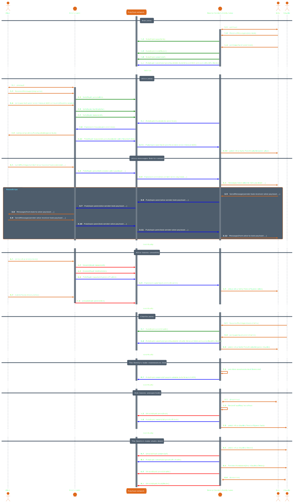

# MESH Signaling

<!-- @toc -->

*   [1. Introduction](#1-introduction)
*   [2. Basic Concepts](#2-basic-concepts)
*   [3. Protocols](#3-protocols)
*   [4. Design](#4-design)
    *   [4.1. Signaling](#41-signaling)

## 1. Introduction

Please see the [MESH spec](mesh-spec.md) for background and terminology.

MESH relies on signalling for peers to discover other peers (eg in an ECHO party),
and for peers to connect to each other. We would like this to work when peers communicate with different
KUBE instances, hence the need for the signaling service to work across hosts. This document describes the design
of such a distributed signaling service by revising the client-host protocol and introducing host-to-host
communication.

## 2. Basic Concepts

Signaling hosts participate in a signaling network, and discover each other through libp2p's DHT, possibly bootstrapped only
from other signaling hosts and/or kubes only.

They rendez-vous on a particular CID on the DHT, allowing for separate signaling networks on the same DHT.

The rest of exchanges happen over Pub/Sub. Topics are namespaced between peer topics (messages of type `PeerEvent`),
host topics (messages of type `HostEvent`), and swarm topics (messages of type `SwarmEvent`).

When a host announces the availability of a peer, it can request other peers in the swarm announce their presence back
through its topic in order to allow for discovery while minimizing receptions.

All events and messages passing through the system are visible by anyone who can connect to the DHT.

Messages can be ciphered and/or signed; this is left as an application concern.

Peer to peer messages (unlike swarm events) could use point-to-point connections rather than Pub/Sub.

## 3. Protocols

```protobuf
syntax = "proto3";

import "google/protobuf/any.proto";
import "google/protobuf/empty.proto";
import "google/protobuf/timestamp.proto";

package dxos.mesh.signal;

option go_package = "github.com/dxos/kube/go/signal/pb";

message JoinRequest {
  bytes swarm = 1;
  bytes peer = 2;
}

message Message {
  bytes author = 1;
  bytes recipient = 2;
  google.protobuf.Any payload = 3;
}

message ReceptionRequest {
  bytes peer = 1;
}

// Goes on Pub/Sub swarm topic and as a Join stream in RPC.
message SwarmEvent {
  message PeerAvailable {
    bytes peer = 1;
    google.protobuf.Timestamp since = 2;
    // When, if at all, this availability would expires were it not re-announced, like
    // periodically in Pub/Sub with some margin such that kubes going offline unexpectedly lead to offline status.
    optional google.protobuf.Timestamp until = 3;

    // Only relevant in Pub/Sub. Optional, the host topic to eagerly send PeerAvailable messages back to.
    optional bytes announceBackToHost = 4;
  }

  message PeerLeft {
    bytes peer = 1;
  }

  oneof event {
    // The peer was announced as available on the swarm.
    PeerAvailable peerAvailable = 1;
    // The peer left, or their announcement timed out.
    PeerLeft peerLeft = 2;
  }
}

// Goes on a Pub/Sub host topic.
message HostEvent {
  oneof event {
    SwarmEvent.PeerAvailable peerAvailable = 1;
  }
}

// Goes on Pub/Sub peer topic.
message PeerEvent {
  oneof event {
    Message message = 1;
  }
}

service Signal {
  rpc Join(JoinRequest) returns (stream SwarmEvent);
  rpc ReceiveMessages(ReceptionRequest) returns (stream Message);
  rpc SendMessage(Message) returns (google.protobuf.Empty);
}
```

## 4. Design

Each kube maintains:

*   as needed, a subscription to their own topic;
*   per local participant, lists of:
    *   swarm memberships with their announcement timeout (announcements must be broadcast periodically, and exits are
        made explicit whenever possible, including at kube soft shutdown);
    *   subscriptions for messages;
*   per swarm with local participants (with a grace period after disconnects so participants can reconnect smoothly):
    *   a subscription to the swarm's topic;
    *   a list of known participants, updated through announcements and their expiries;

### 4.1. Signaling

The sequence diagram below illustrates communications between peers.
This omits STUN/TURN to focus on communications between peers, their signaling services, and the signaling network.



1.  *Prelude: Bob joins.* Bob is already listening for their messages, and has joined `s0`.

2.  *Alice's arrival.* Upon arrival, Alice subscribes to receive her messages. She joins `s0`.
    This causes the kube to request announces back, and the family's kube announces back Bob.
    This also causes the kube to announce her, which gets to Bob.

3.  *Messaging.* As Alice initiates a connection with Bob, she sends a message to him.
    Further messages might be exchanged between Alice and Bob through their respective kubes and topics.

4.  *Alice's departure.*
    Later, Alice leaves the swarm.
    This leads her kube to announce her departure,
    letting Bob's kube refresh its swarm membership table such that future joiners do not discover her immediately,
    and notifying Bob of her departure immediately.
    Because Alice was the last active member of `s0` on her kube, it unsubscribes from `s0`.
    Because it no longer needs to receive lookup responses, it unsubscribes from `akube`.

5.  Charlie joins the family's kube.

6.  *Bob's re-broadcast.*
    After a while, Bob's kube reannounces Bob's swarm membership such that any kube's swarm membership table considers it
    fresh enough to be discovered by incoming clients and not announced as having left to existing ones.

7.  *Bob's departure.*
    Eventually, Bob gets disconnected from their kube. After a timeout, Bob's kube proceeds to announce the departure to
    the network and Charlie, and unsubscribe from their peer events.

8.  *The family kube shuts down.*
    Client streams are closed and topics unsubscribed from. Departures are announced.

