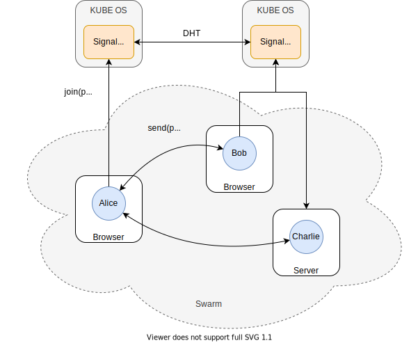
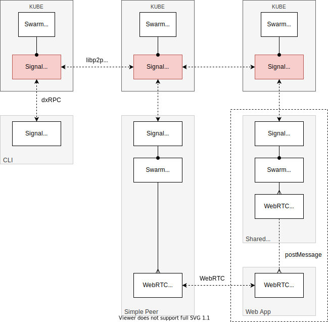

# MESH Spec <!-- omit in toc -->

<!-- @toc -->

- [1. Introduction](#1-introduction)
- [2. Terminology](#2-terminology)
- [3. Basic Concepts](#3-basic-concepts)
  - [3.1. Signaling](#31-signaling)
  - [3.2. Swarms](#32-swarms)
- [Implementation](#implementation)
  - [3.2. Signaling Server](#32-signaling-server)
  - [3.3. Signaling Protocol](#33-signaling-protocol)
  - [3.4. Client Swarms](#34-client-swarms)
  - [3.5. libp2p](#35-libp2p)
  - [3.6. Protocol](#36-protocol)
- [1. Introduction](#1-introduction-1)
- [2. Basic Concepts](#2-basic-concepts)
- [3. Protocols](#3-protocols)
- [4. Design](#4-design)
  - [4.1. Signaling](#41-signaling)

## 1. Introduction

MESH is a set of protocols and components that enable resilient peer-to-peer networks.
The MESH infrastructure supports client application networks (e.g., parties), signaling, and server-to-server networks.

## 2. Terminology

***Discovery Key*** -
Public key used as the connection context for peers joining the swarm.

***Hypercore*** -
The [Hypercore protocol](https://hypercore-protocol.org) is a peer-to-peer data replication mechanism build on top of signed append-only hash-linked logs.

***ICE*** -
The Interactive Connectivity Establishment ([ICE](https://en.wikipedia.org/wiki/Interactive_Connectivity_Establishment)) protocols enables peers (including applications running within a browser) to establish direct connections with each other.

***NAT*** -
Network Address Translation ([NAT](https://en.wikipedia.org/wiki/Network_address_translation)) provides a public IP address to devices behind a router.

***Party*** -
Context for collaboration and data replication.

***Peer*** -
Participant in a swarm. Each peer has a long-lived public key.

***Signaling*** -
Mechanism by which peers discovery each other and connect to a swarm.

***STUN*** -
The Session Traversal Utilities for NAT ([STUN](https://en.wikipedia.org/wiki/STUN)) is a protocol to discover your public address and determine any restrictions in your router that would prevent a direct connection with a peer.

***Swarm*** -
Transient peer-to-peer network of connected peers.

***TURN*** -
The Traversal Using Relays around NAT ([TURN](https://en.wikipedia.org/wiki/TURN)) server is used to relay data packets to bypass router restrictions if necessary.

***WebRTC*** -
The Web Real-Time Communications protocol ([WebRTC](https://developer.mozilla.org/en-US/docs/Web/API/WebRTC_API/Protocols)) API enables Javascript applications running within a browser to open peer-to-peer connections with each other. WebRTC uses the ICE protocols.

## 3. Basic Concepts

The MESH technologies encompasses resilient peer-to-peer connectivity across processes running on different platforms and using different transports across the DXOS network.

### 3.1. Signaling

Signaling enables two or more peers to discover and connect to each other forming a peer-to-peer swarm.

Peers may exist on multiple platforms, including browser and mobile applications, Web services (including bots), and tools (including the CLI and other terminal applications).

### 3.2. Swarms

## Implementation

### 3.2. Signaling Server

Peers connect to a configurable signaling server, typically running on a KUBE node.
The signaling server maintains a DHT that contains a transient map of discovery keys onto a set of peer keys.
This DHT is replicated across all signaling servers; entries in the DHT expire after a given TTL.

The signaling server implements a socket based endpoint that allows peers to join and leave swarms, and to send and receive messages to and from other peers.

### 3.3. Signaling Protocol

> *   Current [signaling protocol design](https://github.com/dxos/protocols/issues/1316). Incl. WebRTC protocol data (SIP, network interfacte, IP addr, STUN/TURN)?
>     protocol.
> *   MST swarm/routing.
> *   Scope of replication for signaling servers (i.e., subnet/realm vs. global DXNS network?) Security considerations. Peers configured with multiple signal servers (one per network)?
> *   Implement general purpose message streaming between peers? (e.g., beyond signaling/discovery, iniitation of party invitations).
> *   Generalize discovery key to generic network assets (i.e., not just party)? E.g., discovery of peers based on agent identity (public key).
> *   Guaranteed message delivery (or just ACK)? AXE for reliable streams? QUIC, SPDY?
> *   Presence management (separate from in-party swarm presence?)
> *   Security considerations (e.g., encryption, authentication, key exchange, hash party/device keys, TTLs)

### 3.4. Client Swarms

Peers use the signaling server to connect and exchange data with other peers that belong to the same ECHO party.
The hash of the party key as the discovery key.
Each peer maintains a map of connections, which may implement different transports (e.g., WebRTC).

  

### 3.5. libp2p

  

  

### 3.6. Protocol

The [Hypercore protocol](https://github.com/hypercore-protocol/hypercore-protocol) XXX.

> *   How is data from a connected peer multiplexed into multiple hypercores (if the swarm is not fully connected)? How does bi-directionality work?
> *   Reference HALO authentication/party admission.
> *   Reference ECHO `hypercore`, `@dxos/protocol` replication; [Noise](https://noiseprotocol.org/noise.html)?
> *   <https://github.com/hypercore-protocol/hypercore-protocol>
> *   <https://github.com/mafintosh/simple-hypercore-protocol/blob/master/schema.proto>
> *   <https://github.com/dat-ecosystem-archive/whitepaper/blob/master/dat-paper.pdf>
> *   Legacy [simple-peer](https://www.npmjs.com/package/simple-peer) WebRTC library.
> *   Migrate to [libp2p](https://github.com/libp2p/specs) DHT/Pubsub; need to resolve deprecated star

## 1. Introduction

MESH relies on signalling for peers to discover other peers (eg in an ECHO party),
and for peers to connect to each other. We would like this to work when peers communicate with different
KUBE instances, hence the need for the signaling service to work across hosts. This document describes the design
of such a distributed signaling service by revising the client-host protocol and introducing host-to-host
communication.

## 2. Basic Concepts

Signaling hosts participate in a signaling network, and discover each other through libp2p's DHT, possibly bootstrapped only
from other signaling hosts and/or kubes only.

They rendez-vous on a particular CID on the DHT, allowing for separate signaling networks on the same DHT.

The rest of exchanges happen over Pub/Sub. Topics are namespaced between peer topics (messages of type `PeerEvent`),
host topics (messages of type `HostEvent`), and swarm topics (messages of type `SwarmEvent`).

When a host announces the availability of a peer, it can request other peers in the swarm announce their presence back
through its topic in order to allow for discovery while minimizing receptions.

All events and messages passing through the system are visible by anyone who can connect to the DHT.

Messages can be ciphered and/or signed; this is left as an application concern.

Peer to peer messages (unlike swarm events) could use point-to-point connections rather than Pub/Sub.

## 3. Protocols

<!-- @code(../../packages/mesh/network-manager/src/proto/defs/dxos/mesh/signal.proto) -->

## 4. Design

Each kube maintains:

*   as needed, a subscription to their own topic;
*   per local participant, lists of:
    *   swarm memberships with their announcement timeout (announcements must be broadcast periodically, and exits are
        made explicit whenever possible, including at kube soft shutdown);
    *   subscriptions for messages;
*   per swarm with local participants (with a grace period after disconnects so participants can reconnect smoothly):
    *   a subscription to the swarm's topic;
    *   a list of known participants, updated through announcements and their expiries;

### 4.1. Signaling

The sequence diagram below illustrates communications between peers.
This omits STUN/TURN to focus on communications between peers, their signaling services, and the signaling network.

1.  *Prelude: Bob joins.* Bob is already listening for their messages, and has joined `s0`.

2.  *Alice's arrival.* Upon arrival, Alice subscribes to receive her messages. She joins `s0`.
    This causes the kube to request announces back, and the family's kube announces back Bob.
    This also causes the kube to announce her, which gets to Bob.

3.  *Messaging.* As Alice initiates a connection with Bob, she sends a message to him.
    Further messages might be exchanged between Alice and Bob through their respective kubes and topics.

4.  *Alice's departure.*
    Later, Alice leaves the swarm.
    This leads her kube to announce her departure,
    letting Bob's kube refresh its swarm membership table such that future joiners do not discover her immediately,
    and notifying Bob of her departure immediately.
    Because Alice was the last active member of `s0` on her kube, it unsubscribes from `s0`.
    Because it no longer needs to receive lookup responses, it unsubscribes from `akube`.

5.  Charlie joins the family's kube.

6.  *Bob's re-broadcast.*
    After a while, Bob's kube reannounces Bob's swarm membership such that any kube's swarm membership table considers it
    fresh enough to be discovered by incoming clients and not announced as having left to existing ones.

7.  *Bob's departure.*
    Eventually, Bob gets disconnected from their kube. After a timeout, Bob's kube proceeds to announce the departure to
    the network and Charlie, and unsubscribe from their peer events.

8.  *The family kube shuts down.*
    Client streams are closed and topics unsubscribed from. Departures are announced.

