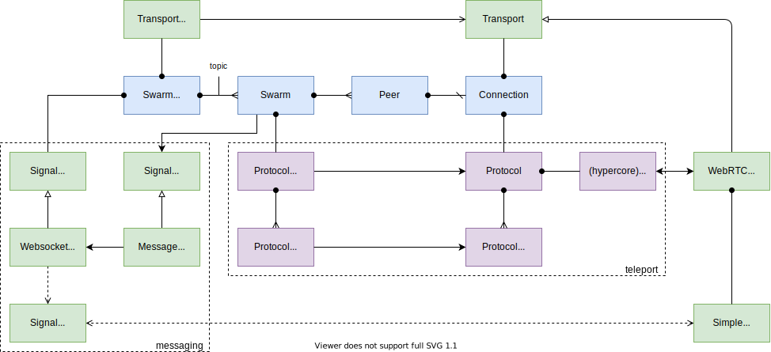

# MESH Spec

<!-- @toc -->

*   [1. Introduction](#1-introduction)
*   [2. Terminology](#2-terminology)
*   [3. Basic Concepts](#3-basic-concepts)
    *   [3.1. Signaling](#31-signaling)
    *   [3.2. Signaling Server](#32-signaling-server)
    *   [3.3. Signaling Protocol](#33-signaling-protocol)
    *   [3.4. Client Swarms](#34-client-swarms)
    *   [3.5. libp2p architecture](#35-libp2p-architecture)
    *   [3.6. Protocol](#36-protocol)

## 1. Introduction

MESH is a set of protocols and components that enable resilient peer-to-peer networks.
The MESH infrastructure supports client application networks (e.g., parties), signaling, and server-to-server networks.

## 2. Terminology

***Discovery Key*** -
Public key used as the connection context for peers joining the swarm.

***Hypercore*** -
The [Hypercore protocol](https://hypercore-protocol.org) is a peer-to-peer data replication mechanism build on top of signed append-only hash-linked logs.

***ICE*** -
The Interactive Connectivity Establishment ([ICE](https://en.wikipedia.org/wiki/Interactive_Connectivity_Establishment)) protocols enables peers (including applications running within a browser) to establish direct connections with each other.

***NAT*** -
Network Address Translation ([NAT](https://en.wikipedia.org/wiki/Network_address_translation)) provides a public IP address to devices behind a router.

***Party*** -
Context for collaboration and data replication.

***Peer*** -
Participant in a swarm. Each peer has a long-lived public key.

***Signaling*** -
Mechanism by which peers discovery each other and connect to a swarm.

***STUN*** -
The Session Traversal Utilities for NAT ([STUN](https://en.wikipedia.org/wiki/STUN)) is a protocol to discover your public address and determine any restrictions in your router that would prevent a direct connection with a peer.

***Swarm*** -
Transient peer-to-peer network of connected peers.

***TURN*** -
The Traversal Using Relays around NAT ([TURN](https://en.wikipedia.org/wiki/TURN)) server is used to relay data packets to bypass router restrictions if necessary.

***WebRTC*** -
The Web Real-Time Communications protocol ([WebRTC](https://developer.mozilla.org/en-US/docs/Web/API/WebRTC_API/Protocols)) API enables Javascript applications running within a browser to open peer-to-peer connections with each other. WebRTC uses the ICE protocols.

## 3. Basic Concepts

### 3.1. Signaling

Signaling enables two or more peers to discover and connect to each other forming a peer-to-peer swarm.
Peers may exist on multiple platforms, including browser and mobile applications, Web services (including bots), and tools (including the CLI and other terminal applications).

### 3.2. Signaling Server

Peers connect to a configurable signaling server, typically running on a KUBE node.
The signaling server maintains a DHT that contains a transient map of discovery keys onto a set of peer keys.
This DHT is replicated across all signaling servers; entries in the DHT expire after a given TTL.

  

The signaling server implements a socket based endpoint that allows peers to join and leave swarms, and to send and receive messages to and from other peers.

### 3.3. Signaling Protocol

> *   Current [signaling protocol design](https://github.com/dxos/protocols/issues/1316). Incl. WebRTC protocol data (SIP, network interfacte, IP addr, STUN/TURN)?
>     protocol.
> *   MST swarm/routing.
> *   Scope of replication for signaling servers (i.e., subnet/realm vs. global DXNS network?) Security considerations. Peers configured with multiple signal servers (one per network)?
> *   Implement general purpose message streaming between peers? (e.g., beyond signaling/discovery, iniitation of party invitations).
> *   Generalize discovery key to generic network assets (i.e., not just party)? E.g., discovery of peers based on agent identity (public key).
> *   Guaranteed message delivery (or just ACK)? AXE for reliable streams? QUIC, SPDY?
> *   Presence management (separate from in-party swarm presence?)
> *   Security considerations (e.g., encryption, authentication, key exchange, hash party/device keys, TTLs)

### 3.4. Client Swarms

Peers use the signaling server to connect and exchange data with other peers that belong to the same ECHO party.
The hash of the party key as the discovery key.
Each peer maintains a map of connections, which may implement different transports (e.g., WebRTC).

  

### 3.5. libp2p architecture

  

  

### 3.6. Protocol

The [Hypercore protocol](https://github.com/hypercore-protocol/hypercore-protocol) XXX.

> *   How is data from a connected peer multiplexed into multiple hypercores (if the swarm is not fully connected)? How does bi-directionality work?
> *   Reference HALO authentication/party admission.
> *   Reference ECHO `hypercore`, `@dxos/protocol` replication; [Noise](https://noiseprotocol.org/noise.html)?
> *   <https://github.com/hypercore-protocol/hypercore-protocol>
> *   <https://github.com/mafintosh/simple-hypercore-protocol/blob/master/schema.proto>
> *   <https://github.com/dat-ecosystem-archive/whitepaper/blob/master/dat-paper.pdf>
> *   Legacy [simple-peer](https://www.npmjs.com/package/simple-peer) WebRTC library.
> *   Migrate to [libp2p](https://github.com/libp2p/specs) DHT/Pubsub; need to resolve deprecated star

