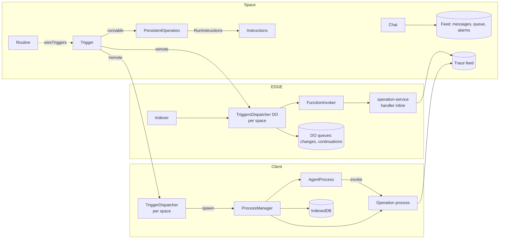
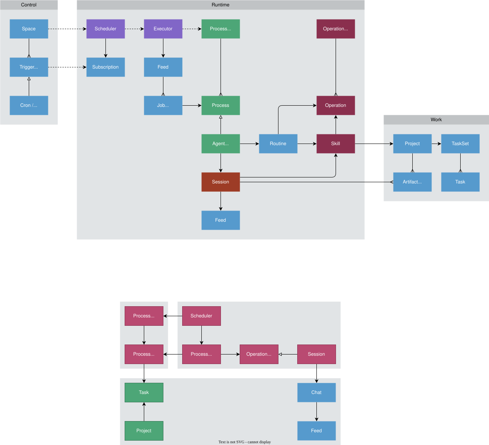

# Process Architecture

## Overview

Users automate a Space by creating `Trigger` objects. A trigger names an action — an `Operation` or a set of
`Instructions` — and a condition: a cron schedule, a query subscription, a feed, a webhook, or a direct request.
When the condition holds, the runtime runs the action as a **process**: a short function that returns a value, or a
long-lived agent that holds a chat session, uses skills, and reads and writes artifacts until it decides to stop.

This runs in two places. The **client** (browser or CLI) runs triggers while the app is open; **EDGE** (Cloudflare
Durable Objects) runs triggers marked `remote` while the space is active. Both read the same objects from the same
space. The document describes what is built, what is wrong with it, and a proposal to close the gap.

## Goals

One mechanism to schedule a process, such that:

1. **Any trigger kind** — cron, subscription, feed, webhook, direct — enters the same path and gets the same
   policy (concurrency, retry, cancel, audit).
2. **Any action shape** — a ten-millisecond operation or a week-long agent — is the same kind of thing: a process with
   a durable record, a place in a tree, alarms, and children.
3. **Either runtime** — client or EDGE — executes it with the same semantics, and the other runtime can see it.
4. **Every firing is recorded** in the space, so "why did my routine not run" is answerable from any device.
5. **The user controls the agent indirectly**, through triggers, instructions, skills and artifacts — not through the
   scheduler.

## Current implementation

### Schematic



### Modules

| Module                                               | Role                                                                                                                                                                                   |
| ---------------------------------------------------- | -------------------------------------------------------------------------------------------------------------------------------------------------------------------------------------- |
| `@dxos/compute` `Trigger`, `Routine`, `Instructions` | The control objects. `Routine` is app-level only; `wireTriggers` compiles it to a trigger pointing at an operation.                                                                    |
| `@dxos/compute` `Process`, `Operation`               | Process definition (`onSpawn`/`onInput`/`onAlarm`/`onChildEvent`, RPCs) and the operation model; `Process.fromOperation` wraps any operation as a one-input process.                   |
| `@dxos/compute-runtime` `TriggerDispatcher`          | Client scheduler, one per space. Live query on triggers; 1-min cron tick; a live query per feed/subscription trigger; global semaphore (5); 30 s cooldown; in-memory `runAgain` retry. |
| `@dxos/compute-runtime` `ProcessManager`             | Client process runtime. Spawns processes with resolved services, a durable KV record and event mailbox, alarms, parent/child linking, hydration of dormant records.                    |
| `@dxos/agent-runtime` `AgentProcess`, `AgentService` | The agent as a native process bound to a `Chat`. Queue and alarms are feed records; turn loop in `onAlarm`; tool calls and delegated sub-agents are child processes.                   |
| `@dxos/assistant-toolkit` `RunInstructions`          | The operation a trigger runs for an instructions action: an `AiSession` inside one handler call, ending on `completeJob`.                                                              |
| `@dxos/edge-compute`                                 | Client-side adapters for EDGE: trigger status poll, `forceRunCronTrigger`, `cancelTriggerRun`, remote operation invoke.                                                                |
| edge `compute-service` `TriggersDispatcher` DO       | EDGE scheduler, one per space. Cron via `DurableObjectCronScheduler` (inactivity-gated); subscription changes and `runAgain` continuations in `DurableObjectQueue`s.                   |
| edge `compute-service` `FunctionInvoker`             | Resolves `dxn:` / `worker:` / `echo:` targets and invokes them; writes trace envelopes.                                                                                                |
| edge `operation-service`                             | Runs a platform operation handler inline in one RPC: space DB, harness from conversation, 10-min timeout, cooperative cancel. No process state.                                        |

### Flow

A `remote` cron trigger, end to end:

1. **Arm.** The trigger replicates to EDGE. The Indexer reports the change; the space's `TriggersDispatcher` registers
   the cron and sets a DO alarm for the next run. Editing or disabling the trigger replaces or removes the key.
2. **Stay armed.** The cron fires only while the space is active: the router's activity tracker calls
   `notifySpaceActive` on replication traffic, resetting an inactivity timeout. Missed occurrences coalesce into one.
3. **Fire.** `alarm()` loads the due triggers, skips any not marked `remote`, and invokes each **sequentially inside
   the alarm**, then drains the subscription-change and continuation queues.
4. **Invoke.** `FunctionInvoker.invokeTrigger` builds the payload from the trigger's `input` template and calls
   `operation-service.invokeOperation`: the handler runs inline with a space DB, a caller-minted `pid`, a trace sink
   into the space's trace feed, and a 10-minute timeout. For `RunInstructions` the whole agent session runs inside
   this one call.
5. **Settle.** `runAgain` enqueues a durable continuation for the next alarm; any other error is logged and **not
   retried**; the schedule advances either way. The client sees the outcome via the trace feed and a 15 s status poll.

Locally the shape is the same with different parts: the dispatcher's tick finds the due trigger, `Process.fromOperation`

- `ProcessManager.spawn` run it as a process, and failure sets a 30 s cooldown.

### Assessment

Against the goals:

1. **Trigger kinds.** One `Trigger` schema, event union, payload builder and `invokeTrigger` entry per side — but two
   dispatchers with different wake sources, retry and subscription semantics (`created/updated/deleted` locally,
   always `updated` on EDGE), statically partitioned by `remote`. `direct` exists only locally; `webhook`/`email` only
   on EDGE, and on EDGE `feed`/`webhook`/`email` bypass the DO, so they get no continuation or cancel.
2. **Action shape.** Holds locally: every execution is a `Process`, so the tree, trace, alarms, children and mailbox are
   common to operations and agents. Does not hold on EDGE (no process manager; the process tree is empty) and does
   not hold across the trigger seam: a triggered agent is `RunInstructions`, a one-shot operation with none of
   `AgentProcess`'s queue, alarms, delegation, steering or hydration, and a hard 10-minute ceiling on EDGE.
3. **Either runtime.** A trigger runs in exactly one place. Process records live in one browser's IndexedDB; two devices
   see two process trees. Only `AgentProcess` records are ever rehydrated; an interrupted trigger run is dropped.
4. **Recorded.** No Job exists. Dispatch is synchronous under a semaphore (client) or inside a DO alarm (EDGE) — which
   is the executor, so a batch of due triggers runs within one alarm's CPU and wall-clock budget; the continuation queue
   exists because that budget was exhausted once already. A failed occurrence leaves an errored span and a log line.
   The trace feed is the only cross-runtime record, and `traceMeta.trigger` the only run→trigger link.
5. **Indirect control.** Holds: the agent reads its chat, instructions, skills and artifacts; the scheduler knows
   nothing about them.

## Proposed implementation

### Schematic



The scheduler no longer invokes. It **appends a `Job`** to a per-space feed and returns. An **executor** in the same
runtime claims pending Jobs from the feed in bounded batches, runs them through the existing invocation path, and
appends the outcome. The feed is the record every runtime and device reads; the executor's working set — claims,
timeouts, cursor, attempts — is private, indexed state (DO SQLite on EDGE, memory + IndexedDB on the client).

### Modules

| Module                                      | Change                                                                                                                                                                                                         |
| ------------------------------------------- | -------------------------------------------------------------------------------------------------------------------------------------------------------------------------------------------------------------- |
| `@dxos/compute` `Job`                       | New type + `Ack` / `Failed` / `Cancelled` annotations; `JobStore` projection (one cursor scan, `SessionStore` shape).                                                                                          |
| `TriggerDispatcher` (client)                | Tick and live queries unchanged; `invokeTrigger` appends a Job. Loses in-memory `retry`, `cooldownUntil`. Gains an executor fiber.                                                                             |
| `TriggersDispatcher` DO (EDGE)              | `alarm()` appends Jobs, then drains a bounded batch. Loses `_continuationQueue`, generation maps, inline invocation. Feed/webhook/email handlers append too (webhook executes inline for a synchronous reply). |
| Executor (both)                             | `claim → invoke → settle`. Working set: DO SQLite `jobs` table on EDGE (transactional claims, indexed by state/due); memory + IDB on the client.                                                               |
| `ProcessManager` (client)                   | Unchanged; process record carries the Job id.                                                                                                                                                                  |
| `FunctionInvoker` / `operation-service`     | Unchanged.                                                                                                                                                                                                     |
| `EdgeTriggerManager` / `EdgeProcessManager` | Derive `Trigger.State` and the EDGE process tree from the feed; the 15 s poll becomes optional.                                                                                                                |

### Flow

The same cron, after the change:

1. **Arm / stay armed.** Unchanged.
2. **Enqueue.** `alarm()` appends one `Job { trigger, runnable, event, input, runtime: 'edge', generation, attempt: 0 }`
   per due trigger. Cheap and bounded. "Run now" appends a Job with a fresh generation; `forceRunCronTrigger`
   reduces to "drain now".
3. **Claim.** The executor scans the feed from its cursor for pending Jobs with `runtime === mine`, takes one batch,
   and records each claim in its working set (`INSERT ... WHERE state = 'pending'` on EDGE). One executor per runtime
   per space; the other runtime never claims, only reads.
4. **Execute.** Unchanged: `FunctionInvoker.invokeTrigger` with the Job's precomputed `input`, the same `pid`
   correlating to the trace feed. Locally, `Process.fromOperation` + `spawn`.
5. **Settle.** Append `Ack { output? }` or `Failed { error, terminal }` to the Job; delete the working-set row.
   `runAgain` = `Ack` + a new Job with `continues` and the same generation. Retry = a new Job with `attempt + 1`,
   only when the runnable is `Operation.idempotent` and under the trigger's `maxAttempts`; otherwise `Failed` is
   terminal and is the audit record.
6. **Reclaim and cancel.** A claim past its timeout with no settle (killed isolate) is settled `Failed { terminal:
false }` on the next drain and retried under the same rule. `cancelTriggerRun` appends `Cancelled` per generation;
   claim skips it and no continuation is appended.

### Records

```ts
class Job extends Type.makeObject<Job>(DXN.make('org.dxos.type.job', '0.1.0'))(
  Schema.Struct({
    trigger: Ref.Ref(Trigger.Trigger),
    runnable: Ref.Ref(Runnable.Runnable), // resolved at enqueue, so a trigger edit does not change a queued Job
    event: TriggerEvent.TriggerEvent,
    input: Schema.Any, // createInvocationPayload(trigger, event)
    runtime: Schema.Literals(['edge', 'local']),
    generation: Schema.Number, // one activation; continuations share it
    attempt: Schema.Number,
    continues: Schema.optional(Ref.Ref(Job)),
    priority: Schema.optional(Schema.Number), // recorded, not enforced
    requestedAt: Schema.Number,
  }),
) {}

const Ack = Annotation.make({
  id: 'org.dxos.annotation.job.ack',
  schema: Schema.Struct({ pid: Schema.String, completedAt: Schema.Number, output: Schema.optional(Schema.Any) }),
});
const Failed = Annotation.make({
  id: 'org.dxos.annotation.job.failed',
  schema: Schema.Struct({
    pid: Schema.String,
    completedAt: Schema.Number,
    error: SerializedError,
    terminal: Schema.Boolean,
  }),
});
const Cancelled = Annotation.make({
  id: 'org.dxos.annotation.job.cancelled',
  schema: Schema.Struct({ at: Schema.Number }),
});
```

The feed is found by kind, like the trace feed (`Feed.make({ kind: 'dxos.org.feed.jobs' })`). Appending by id is an
upsert, so a Job is one feed entry however it ends. In-flight state is deliberately **not** on the feed: it is the one
transition that needs compare-and-set, it would double the replication traffic per firing, and it is only meaningful to
the executor that holds it. Projections: pending = no terminal annotation and not claimed by me; history = `Ack` or
`Failed`.

### Benefits

- **One path for every trigger kind on both runtimes.** Cron, subscription, feed, webhook, email and run-now all
  become "append a Job"; policy lives in one executor per runtime.
- **The alarm is bounded.** The DO alarm appends and drains a batch; it no longer runs N invocations inline.
- **Audit and cross-device visibility for free.** The feed replicates; any device answers "what ran, what failed, what
  is pending" without an endpoint. The EDGE process tree stops being empty.
- **Crash reclaim and safe retry.** A dead isolate or closed tab leaves an expired claim, not a run that "reads as still
  running forever"; retry is opt-in per operation via the idempotency annotation the runtime already has.
- **Three private mechanisms become feed records.** The DO continuation queue, the generation-based cancel maps and the
  client's in-memory retry state are all expressed as `Job`, `continues`, `Cancelled`.
- **The Job is the durable ancestor of a process.** Locally it links to the `ProcessManager` record; on EDGE it is the
  only durable record until a process host exists, and the natural input to one.

Not claimed: priority (a field, not a scheduler — contention is at `operation-service` and the model providers, not in a
space's queue) and a long-lived agent on EDGE, which needs a process host (a Durable Object per conversation or a
DO-backed `ProcessManager`) that this feed would later feed into.

## Plan

1. **Record only.** Both dispatchers append `Job` at fire time and `Ack`/`Failed` at settle, around their existing
   invocation. No behaviour change. The feed becomes the audit record; `EdgeProcessManager` fills in from it. Lands
   alone and already answers "why did my routine not run".
2. **Executor on EDGE.** `alarm()` enqueues and drains; DO SQLite working set; continuation queue and generation maps
   replaced; reclaim and idempotent retry enabled; feed/webhook/email handlers append.
3. **Executor on the client.** `TriggerDispatcher` drains the feed for `runtime: 'local'`; process records carry the Job
   id; in-memory retry and cooldown replaced.
4. **Run-now via the feed.** `Trigger.Monitor.invokeTrigger` appends; `forceRunCronTrigger` becomes "drain now".
5. **Retention.** Compaction policy for the Job feed, shared with the trace feed.

Open questions to settle before phase 2:

1. Subscription triggers must not observe the Job feed (or the trace feed) — a `namespace` filter in the subscription
   matchers on both sides.
2. Whether `Ack.output` is stored, capped, or left to the trace feed.
3. Idempotency of `RunInstructions` is that of its instructions; default off, possibly an `Instructions` field later.
4. Client-side reclaim: a closed tab is not a crash and the local record may still hydrate — reclaim on EDGE only at
   first.

## Appendix: Vocabulary

| Term               | Code                                                     | Where                                                            |
| ------------------ | -------------------------------------------------------- | ---------------------------------------------------------------- |
| Trigger            | `Trigger.Trigger` (`org.dxos.type.trigger`)              | `compute/src/types/Trigger.ts`                                   |
| Routine            | `Routine.Routine` — app-level only                       | `compute/src/types/Routine.ts`, `plugin-routine`                 |
| Instructions       | `Instructions.Instructions`                              | `compute/src/types/Instructions.ts`                              |
| Operation          | `Operation.Definition` / `Operation.PersistentOperation` | `compute/src/Operation.ts`                                       |
| Runnable           | alias of `PersistentOperation` (TODO: widen)             | `compute/src/Runnable.ts`                                        |
| Job                | proposed `Job` + `Ack`/`Failed`/`Cancelled`              | —                                                                |
| Scheduler (client) | `TriggerDispatcher`, one per space                       | `compute-runtime/src/triggers/trigger-dispatcher.ts`             |
| Scheduler (EDGE)   | `TriggersDispatcher` Durable Object, one per space       | edge `compute-service/src/triggers/trigger-dispatcher-object.ts` |
| Executor           | proposed; today the scheduler invokes directly           | —                                                                |
| Process Manager    | `ProcessManager.Manager`, one per client runtime         | `compute-runtime/src/ProcessManager.ts`                          |
| Process            | `Process.Process` definition; `ProcessHandle` instance   | `compute/src/Process.ts`, `compute-runtime/src/ProcessHandle.ts` |
| Agent Process      | `AgentProcess` (key `org.dxos.testing.process.agent`)    | `agent-runtime/src/agent-service/agent-process.ts`               |
| Session (Chat)     | `Chat.Chat` → owns a `Feed.Feed`                         | `assistant/src/types/Chat.ts`                                    |
| Alarm              | `Alarm.Alarm` feed record; `HarnessControl.setAlarm`     | `assistant/src/session/Alarm.ts`                                 |
| Skill              | `Skill.Skill`                                            | `compute/src/types/Skill.ts`                                     |
| Trace feed         | `Feed` of kind `dxos.org.feed.trace`                     | `compute-runtime/src/FeedTraceSink.ts`                           |
| Artifact / Task    | ordinary ECHO objects read and written through skills    | —                                                                |
