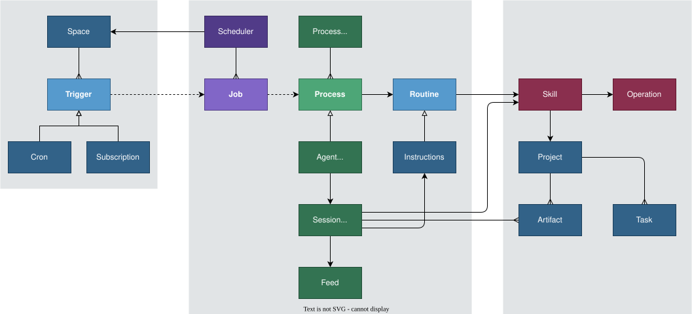
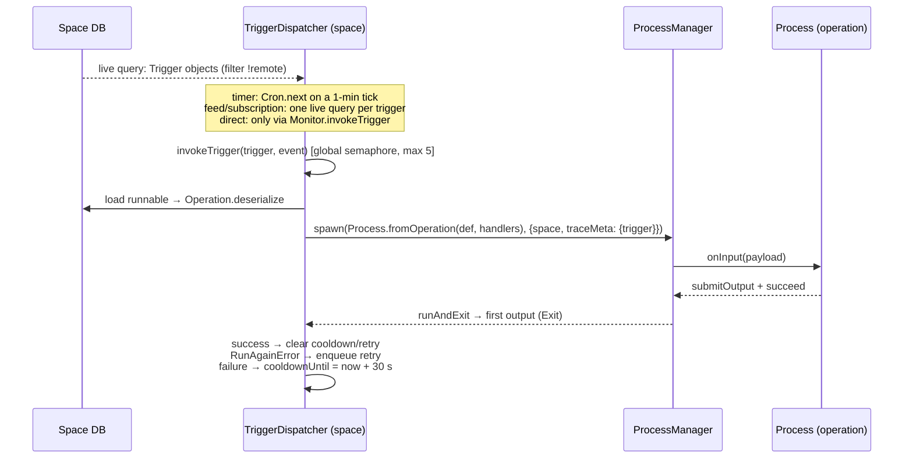
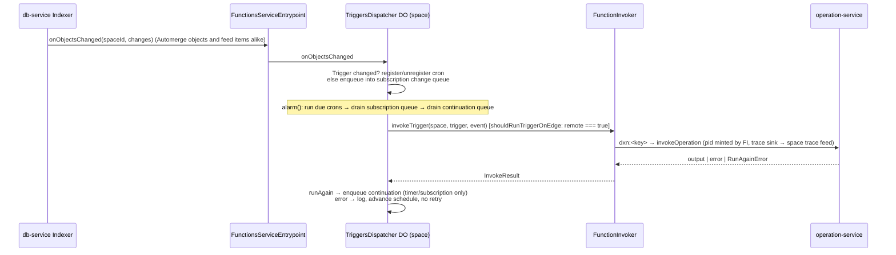

# The Scheduler

## Control flow

All of the following runs within the context of a Space (and associated Durable Objects).

- Users create `Trigger` objects (e.g., Cron, Subscription, Webhook, Direct).
- A `Trigger` specifies and action (e.g., Operation, Instructions).
- The `Scheduler` subscribes to `Trigger` objects and sets up the trigger processes.
- When a trigger fires it writes a `Job` onto the Job queue.
  - NOTE: Triggers do not invoke the action directly; the job queue enables us to prioritize, retry, and audit Jobs.
- The `Process Manager` subscribes to the Job queue and initiates a `Process`
  - A `Process` may invoke an `Operation` directly then exit.
  - An `Agent Process` starts an `Agent` with a `Chat` session and `Feed`.
- An `Agent Process` runs until it decides to terminate, or is terminated by the `Process Manager`.
- The `Agent` is controlled by:
  - The `Skill` modules it has access to.
  - Its `Instructions`.
- It uses skills to read, update, and create `Artifact` objects.
  - These artifacts may contain `Task` objects that INDIRECTLY control its behavior (depending on its instructions).
  - NOTE: Tasks are not "special"; it could just as easily be controlled by a poem, diagram or weather feed.
    However, The Task Planning skill enables users to indirectly control and monitor the agent.

## Schematic

## Control Plans and Observation

- Triggers (user control mechanism)
  - Job Queue (policy based on resources)
    - Process Tree (runtime state)
      - Agent Chat Feeds (durable state)
        - Artifacts (output)

## Current mechanism

What follows is what the code does today, read against the schematic above. Sources are
`packages/core/compute/*` in this repo and `packages/services/{compute-service,operation-service}` in the
`edge` repo. The schematic's vocabulary is kept; where the code uses a different name the mapping is given.

### Vocabulary

| Schematic         | Code                                                            | Where                                                             |
| ----------------- | --------------------------------------------------------------- | ----------------------------------------------------------------- |
| Trigger           | `Trigger.Trigger` (`org.dxos.type.trigger`)                     | `compute/src/types/Trigger.ts`                                    |
| Routine           | `Routine.Routine` (`org.dxos.type.routine`) — app-level only    | `compute/src/types/Routine.ts`, `plugin-routine`                  |
| Instructions      | `Instructions.Instructions` (`org.dxos.type.instructions`)      | `compute/src/types/Instructions.ts`                               |
| Operation         | `Operation.Definition` / `Operation.PersistentOperation`        | `compute/src/Operation.ts`                                        |
| Scheduler (local) | `TriggerDispatcher` — one per space, in the client              | `compute-runtime/src/triggers/trigger-dispatcher.ts`              |
| Scheduler (EDGE)  | `TriggersDispatcher` Durable Object — one per space             | `edge: compute-service/src/triggers/trigger-dispatcher-object.ts` |
| Job / Job queue   | **does not exist** (see [Assessment](#assessment))              | —                                                                 |
| Process Manager   | `ProcessManager.Manager` — one per client runtime               | `compute-runtime/src/ProcessManager.ts`                           |
| Process           | `Process.Process` definition + `ProcessHandle` instance         | `compute/src/Process.ts`, `compute-runtime/src/ProcessHandle.ts`  |
| Agent Process     | `AgentProcess` (key `org.dxos.testing.process.agent`)           | `agent-runtime/src/agent-service/agent-process.ts`                |
| Session (Chat)    | `Chat.Chat` → owns a `Feed.Feed`                                | `assistant/src/types/Chat.ts`                                     |
| Skill             | `Skill.Skill` refs on `Instructions` / `Chat`                   | `compute/src/types/Skill.ts`                                      |
| Artifact / Task   | ordinary ECHO objects the agent reads and writes through skills | —                                                                 |

### Control objects in the space

Everything the user controls is an ECHO object in the space, so it replicates to every device and to EDGE.

- **`Trigger`** — `spec` (discriminated on `kind`: `timer` (cron), `subscription` (query + `deep`/`delay`), `feed`
  (`Ref<Feed>`), `direct`, `webhook`, `email`), `runnable: Ref<PersistentOperation>`, an `input` template
  (`{{event.item}}` / `{{trigger.x}}` substitutions, `input-builder.ts`), `enabled`, `concurrency` (default 1) and
  **`remote`**. `remote` is the routing bit: `true` runs on EDGE, unset runs on the client. A trigger runs in exactly
  one place; there is no failover between the two.
- **`Runnable`** is today an alias for `PersistentOperation` — the serialized form of an `Operation.Definition`
  (key + version + JSON input/output schemas). `Runnable.ts` carries a TODO to widen it to `Operation | ComputeGraph`.
  The dispatcher resolves the definition back from the record (`Operation.deserialize`) and looks the handler up in
  the runtime's `OperationHandlerSet`.
- **`Routine`** is the user-facing aggregate: `spec` is either `{ kind: 'runnable', runnable }` or
  `{ kind: 'instructions', instructions }` plus an owned `triggers[]`. It is app-level only — EDGE never sees it.
  `plugin-routine`'s `wireTriggers` compiles it down: an operation action sets `trigger.runnable` to that operation;
  an instructions action sets `trigger.runnable` to the static `RunInstructions` operation and binds the
  `Instructions` ref into `trigger.input`. So the two "action kinds" of the schematic reach the scheduler as one
  thing — a trigger pointing at an operation.
- **`Instructions`** — markdown `text`, `skills[]`, context `objects[]`, input/output JSON schema.
- **`Chat`** owns a `Feed` and optionally points at `Instructions`. The feed is the agent's durable state: history,
  the queued prompts (`SessionStore.QueuedAnnotation` / `InFlight` / `Consumed`) and pending `Alarm` records
  (`assistant/src/session/Alarm.ts`) all live in it. This is what lets an agent process be torn down and rebuilt.

### Two runtimes

| Concern                     | Client (browser / CLI)                                           | EDGE (Cloudflare)                                                                                                                      |
| --------------------------- | ---------------------------------------------------------------- | -------------------------------------------------------------------------------------------------------------------------------------- |
| Trigger dispatcher          | `TriggerDispatcher`, one per space, Effect fibers                | `TriggersDispatcher` DO, one per space, DO alarms + `DurableObjectQueue`                                                               |
| Wake sources                | live ECHO queries + 1-min cron tick                              | Indexer change notifications, cron alarm, feed inserts, HTTP, email                                                                    |
| Runs while                  | the app is open and `space.properties.triggersDisabled` is unset | the space is "active" (router `SpaceActivityTracker` → `notifySpaceActive` resets an inactivity timeout); continuations run regardless |
| Trigger kinds               | timer, subscription, feed, direct                                | timer, subscription, feed, webhook, email (direct = `forceRunCronTrigger`)                                                             |
| Execution unit              | a `Process` in the `ProcessManager`                              | one bounded RPC into `operation-service` (or a deployed worker / workflow)                                                             |
| Process manager             | yes — durable records, alarms, children, hydration               | **none** (`EdgeProcessManager` is a stub: empty tree + cancel only)                                                                    |
| Agent                       | `AgentProcess` (long-lived, suspendable)                         | `RunInstructions` operation (one-shot, ≤ 10 min)                                                                                       |
| Failure policy              | 30 s cooldown; `runAgain` → in-memory retry queue                | no retry, schedule advances; `runAgain` → durable continuation queue                                                                   |
| Process/trigger persistence | IndexedDB (`dxos-process-manager`), per browser                  | DO storage, per space                                                                                                                  |

The client assembles this per app in `app-framework/src/plugin-process-manager/process-manager-capability.ts`
(one `ProcessManager` on a `ManagedRuntime`, IDB KV store, `LayerStack`/`ServiceResolver`, reactive
`OperationHandlerSet`) and per space through `plugin-routine`'s `LayerSpec`s (`TriggerDispatcher`,
`TriggerStateStore` (memory), `TriggerMonitor`, `FeedTraceSink`, and the EDGE adapters `EdgeTriggerManager`,
`EdgeProcessManager`, `EdgeOperationInvoker`). `trigger-runtime-controller.ts` starts/stops each space's dispatcher
from `space.properties.triggersDisabled`.

### The trigger mechanism

#### Local dispatcher

- **Trigger set.** One live query on `Trigger` objects; `remote` triggers are filtered out. Every change re-runs
  `refreshTriggers`, which also reconciles the reactive sources below.
- **Timer.** `Cron.next` per trigger; a fixed 1-minute tick (`livePollInterval`) sweeps due timers. A minute is the
  finest schedule the client honours.
- **Feed / subscription.** Not polled. Each enabled trigger gets its own live query (`Feed.query(... cursor).limit(1)`
  or the subscription's query AST with tombstones) and any change forks a dispatch scoped to that trigger, serialized
  through one semaphore. Feed dispatch reads pages of `concurrency` items past the trigger's cursor
  (`Feed.CursorAnnotation` on the trigger object, flushed to the DB after each successful page). Subscription
  dispatch diffs a content signature per object in `TriggerStateStore` and emits `created` / `updated` / `deleted`.
- **Direct.** Never scheduled; `Trigger.Monitor.invokeTrigger` (the UI's run-now) calls it.
- **Invocation.** `invokeTrigger` is the single entry for every kind: build the payload
  (`createInvocationPayload`), `Process.fromOperation`, `ProcessManager.spawn` with `environment.space` and
  `traceMeta.trigger`, submit one input, take the first output. One process per firing.
- **Policy.** A global semaphore (`maxConcurrency` 5) bounds concurrent firings; per-trigger `concurrency` only sizes
  feed pages. A failed run puts the trigger in a 30 s cooldown (scheduled firings skipped, manual ones not). An
  operation that yields `Operation.runAgain()` is not a failure: the event is re-queued in memory and drained FIFO at
  the tail of the next dispatch. Dispatcher state (`Trigger.State`, invocations, errors) is published on an atom for
  the UI.

#### EDGE dispatcher

- **Trigger set.** Triggers arrive by replication. The Indexer reports object changes (typename + id) to the functions
  service, which routes them to the space's DO. A `Trigger` change registers/unregisters its cron in
  `DurableObjectCronScheduler`; any other change is enqueued for subscription matching. Only `remote: true` triggers
  are executed (`shouldRunTriggerOnEdge`).
- **Timer.** One pending run per trigger, missed intervals coalesce, the DO alarm tracks the earliest due run. Crons
  only run while the space is active; the router's `SpaceActivityTracker` calls `notifySpaceActive` on replication
  traffic to extend the inactivity window.
- **Subscription.** Changes are compacted by `(feedId, objectId)` in a `DurableObjectQueue`, matched against
  enabled subscription triggers' query typename/scope in memory, and every match is reported as `updated` — the
  indexer does not distinguish first-sight or tombstones, so the client's `created`/`deleted` semantics are not
  reproduced here.
- **Feed.** `FeedSpace` → `onQueueItemsInserted` → `handleFeedInsertionTriggers` invokes matching feed triggers from
  the entrypoint, not the DO — so feed runs have no alarm and no continuation.
- **Webhook / email.** `/webhook/:token` (`spaceId:triggerId`) and `spaceId@dxos.org` resolve the trigger and invoke
  directly; these kinds exist only on EDGE.
- **Invocation.** `FunctionInvoker.invoke(uri)` is the single entry: `dxn:<key>` → platform operation via the
  `operation-service` binding; `worker:<id>` → a deployed user worker (Worker Loader / Workers for Platforms);
  `echo:` → resolve a `Function` or `ComputeGraph` object and dispatch accordingly. Platform operations run their
  handler inline (`wrapFunctionHandler`) under a 10-minute timeout, cooperative cancellation, and a trace sink that
  writes `OperationStart`/`OperationEnd` (and handler events) to the space's trace feed.
- **Policy.** No retry: a failed occurrence is skipped and the schedule advances. `runAgain` yields a durable
  continuation with a per-activation generation (so `cancelTriggerRun` can stop a chain without disabling the
  trigger); continuations drain one bounded batch per alarm.

#### What is shared

The `Trigger` schema, the `TriggerEvent` union, `createInvocationPayload`, the `RunAgainError` contract and the
per-space trace feed are the same on both sides. The dispatchers themselves are two implementations with two policy
sets.

### The process mechanism

#### Process definition and lifecycle

A `Process.Process` is a factory: `{ key, input, output, services[], rpcs }` plus `create(ctx)` returning
callbacks — `onSpawn`, `onInput`, `onAlarm`, `onChildEvent`, `rpcHandlers`. The `ctx` offers `succeed()`, `fail()`,
`submitOutput()`, `setAlarm(ms)`. Handlers are meant to complete in seconds; anything longer is expressed as
"schedule an alarm and return".

States: `RUNNING` (a handler is executing) → `IDLE` (waiting for input) or `HYBERNATING` (an alarm is pending or a
child is still running) → terminal `SUCCEEDED` / `FAILED` / `TERMINATED`. The handle computes the state from handler
accounting; a process is not "done" until it calls `succeed()` and nothing is pending.

#### ProcessManager

`spawn(definition, options)`:

1. Mints a pid, builds the process scope, and resolves declared `services` through the `ServiceResolver` with a
   `LayerContext` of `{ space, conversation, process }` inherited from the parent unless overridden — this is how a
   process reaches the right `Database.Service` or the right conversation's harness.
2. Adds the built-in services: `StorageService` (KV namespaced `process/<pid>/`), `Scope`, `Cancellation`,
   `TraceService` (stamped with pid, parent pid, runtime name, trigger/conversation meta), and `Operation.Service`
   as a `ProcessOperationInvoker` bound to this pid — so **any `Operation.invoke` from inside a process spawns a
   linked child process**, and `Operation.schedule` spawns a detached one. `on: 'edge'` diverts to
   `RemoteOperationInvoker` by `deployedId` instead.
3. Writes the durable record (`PersistedProcess`: id, key, params/annotations, environment, parentId, state,
   `alarmDueAt`, and an event mailbox of `spawn | input | alarm | childEvent`), appends the spawn event, runs
   `onSpawn`.

Mailbox events are removed when their handler settles, so an interrupted handler is redelivered on hydrate.
Child exits are delivered to the parent's `onChildEvent`; terminating a parent terminates its children. The
process tree is published on an atom (`Process.Info[]`) and `process.spawned` / `process.exited` are written to the
trace feed.

**Hydration is caller-driven.** `list()` returns `DormantHandle`s for persisted non-terminal records, but the manager
does not know the process definition — the owner must call `handle.hydrate(definition)`. Today the only owner that
does is `AgentService.hydrate` (via `plugin-assistant`'s `agent-hydrator`), for `AgentProcess` records. Operation
processes spawned by the trigger dispatcher are never rehydrated: after a reload their records are dormant until
discarded, and the trigger simply fires again on its next occurrence.

#### An operation as a process

`Process.fromOperation(def, handlerSet)` wraps an operation handler as a single-input process: on `onInput` it writes
`OperationStart`/`OperationInput`, runs the handler, `submitOutput` + `succeed`, writes `OperationOutput`/`OperationEnd`
(with `errorCode` on failure). Because the runtime redelivers interrupted inputs, a non-idempotent operation
(`Operation.idempotent` not set) records a durable "started" marker and fails rather than repeats if redelivered.

Every local invocation path — trigger dispatch, a tool call from an agent, `Operation.invoke` from another handler,
the UI's operation invoker — goes through this wrapper, so an operation always shows up as a node in the process
tree with the same trace envelope.

#### The agent as a process

`AgentProcess` is a native process (not an operation). `AgentService.getSession(chat)` finds a live process whose
`TargetAnnotation` is the chat, hydrates a dormant one, or spawns one with `environment = { space, conversation }`,
`HarnessHostAnnotation` and `rpcs = HarnessControl`. The harness refactor spec
(`assistant/docs/harness-refactor.md`) fixes four planes and the process follows them:

| Plane         | Mechanism                       | In `AgentProcess`                                                          |
| ------------- | ------------------------------- | -------------------------------------------------------------------------- |
| Work queue    | `submitInput` → durable mailbox | `onInput` appends a queued `Message` to the **chat feed** and sets alarm 0 |
| Control plane | process RPC (`HarnessControl`)  | `setAlarm(at, message)` appends an `Alarm` record; `enqueueMessage`        |
| Durable state | `StorageService` cells          | undelivered tool results, delegation pid→id map, tool-call state           |
| Identity      | annotations set at spawn        | target chat, harness-host marker                                           |

`onAlarm` is the turn loop: drain an undelivered tool result, else the first queued feed message, else a due `Alarm`
record (synthetic wake-up prompt); mark it in-flight, run one `AiSession` turn, ack it, then reconcile — reschedule
the alarm if work remains, run end-request skill hooks (which may enqueue more work), and only `succeed()` when the
feed shows nothing pending. Tool calls run as linked child operation processes; with a `DelegationStrategy` injected
(from `assistant-toolkit`) the agent also spawns sub-agents as linked children and folds their exits back in
`onChildEvent`. The process therefore alternates `RUNNING` ↔ `HYBERNATING`/`IDLE` for as long as the conversation
has work, survives reloads through `hydrate` + re-reading the feed, and its queue and alarms are visible to any
device because they are feed records, not process memory.

#### Processes on EDGE

There is no `ProcessManager` on EDGE. `operation-service.invokeOperation` runs the handler inline inside one RPC:
it builds a function context (space DB over the data-service bindings, a self-pointing `FunctionsService` so nested
`Operation.invoke` calls resolve in-process, the harness rebuilt from the conversation feed when one is given, a
capability manager), emits the trace envelopes (or lets the caller own them by passing `pid`), and returns the
output snapshot. Nested tool calls are traced as children by `parentPid`, but there is no durable process record,
no mailbox, no alarm, no hibernation and no process tree endpoint (`EdgeProcessManager` returns an empty tree; its
only control is `cancelTriggerRun`). Long-running work on EDGE is expressed exclusively through `runAgain`
continuations, one bounded dispatch at a time.

### From trigger to agent: `RunInstructions`

The schematic's "Agent Process started by a trigger" is implemented by an operation,
`org.dxos.operation.assistantToolkit.runInstructions` (`assistant-toolkit/src/operations/run-instructions.ts`). It
loads the `Instructions`, binds their skills and context objects, and runs an `AiSession` **inside the operation
handler** with a `completeJob` tool whose payload becomes the operation's output. If the trigger input names a
`chat`, the session runs on that chat's feed so history accumulates; otherwise it creates a throwaway feed. On the
client this is one operation process that stays `RUNNING` for the whole session; on EDGE it is one bounded
invocation.

This is the seam between the two halves of the schematic, and it is where the "single mechanism" claim currently
breaks: a triggered agent is a one-shot operation, not an `AgentProcess`. It gets none of the queue, alarm,
delegation, tool-backgrounding or hydration behaviour, cannot be steered mid-run through `HarnessControl`, and on
EDGE has a hard 10-minute ceiling.

### Observation

- **Triggers.** `TriggerMonitor` merges the local dispatcher's atom with `EdgeTriggerManager`, which polls
  `GET /compute/triggers/:spaceId` every 15 s and maps EDGE cron status (next run, cooldown, last result) into the
  same `Trigger.State` shape marked `environment: 'edge'`. `invokeTrigger` routes by the `remote` flag
  (`forceRunCronTrigger` on EDGE).
- **Processes.** `ProcessMonitor` merges the local tree with the remote one (empty today) and merges ephemeral trace
  streams from local processes and from EDGE runs broadcast over the space swarm (`RemoteTraceMonitor`).
- **Durable trace.** Both runtimes write `OperationStart`/`OperationEnd`, `process.spawned`/`process.exited` and
  agent request events to the space's trace feed (`FeedTraceSink`); this is the only cross-runtime, cross-device
  record of "this trigger fired and this ran".

### Assessment

Against the claim of one mechanism to schedule a process:

1. **Trigger kinds (cron / subscription / direct) — holds at the model, not at the runtime.** One `Trigger` schema,
   one event union, one payload builder and one `invokeTrigger` entry per side. But there are two dispatchers with
   different wake sources, retry policies and subscription semantics, partitioned statically by `remote`, and two
   kinds exist on only one side (direct locally; webhook/email on EDGE).
2. **Operation vs agent — holds locally, not on EDGE, and not across the trigger seam.** Locally every execution is a
   `Process`, so the process tree, trace, child linking, alarms and durable mailbox are genuinely common to a
   ten-millisecond operation and a week-long agent. EDGE has no process abstraction, and the trigger→agent path
   (`RunInstructions`) bypasses `AgentProcess` on both sides.
3. **The Job queue does not exist.** Triggers invoke synchronously under a semaphore (client) or from a DO alarm
   (EDGE). The only durable queues are EDGE-internal (subscription changes, `runAgain` continuations) and the
   agent's own feed queue. There is no space-level record that a trigger fired, no prioritisation, no cross-runtime
   retry, and no audit beyond the trace feed. The `traceMeta.trigger` on a process is the only link from a run back
   to its trigger.
4. **Process state is local to a device.** The client's process records live in that browser's IndexedDB; the trace
   feed and the agent's chat feed are the only process-related state in the space. Two devices see two different
   process trees, and a device that goes away takes its dormant processes with it.
5. **Liveness is external.** The client dispatcher runs only while the app is open; the EDGE cron runs only while
   the space is active (with `notifySpaceActive` renewals) and coalesces missed occurrences. Neither side promises
   at-least-once delivery of an occurrence.
6. **Hydration is by-owner.** Only `AgentProcess` records are rehydrated after a reload; interrupted trigger runs are
   dropped locally (cooldown) and skipped on EDGE.

## When a cron fires on EDGE

The `remote: true` path, end to end. File references are in the `edge` repo unless noted.

1. **Arm.** The `Trigger` replicates to EDGE. The db-service Indexer reports the changed object to
   `FunctionsService.onObjectsChanged`, which routes to the space's `TriggersDispatcher` DO. `_handleCronTriggerStateChange`
   sees an enabled `timer` spec and calls `DurableObjectCronScheduler.registerCron({ id, schedule })`, which stores one
   next-run key and sets the DO alarm for the earliest pending run (`compute-service/src/triggers/trigger-dispatcher-object.ts`,
   `edge-platform/src/cron-scheduler.ts`). Disabling or editing the trigger re-runs the same path and replaces or deletes
   the key.
2. **Stay armed.** The cron only fires while the space is active. The router's `SpaceActivityTracker` observes replication
   traffic and calls `notifySpaceActive` (throttled to 10 s), which resets the scheduler's inactivity timeout. A DO that
   sleeps through several occurrences fires **once** on wake and computes the next run from _now_.
3. **Fire.** The DO alarm runs `alarm()`: `_runCronTasks()` takes the due cron ids, loads their `Trigger` objects
   (`TriggerLoader.loadEnabledTriggersById('timer', ids)`), skips any without `remote: true`, mints a run generation, and
   for each — sequentially, inside the alarm — calls `FunctionInvoker.invokeTrigger(space, trigger, { tick })` under an
   abort signal registered for `cancelTriggerRun`. The same alarm then drains the subscription-change queue and the
   continuation queue.
4. **Invoke.** `invokeTrigger` builds the payload from `trigger.input` (`createInvocationPayload`, shared with the client)
   and calls `invoke(trigger.function.uri)`. For a platform operation (`dxn:<key>`) that is
   `operation-service.invokeOperation` over a service binding: the handler runs inline in that worker with a space DB
   over the data-service bindings, a caller-minted `pid`, a trace sink that writes `OperationStart`/`OperationEnd` to the
   space's trace feed, a 10-minute timeout and cooperative cancellation (`compute-service/src/invocation/function-invoker.ts`,
   `operation-service/src/entrypoint.ts`). A `worker:` uri runs a deployed user worker instead; an `echo:` uri resolves a
   `Function` or `ComputeGraph` object first. If the operation is `RunInstructions` (dxos repo,
   `assistant-toolkit/src/operations/run-instructions.ts`) the whole `AiSession` runs inside this one invocation.
5. **Settle.** The result is an `InvokeResult` (`success` | `error`). `_maybeScheduleContinuation` inspects it: a
   `RunAgainError` enqueues a durable continuation tagged with the run's generation (drained one bounded batch per alarm,
   dropped if `cancelTriggerRun` marked the generation); any other error is logged and **not retried**. Either way
   `task.markCompleted()` advances the schedule. The client learns of the outcome through the trace feed (durable) and,
   within 15 s, through `EdgeTriggerManager`'s poll of `GET /compute/triggers/:spaceId` (next run, cooldown, last result).

## Proposed vs current (EDGE)

| Schematic step                            | Current EDGE                                                                     | Delta                                                                             |
| ----------------------------------------- | -------------------------------------------------------------------------------- | --------------------------------------------------------------------------------- |
| Scheduler subscribes to `Trigger` objects | Indexer → `onObjectsChanged` → DO registers/unregisters cron                     | matches                                                                           |
| Trigger fires → writes a `Job`            | Trigger fires → invokes synchronously inside the DO alarm                        | **no Job**; two narrow DO queues (subscription changes, `runAgain` continuations) |
| Process Manager subscribes to the queue   | none on EDGE; `FunctionInvoker` → `operation-service` RPC                        | **no Process Manager**                                                            |
| Process invokes an Operation and exits    | one bounded invocation, trace envelopes, no durable process record               | partial                                                                           |
| Agent Process runs until it terminates    | `RunInstructions` runs an `AiSession` inside one ≤ 10 min invocation             | **no long-lived agent**                                                           |
| Job queue: prioritise / retry / audit     | no priority; no retry (skip-until-next); audit = trace feed + 15 s polled status | —                                                                                 |

### Is a durable Job queue a good idea?

Yes — but only if it is one specific thing. The generic "queue between trigger and process" the schematic implies
would be a third durable layer on a platform that already has two (DO alarms/storage and `DurableObjectQueue`), and
its main advertised benefits do not follow from being a queue.

**What the current shape actually costs.** These are the concrete problems, each already visible in the code:

- The alarm handler _is_ the executor. `_runCronTasks` awaits each invocation in turn inside `alarm()`, so N due
  triggers × up to 10 min each run within one alarm's wall-clock, CPU and subrequest budgets. The continuation queue
  (DX-1123) exists precisely because looping `runAgain` in-process exhausted those limits; the same pressure applies
  to a batch of ordinary due triggers.
- A failed occurrence is gone. There is no record of it other than an errored span and a `log.warn`; the client's
  `Trigger.State.lastResult` shows only the most recent outcome, polled.
- Trigger kinds are not on one path. `feed`, `webhook` and `email` invoke from the entrypoint, not the DO, so they get no
  continuation, no generation-based cancel and no `getTriggerStatuses` visibility.
- "What is running" is unanswerable. `EdgeProcessManager.processTree` is empty; `traceMeta.trigger` on the client-side
  process and the `trigger:` tag on swarm-broadcast progress are the only run→trigger links.
- Nothing crosses runtimes. A trigger runs where `remote` says, and a device that is closed or an EDGE space that is
  inactive simply does not run it.

**What a Job record buys, and what it does not.**

| Claimed benefit         | Follows from a durable Job?                                                                                                                                                                                                                                                                         |
| ----------------------- | --------------------------------------------------------------------------------------------------------------------------------------------------------------------------------------------------------------------------------------------------------------------------------------------------- |
| Audit                   | Yes, if the record is readable by the client — i.e. lives in the space, not in DO storage.                                                                                                                                                                                                          |
| Retry                   | Only for idempotent operations. `Operation.idempotent` exists in the dxos runtime (`Process.fromOperation` refuses to redeliver otherwise) and EDGE does not check it. Blind retry of a mail-send or object-create is worse than the current drop. Retry must be opt-in per operation, default off. |
| Prioritisation          | Mostly no. Contention is not inside one space's DO (a handful of jobs) but at `operation-service`, the LLM providers and the data-service — none of which a per-space queue can see. Priority across spaces is a different, global component.                                                       |
| Bounded alarms          | Yes: the alarm becomes "claim one batch, dispatch, re-arm", which is what the continuation queue already does for one case.                                                                                                                                                                         |
| One path for all kinds  | Yes, if feed/webhook/email append a Job instead of invoking inline. Webhooks must still answer synchronously, so they record the Job and execute it inline rather than deferring.                                                                                                                   |
| Cross-runtime execution | Only if the Job is claimable from both sides, which needs a claim protocol ECHO does not give for free (no compare-and-set).                                                                                                                                                                        |

**Where it should live.** Three candidates:

1. **DO storage (`DurableObjectQueue`).** Cheapest; it is the continuation queue generalised to every firing. Solves
   bounded alarms and one-path-for-all-kinds. Solves nothing observable: still needs an endpoint and a poll, still
   invisible to a second device, still no client-side correlation.
2. **An ECHO object per firing.** Visible and queryable, but wrong shape: a per-second cron mints an object per tick
   into an Automerge document that never shrinks; every write replicates, wakes the Indexer, and lands in
   `onObjectsChanged` — where it would match any subscription trigger that is not carefully excluded (a feedback loop);
   and two runtimes claiming the same object have no atomic claim.
3. **A per-space `Feed` of Job records.** This is the shape the codebase already converged on twice: the trace feed
   (`FeedTraceSink`, `OperationStart`/`OperationEnd`) and the agent's queue (`SessionStore` — append to enqueue, append
   an ack annotation to consume, "the queue is a projection over unacked items"). Feeds are append-only, replicate,
   are queryable with a cursor, and already reach EDGE (`onQueueItemsInserted`) and the client. A Job feed gives audit
   and cross-device visibility by construction, makes reclaim-after-crash a scan for in-flight-without-ack, and lets
   `runAgain` become "append the next Job" — retiring the continuation queue and its compaction keys. Costs:
   retention/compaction policy for the feed, and the same subscription-trigger exclusion as option 2.

**Recommendation.** Adopt option 3 with a narrow contract:

- `Job` = `{ trigger, event, generation, requestedAt }` appended by whichever dispatcher owns the trigger (still chosen
  by `remote`); `InFlight` / `Ack` / `Failed` are annotations appended by the executor, mirroring `SessionStore`.
  The other runtime only observes.
- The DO alarm and the client tick stay the wake mechanism; they append and then drain, so nothing gets slower and
  the alarm body becomes bounded.
- Retry only where `Operation.idempotent` is set; otherwise a failed Job is marked `Failed` and left as the audit record
  the schematic asks for.
- Priority is out of scope for this queue. Record it (a `priority` field is cheap) but do not build a scheduler around
  it until there is a global executor to enforce it.
- The Job is the durable ancestor of a process, not a replacement for one. On the client the `ProcessManager` record
  stays where it is (device-local KV) and links to the Job by id; on EDGE the Job _is_ the only durable record until an
  EDGE process manager exists. That is the honest state of the schematic's "Process Manager subscribes to the Job
  queue": on EDGE there is nothing to subscribe yet, and the Job feed is the first half of building it.

What the queue does not solve, and should not be sold as solving: a long-lived agent on EDGE. That needs an
`AgentProcess` host with alarms and hibernation — a Durable Object per conversation, or an EDGE `ProcessManager`
backed by DO storage — and is independent of how firings are recorded.
