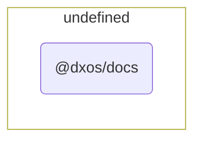

# @dxos/docs

## Dependency Graph

```mermaid
%%{ init: {'flowchart':{'curve':'basis'}} }%%

flowchart LR

%% Classes


%% Nodes

subgraph undefined [undefined]
  style undefined fill:transparent
  dxos/docs("@dxos/docs"):::root
  click dxos/docs "dxos/dxos/tree/main/docs/docs"
end
```

## Dependencies

| Module | Direct |
|---|---|
