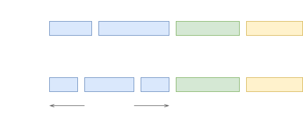

# Meta Graph Design Document <!-- omit in toc -->

This document presents the design of the Decentralized Meta Graph (DMG).

> *   TODO: Merge with dmg-spec, dmg-usage.

<!-- @toc -->

*   [1. Terminology](#1-terminology)
*   [2. Basic Concepts](#2-basic-concepts)
    *   [2.1. Subnets](#21-subnets)
        *   [2.1.1. Realms](#211-realms)
        *   [2.1.2. Records](#212-records)
        *   [2.1.3. Computation](#213-computation)
        *   [2.1.4. Issues](#214-issues)
*   [3. Architecture](#3-architecture)
    *   [3.1. KUBE Services](#31-kube-services)
    *   [3.2. KUBE Architecture](#32-kube-architecture)
    *   [3.3. Service Monitoring and Scale](#33-service-monitoring-and-scale)
*   [4. Notes](#4-notes)
*   [5. Model](#5-model)
    *   [5.1. Source](#51-source)
    *   [5.2. Publishing](#52-publishing)

## 1. Terminology

**Credential** -
Verifiable credential that enables decentralized access control within the Subnet (e.g., administrative, read/write, replication, control).
Each KUBE maintains a secure Credential store.

> *   Conceptually part of HALO, but may be implemented via TLS.
> *   TODO: Disambiguation TLS certificates from credentials (vs. CA/DNS).
> *   TODO: Connect Pierre with Ben Laurie!

**DNS** -
Global authority for domain records.

**KUBE** -
Individual Host (Subnet Node) running the KUBE daemon.

**Realm** -
Logical partition of the federated DMG consistent across the Subnet.

**Root CA** -
Root Certification Authority (for the Subnet).
Used to enroll KUBEs into the Subnet and is the root for other Credentials used within the Subnet.

**Subnet** -
A cluster of KUBE nodes under local authority.

## 2. Basic Concepts

*   DMG is a decentralized federated graph.
*   It consists of locally controlled subnets that are made up of KUBE nodes.

### 2.1. Subnets

A KUBE Subnet is a collection of devices running the KUBE daemon.
Subnets implement a coordinated set of services and may span network boundaries.

> *   TODO: Centralized vs. decentralized autority.

Typically, domain records point to the IP addressese of one or more Subnet devices.
Multiple domain names may reference the same Subnet;
conversely, Subnets are not reqrued to be associated with a domain name.


```
Case 1: Single new KUBE (DX instance) (local laptop, doing development)

Alice
- Develops source code in Linus file system using git and regular toolchain
  Literally use git to leverage knowledge and toolchain.
  - Use uses git for their source code => github.com
  - Creates regular git repo: ~/code/notepad
  - git remote -v => origin	git@github.com:alice/notepad.git (fetch)

- Installs DX and publishes build artifacts
  - ~/code/notepad/dx.yml has github actions for build/deploy
    - when update main, run esbuild

    dx.yml
    pub:
      main:
        target: dx://notepad            ## notepad.kube.local

      dev:
        target: dx://notepad/dev        ## dev.notepad.hostname
        target: dx://notepad:dev        ## notepad.hostname/dev


  - dx publish kube.local/notepad
    dx remote -v => kube.local/notepad

  - dx ls
    dx://notepad


https://notepad.kube.local      => /refs/notepad/@dx      <= git@github.com:alice/notepad.git#main

https://dev.kube.local/notepad  => /refs/notepad/dev/@dx  <= git@github.com:alice/notepad.git#dev


- Map to https://notepad.kube.local (require TLS Cert)

- Map to https://notepad.example.com

[SOURCE REPO] => [FILE REPO] <= URL
~/code                          http://


- 1 single DX repo per KUBE machine


Browser                               CLI


    dx --help
    dx repo create main
    mkdir -p app/notepad
    touch app/notepad/index.html
    echo "console.log('hello world')" > app/notepad/main.js
    dx commit -a
    dx push

    dx://   main  app/notepad => { index.html, main.js }


notepad.kube.local                    dx://local/kube/nodepad => dmg:/app/notepad


                                              /textapp => { index.html, main.js }

notepad.foo.com     => [[Subnet]]  => dmg:/com/foo/notepad
notepad.bar.com                       dmg:/com/bar/notepad

textapp.foo.com                       dmg:[pierre.com]/app/textapp

```

> - ISSUE: Load balancing (FE/BE)

- Each KUBE machine has a Repo (snowflake)
- Repo can mount and share hierarchies (within subnet and across subnets)
  - ISSUE: How to reference other subnets? DNS primary mechanism for global names. In theory could have non-DNS.


#### 2.1.1. Realms

The DMG is a global federated graph physically partitioned by Subnets.
Subnets also manage logical partitions called Realms.

Each Subnet operates a DMG Service, which manages a Realm.
A Realm can be thought of as decentralized file system that is consistent across the Subnet.
Each KUBE within the Subnet replicates changes to all other KUBEs, which form a peer-to-peer network.

Directories within the Realm may be mapped onto domain and subdomain names managed by the Subnet.

**Example**

#### 2.1.2. Records

Nodes are typed protocol buffer encoded data structures.
Different Record types represent different Graph resources and may be handled differently by the KUBE Web server in a manner similar to [MIME types](https://mimetype.io/all-types).

The KUBE server contains a Web server that maps conventional HTTP requests onto files represented within the graph.

DMG Records may be mapped onto URLs as follows:

> Note: Multiple domain names may be mapped to a KUBE Subnet, therefore there may be a many-to-one relationship between Subnet and DMG Realm.



> *   Note: Realm is just a FQ hostname.
> *   TODO: Resources are "leaf" nodes of the graph and are processed by a `handler` specified by its ancestors Records, which may be inherited.

Realms represent a logical partition of the KUBE subnet's DMG.
They map directly onto a root folder within the graph.

The URL's `path` components is split into `record` and `resource` parts.
The `path` is used to traverse the DMG graph from the root associated with the `realm` until a DMG Record is found.
The remainder of the `path` is then considered to be a `resource` path within the associated record.



> *   TODO: Illustrate inheritance and overriding props (e.g., /app/notepad/dev)

Records are retrieved via the DMG Record Service, which defines the following API.

> Note: The path may return a hierarchical list of Record refs.

```protobuf
package dxos.dmg.service;

service DMG {
  rpc ResolveUrl(ResolveUrlRequest) returns (ResolveUrlResponse);
  rpc getRecords(RecordRequest) returns (RecordResponse);
  rpc setRecord() returns ();
}

message ResolveUrlRequest {
  string url = 1;
}

message ResolveUrlResponse {
  message Part {
    string path = 1;
    Hash record = 2;
    Hash resource = 3;
  } 

  repeated Part parts = 1;
}

message RecordRequest {
  repeated Ref records = 1;  
}

message RecordResponse {
  repeated google.protobuf.any records = 1;
}
```

> Note: The API support both git and blockchain/IPFS implementations.

**Example**

```ts
api.LookupRequest({ url: 'https://beta.example.com/app/notepad/index.html' })
```

Returns

```json
{
  "@type": "dxos.dmg.service.LookupRequest",
  "parts": [
    {
      "path": "com",
      "record": "3fc2b23fed0ac15fa5cb79d545e5a508a1c20e48"
    },
    {
      "path": "example",
      "record": "d5b0ed624cdc8d6a11793cea81fb400d3f9c4878"
    },
    {
      "path": "beta",
      "record": "2ec5b45edb99d4e0f902e1d77201d6e580e62493"
    },
    {
      "path": "app",
      "record": "95de870800728425d7b2e6f95c2cea69a17d12d3"
    },
    {
      "path": "notepad",
      "record": "28bcd4589ab5183209e36978c1f3b21de760fe30"
    }
    {
      "path": "index.html",
      "resource": "804e56b5a95ebf3030d605751b0340124cbc896f"
    }
  ]
}
```

> *   TODO: When Records are requested they are decoded by the client using a codec retrieved from DMG via the Record's `type` property.

The DMG record can be retrieved as JSON objects by passing appropriate [Accept](https://developer.mozilla.org/en-US/docs/Web/HTTP/Headers/Accept) and [Authroization](https://developer.mozilla.org/en-US/docs/Web/HTTP/Headers/Authorization) headers.

**Example**

The following example illustrates a DMG Record that represents a Web application.

```json
{
  "type": "schema.dxos.org/dmg/webapp",
  "manifest": {
    "default": "index.html",
    "files": [
      "index.html",
      "main.js",
      "img": [
        "logo.png"
      ]
    ]
  }
}
```

> *   TODO: DMG Record protocol buffer schema.

The DMG Record can be retrieved as a JSON document via a TCP or HTTP request:

```bash
> curl -H "Accept:application/json" -H "Authorization:TOKEN" https://beta.example.com/app/notepad | jq
```

The `type` field references a DMG Record that represents a protocol buffer schema definition.
Note: DMG references may point to Records defined in another Subnet.

Given the Example above, the following are all valid requests that return a resource located within a DMG Record's bundle.

```bash
curl https://beta.example.com/app/notepad
curl https://beta.example.com/app/notepad/index.html
curl https://beta.example.com/app/notepad/main.js
```

#### 2.1.3. Computation

DMG Records may also reference serverless compute endpoints that can be invoked by HTTP requests.

**Example**

The following example, defines a script.

```json
{
  "type": "/dxos/schema/webapp",
  "manifest": {
    "exec": [
      "data": {
        "method": "POST",
        "entry": "exec.js"
      }
    ]
  }
}
```

The script can be invoked by making an HTTP POST request.

```bash
curl -X POST -H "Accept:application/json" https://beta.example.com/app/notepad/data
```

> *   TODO: Note the script would typically be a think adapter to some other compute system.
> *   TODO: How does this relate to bots?

#### 2.1.4. Issues

*   Realms, Subnets, Domains, Logical partitions, mapping
*   Hierarchical records (e.g., /app/notepad, /app/notepad/beta)
*   Lambda and other compute (e.g., invoking other platforms)
*   IPLD? DXLD?

## 3. Architecture

### 3.1. KUBE Services


### 3.2. KUBE Architecture



### 3.3. Service Monitoring and Scale


*   Monitoring
*   Autoscale
*   Subnet resource management

## 4. Notes

*   Each KUBE runs a Web server that handles HTTP request.
    *   The host (example.com) is a subnet (DNS may be managed by the subnets own DNS servers).

*   Example URL:
    *   <https://dev.example.com/office/notepad>
    *   <https://example.com/dev/office/notepad>
    *   <https://example.com/office/notepad/dev>

*   The Web server resolved \['/dev', '/office/notepad'] to a DMG record (which is represented by a git ref)
    *   ISSUE: Is the subdomain special -- e.g., should it represent a "Realm"?
        *   Realm is a unit of organization of files (users can have an unlimited number)
        *   Possible to map local subnet Realms onto other Realms? (e.g., live.rich.com/app => beta.example.com/app)
        *   If not, then the first 2 URLs above would be equivalent?
        *   ISSUE: Browser subdomain isolation
        *   ISSUE: Browser will resolve files relative to URL (not to contents of record)
    *   The DMG record is a typed record (protobuf) that defines the resource
    *   The record may reference other files within the DMG (e.g., PNG, JSON document, index.html, javascript, Android PDK)
    *   Based on the record type, the web server returns the associated content

        <https://dev.example.com/office/notepad>
        \=> DMG Record{ mime: 'text/html', path: 'index.html', ref: tree-ish, ...meta }
        <https://dev.example.com/office/notepad/index.html>   => tree-ish/index.html
        <https://dev.example.com/office/notepad/main.js>      => tree-ish/main.js

        `curl https://dev.example.com/office/notepad => index.html`
        `curl -H "Accept:application/dmg" https://dev.example.com/office/notepad | jq`
        \=> JSON DMG record (represents the app bundle)

        (NOTE: tree-ish == SHA)

        curl <https://dev.example.com/office/notepad/main.js> => main.js

        *   Path requests are relative to the nearest ancestor representing a DMG record

        *   E.g., HTTP GET `https://dev.example.com/office/notepad/main.js` is handled by the Web server
            *   First we request the DMG record associated with the nearest ancestor (i.e., `dev::office/notepad`)
                *   (This is equivalent to `curl -H "Accept:application/dmg" -H "Authorization:xxx" https://dev.example.com/office/notepad`)
            *   The DMG record references a SHA and path
            *   The relative path from this entry point is then used to serve an individual file

        *   ISSUE: One repo per Realm?

        *   ISSUE: Are we overloading browser isolation with Realm organization?

        *   ISSUE: DMG record can map subpath onto Lambda

*   Each KUBE Node creates a single local repo named `dmg` (`~/.kube/dmg.git`).

*   Suppose we have a Subnet controlled by `alice` with three KUBE Nodes (`a1`, `a2`, `a3`).
    Each local repo has a `remote`, which references the other Nodes on the Subnet.

*   All changes to the repo are replicated (pushed) to other Nodes.

*   The Subnet maintains a locally consistent repo.

2022-07-26 \[RB, Zhenya]

*   ISSUE: Mapping URLs onto records (e.g., significance of subdomain and path)?
*   ISSUE: Management of records (e.g., into Realms)

2022-07-24 \[RB, Pierre]

*   What are the relationships between URL => Realm => Refs (and the implied mapping)?

*   Of course URL => Subnet, but the part of the URL that isn't just the host (i.e., subnet) consists of (possibly) a subdomain name (alice.example.com) and a path (/notepad).
*   That's what i'm calling a "name" or DXN (i.e., alice/notepad).
*   So a URL identifies both a Subnet and a resource Name (DXN).
*   Names (DXNs) contain both a Realm and a Resource (path). E.g., "alice.notepad" references the Realm "alice" and the Resource "notepad".
*   Questions:
*   1.  Can Realms be hierarchical (e.g., dxos.devnet vs. alice).

Yes.

*   2.  Are Realms fixed to Subnets? Are they fixed to Domain names? (What if I don't have a domain name? What if I want to transfer them?). I don't think they are.

Yes and yes, but I can replicate a realm and mount inside my realm. Transfer -> read in, write out.

*   3.  But if not, then how do we have globally unique Realm names?

Well-defined roots, like /dnsaddr/ams-2.bootstrap.libp2p.io/tcp/4001/p2p/QmbLHAnMoJPWSCR5Zhtx6BHJX9KiKNN6tpvbUcqanj75Nb in multiaddr,
except we have a few well-defined roots (eg /onion/) and fall back onto DNS.

*   4.  DMG maintains the map between the name and the refs -- what is the model for this? Each subnet is responsible for maintaining it's own map -- since each subnet is the AUTHORITY (with different forms of consensus) for it's SET of realms.

It works like mountpoints. I might mount a realm as a participant or as something I want to expose (but have no control over) or as a mere observer.

## Example of DMG mappings

A browser loads https://alice.pcarrier.com/notepad.
It connects to one of the servers returned by the pcarrier.com DNS servers for alice.pcarrier.com,
hence trusted members of the pcarrier.com subnet and a primary source of authority for refs/com/pcarrier (ie, people would pull from there).

They look up locally, in order:
```
  refs/!meta
  refs/com/!meta
  refs/com/pcarrier/!meta
  refs/com/pcarrier/alice/!meta
  refs/com/pcarrier/alice/notepad/!meta
```

Any of those meta can choose to redirect to another meta, for example 'refs/com/pcarrier/:meta` could say `refs/com/pcarrier/alice`
is in fact `refs/org/dxos/alice` (or `refs/com/alice`) which would fork the traversal into:

```
  refs/!meta
  refs/com/!meta
  refs/com/pcarrier/!meta
  refs/org/dxos/alice/!meta
  refs/org/dxos/alice/notepad/!meta
```

`refs/org/dxos/alice/notepad/!meta`
could be a ref to a commit that contains the file `dx.yml` with:
```
https:
  serve:
    !https:
  fallback:
    !https:index.html
actions:
  writes:
    - name: admin-publishes
      from: /org/dxos/admins:keys
      only:
      - !code
      - !dev/*
    - name: https propagation:
      publish-https:
        after: !code:build
        from: !code:public
        to: !https
```
+
+Which we merge with `refs/org/dxos/alice/!meta : dx.yml`, `refs/org/dxos/!meta : dx.yml`
+
+`/refs/org/dx/alice/notepad/!https` is a ref to a commit that contains:
+```
+index.html
+0636c948994da120435f13158ab4bb8466b7c435.js
+0636c948994da120435f13158ab4bb8466b7c435.css
+```
+
signed by the user/kube that performed the build (eg through `dx build` automatically creating the local ref ready to be
pushed. Note that commits can be created and referred to by multiple `tag` objects inside one transaction efficiently, allowing
for quiescent operation of the blockchain outside of big push events (intermediates could prepare then perform them at once;
eg could have a bag of `refs/org/dxos/!changeset/$account/v2.0/$ref` updates transacted atomically).

<!--
        alice (alice.com) :: [a1, a2, a3]
            /alice/notepad
            /alice/tasklist
            /bob/notepad
                /pub

        bob (bob.com) :: [b1]
            /bob/notepad
                /dev
                /pub

        Browser
            https://dxos.org/.well-known
                                /status
                                /ipfs/Qx28237982374982

            https://dxos.org/alice/notepad

                            => App Service running on the dxos.org cluster (resolved by DNS)
                                /alice/notepad 
                                    => /refs/dxos.org/alice/notepad/prod => { dx.yml, index.html, indes.js }

            DXNS (runs on every Subnet)
                - Maps DXN path/name (embedded within URL and subdomain) to git ref; App server then retrieves and serves these files.
                - Allows publishing via either:
                    - Blockchain based authority (which dxos.org runs, and rich.com also chooses to run) has on-chain map.
                        - Trust based on account
                    - Local (running on pcarrier.com) authority based on ssh keys and mapping within git.


        On Alice's workstation

            /refs/heads/alice/notepad

        Publishing to dxos.org

            1. Create DX account for DXNS (since dxos.org is running the DXNS service).
            2. Create authority `alice` by staking DX tokens (required by DXNS service).
            3. Publish 
                - create empty signed commit (aka release branch)
                - push commit to local repo then replicate to dxos.org

        Publishing locally

            [DNS domain subnet]/[authority]]/[resource]
-->

## 5. Model

This section illustrates the User Model for developers.

> *   ISSUE: We need to map Source => Build Artifacts => Publishing Address (and published metadata; hierarchical records)

### 5.1. Source

Developers use conventional source code managements systems and tools, such as `git`, during the development phase.

**Example**

Alice is developing a new Web applications called Notepad.
She creates a Github repo that is published at `github.com/alice/notepad`.
She maintains a local clone of the repo on her developer workstation.
Alice uses feature branches, which are merged back to a primary `main` branch once all tests are passing.
She also maintains a `prod` branch and periodically merges changes here from the `main` branch.

Alice's goal is to have the build artifacts created from both the `main` and `prod` branches available at all times on different URLs.

```bash
> git clone git@github.com:alice/notepad.git
> git remote -v
origin	git@github.com:alice/notepad.git (fetch)
origin	git@github.com:alice/notepad.git (push)
> git branch
* main
  prod
```

### 5.2. Publishing

Developers use the `dx` CLI tool to manage publishing build artifacts to the DMG.
She creates a `dx.yml` configuration file within each project she wants to publish.

**Example**

```yml
# dx.yml
project:
  build:
    repo: git@github.com:alice/notepad.git
    command: yarn build

  publish:
    realm: dx://beta.alice.com/app/notepad
    files:
      - public/index.html
      - dist/main.js

  endpoints:
    - url: https://kube.local/notepad
      resource: /index.html
    - url: https://notepad.alice.com
      resource: /index.html
    - url: https://alice.com/dsuite/notepad
      resource: /index.html
```

Alice installs the `kubed` daemon on her workstation.
The daemon provides a DMG service that handles querying and publishing requests.

Alice runs the following command to publish the package.

```bash
> dx publish
> dx remote -v
dx://beta.alice.com/app/notepad
> dx status
Published: 2022-07-31 15:05:02
```

> *   ISSUE: URL mapping conflicts across DMG records.

> *   TODO: Compare (serverless, lambda, digital ocean, etc.)

```
Case 1: Single new KUBE (DX instance) (local laptop, doing development)

Alice
- Develops source code in Linus file system using git and regular toolchain
  Literally use git to leverage knowledge and toolchain.
  - Use uses git for their source code => github.com
  - Creates regular git repo: ~/code/notepad
  - git remote -v => origin	git@github.com:alice/notepad.git (fetch)

- Installs DX and publishes build artifacts
  - ~/code/notepad/dx.yml has github actions for build/deploy
    - when update main, run esbuild

    dx.yml
    pub:
      main:
        target: dx://notepad            ## notepad.kube.local

      dev:
        target: dx://notepad/dev        ## dev.notepad.hostname
        target: dx://notepad:dev        ## notepad.hostname/dev


  - dx publish kube.local/notepad
    dx remote -v => kube.local/notepad

  - dx ls
    dx://notepad


https://notepad.kube.local      => /refs/notepad/@dx      <= git@github.com:alice/notepad.git#main

https://dev.kube.local/notepad  => /refs/notepad/dev/@dx  <= git@github.com:alice/notepad.git#dev


- Map to https://notepad.kube.local (require TLS Cert)

- Map to https://notepad.example.com

[SOURCE REPO] => [FILE REPO] <= URL
~/code                          http://


- 1 single DX repo per KUBE machine


Browser                               CLI


    dx --help
    dx repo create main
    mkdir -p app/notepad
    touch app/notepad/index.html
    echo "console.log('hello world')" > app/notepad/main.js
    dx commit -a
    dx push

    dx://   main  app/notepad => { index.html, main.js }


notepad.kube.local                    dx://local/kube/nodepad => dmg:/app/notepad


                                              /textapp => { index.html, main.js }

notepad.foo.com     => [[Subnet]]  => dmg:/com/foo/notepad
notepad.bar.com                       dmg:/com/bar/notepad

textapp.foo.com                       dmg:[pierre.com]/app/textapp

```

> *   ISSUE: Load balancing (FE/BE)

*   Each KUBE machine has a Repo (snowflake)
*   Repo can mount and share hierarchies (within subnet and across subnets)
    *   ISSUE: How to reference other subnets? DNS primary mechanism for global names. In theory could have non-DNS.

