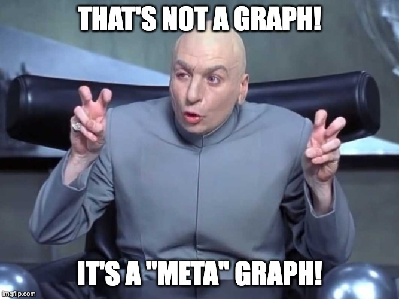
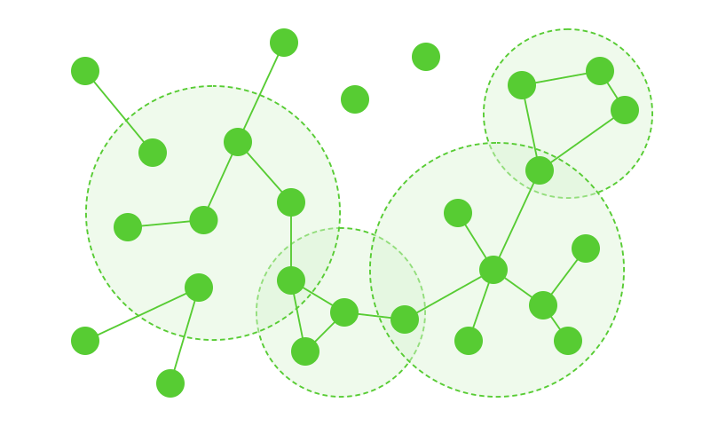
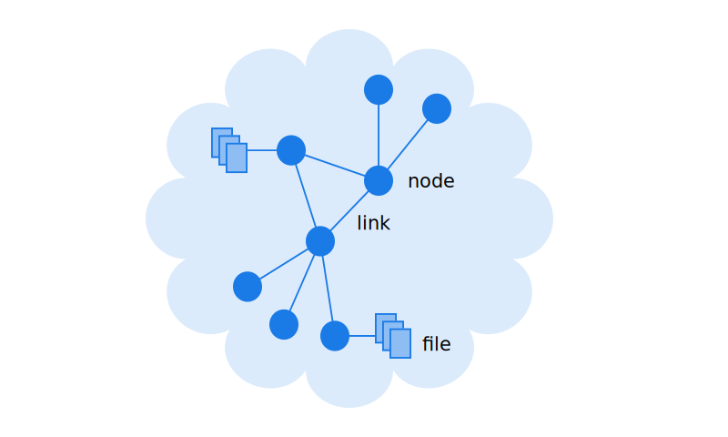
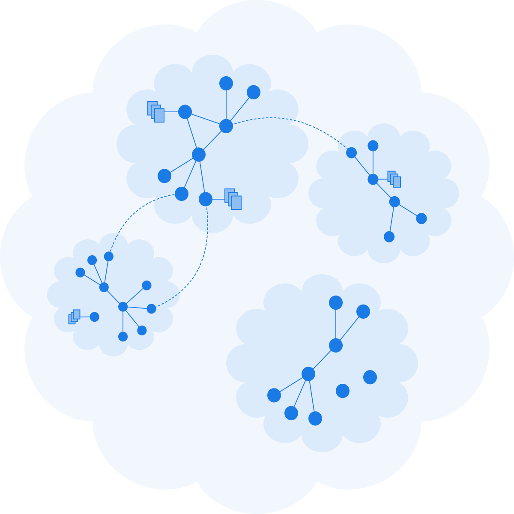
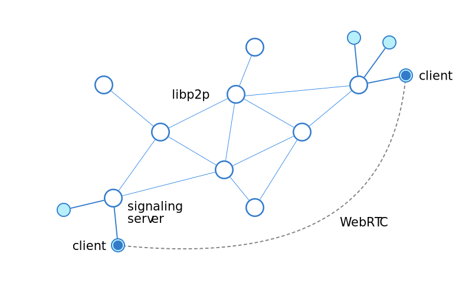

# The Decentralized Meta Graph (DMG) <!-- omit in toc -->

This document outlines the DXOS Decentralized Meta Graph (DMG).

<!-- @toc -->

*   [1. Introduction](#1-introduction)
    *   [1.1. Motivation](#11-motivation)
        *   [1.1.1. Information Management](#111-information-management)
        *   [1.1.2. Collaboration](#112-collaboration)
*   [2. Terminology](#2-terminology)
*   [3. Basic Concepts](#3-basic-concepts)
    *   [3.1. Decentralized Meta Graph](#31-decentralized-meta-graph)
    *   [3.2. Identity: Circles, Groups, and Agents](#32-identity-circles-groups-and-agents)
        *   [3.2.1. References](#321-references)
    *   [3.3. Information: Branes, Spaces, and Nodes](#33-information-branes-spaces-and-nodes)
        *   [3.3.1. Consistency and Consensus](#331-consistency-and-consensus)
        *   [3.3.2. Data Model](#332-data-model)
        *   [3.3.3. Data Federation](#333-data-federation)
        *   [3.3.4. References](#334-references)
    *   [3.4. Decentralized Networks](#34-decentralized-networks)
*   [4. Notes](#4-notes)

## 1. Introduction

### 1.1. Motivation

As humans we interact with many different applications and services, each of which have different user interfaces.
Many systems share similar conceptual aspects, for example with respect to identity and access control, and the representation of data (files, tables, etc.)
In some cases, these involve are overlapping/redundent implementations (e.g., Google Docs, Notion, Dropbox, Github all have different concepts of accounts, teams, roles, etc.)
Some smaller subset of activities may share a common implementation (e.g., Notion supports universal login via Google accounts; Dropbox synchronizes files with the native operating system.)

The first user-facing applications were created on early operating systems such as the [Alto Exec](https://en.wikipedia.org/wiki/Xerox_Alto) developed by Xeros PARC, which introduced for the first time the [desktop metaphor](https://en.wikipedia.org/wiki/Desktop_metaphor).
The Apple Lisa and then Macintosh borrowed these concepts and brought them to the mainstream market.

Industrial age metaphors

Post symbolic communication is when we can instead of sequencing symbols (words and sentences) to ascribe ideas, we can just materialize the thing we're talking about

#### 1.1.1. Information Management

#### 1.1.2. Collaboration

*   Our professional and social networks are one of our most valuable assets.
*   Social networks suck; they don't serve us.
*   We need fundamental internet-scale protocols to build more advanced applicaitons and systems.
*   HALO and ECHO define low-level protocols that represent identity and information;
    MESH and KUBE provide the building blocks to support such systems.

> *   TODO: Motivate tangible and evocative first steps towards a new class of social networks.

## 2. Terminology

***Brane*** -
Set of all data accessible to an agent within the network.

***Circle*** -
Set of all agents known to another agent within the network.

***Frame*** -
Module application component.

***Space*** -
A collaborative database realm controlled by one or more agents within the network.

## 3. Basic Concepts

### 3.1. Decentralized Meta Graph

The Decentralized Meta Graph (DMG) is made up of Circles (decentralized identity) and Branes (decentralized data).

It is more than a graph database;
it is a single global singleton that securely encompasses all of the information accessible to an individual Agent.

### 3.2. Identity: Circles, Groups, and Agents

Participants within the DMG (both humans and autonomous systems) are called ***Agents***,
which control their own [self-sovereign identity](https://academy.affinidi.com/compare-and-contrast-federated-identity-vs-self-sovereign-identity-227a85cbab18) (SSI).
Agents identify themselves using [Peer DIDs](https://www.w3.org/TR/vc-data-model),
which can be resolved by the network to [DID Documents](https://www.w3.org/TR/did-core/#dfn-did-documents) that contain metadata (including public keys) associated with the agent.

An example of a Peer DID: `did:peer:1zdksdnrjq0ru092sdfsd491cxvs03e0`.

Agents maintain a [HALO](./halo-spec.md), which is a secure decentralized keychain that contains [Verifiable Credentials](https://www.w3.org/TR/vc-data-model) that represent various forms of ***Claims***.
Claims may represent access rights, digital asset ownership, relationships, and other information that can be digitally verified without the need for a centralized authority.

The HALO also contains an address book of other agents (represented by Peer DIDs) along with metadata that may represent relationships and claims associated with these agents. For example, one agent may issue a verifiable credential representing a friendship, which may enable the other agent to freely exchange messages or request information.

The set of all contacts for a given agent is called a ***Circle***.

The system also enables the creation of ***Groups***, which are ad hoc collections of agent identifiers (Peer DIDs) and claims (Verifiable Credentials) that may represent rights associated with these agents.
Groups are also referenced by Peer DIDs; the corresponding DID Document may be used to verify the management rights to the group.
Groups may be used to implement access control for decentralized digital assets.

#### 3.2.1. References

*   [Decentralized Identifiers (DIDs)](https://www.w3.org/TR/did-core)
*   [Verifiable Credentials Data Model](https://www.w3.org/TR/vc-data-model)
*   [Peer DID Method Specification](https://identity.foundation/peer-did-method-spec)
*   [Compare and Contrast — Federated Identity vs Self-sovereign Identity](https://academy.affinidi.com/compare-and-contrast-federated-identity-vs-self-sovereign-identity-227a85cbab18)
*   [Peer DIDs - What Can You Do With It?](https://academy.affinidi.com/peer-dids-an-off-ledger-did-implementation-5cb6ee6eb168)

 

### 3.3. Information: Branes, Spaces, and Nodes

The DMG consists of millions of interconnected globally identifiable database instances called ***Spaces***.

Spaces are graph databases that contain atomic data elements called ***Nodes***.
Spaces are implemented using secure and privacy-preserving [ECHO](./echo-spec.md) peer-to-peer databases.
The graph is traversable using the \[LINK] ECHO Graph API.

> *   TODO: Spaces were previously called Spaces. Change use of space for ad hoc sessions?
> *   TODO: Rename Nodes to Atoms?
> *   TODO: Spaces are globally addressable digital assets.
> *   TODO: Define Branespace.

Nodes are identifiable data structures that are constructed and accessed using one of an extensible set of ***Model*** APIs.
Models provide convenient APIs representing different complex data structures with specific distributed consensus mechanisms.
For example, models may represent text documents, hierarchical structured documents, messaging channels, game states, and other state machines.

Spaces are digital assets that are created and controlled by groups of agents.
Agents maintain ownership and access control credentials within their HALO.
The complete set of interconnected spaces accessible by an agent is called a ***Brane***.

> *   TODO: Are Node IDs GUIDs -- or local to the Space, whereby the GUID is constructed with the Space identifier.

#### 3.3.1. Consistency and Consensus

Each ECHO instance is a graph database composed of elemental data structures called nodes.
Nodes can be queried using the ECHO Graph API.

*   TODO: Individual nodes are accessed using their associated model API.
*   TODO: Different model APIs provide different consistency capabilities.

Nodes are constructed and updated by ***mutations***.
Mutations are atomic transformations that are applied to the associated node's state machine.
Individual mutations are written as signed immutable ***messages*** into an append-only hash linked data structure called a ***feed***.
Each peer that has writable access to an ECHO instance maintains one or more feeds.
The database is made up from the set of feeds from each of the participating agents' peers.

The state of each node is constructed by applying mutations from individual feeds.
Since mutations may be applied by different peers concurrently, the system has to determine in which order each peer processes them.
Each message contains a special hash of the current state of the ECHO instance called a ***Timeframe***.
The timeframe is a kind of [Vector Clock](https://en.wikipedia.org/wiki/Vector_clock) consisting of an array of typles containing the associated feed's public key and the ordinal position of the mutation within that feed.
Timeframes allow for deterministic ordering of mutations so that each peer processes mutations in the same order as all other peers regardless of when the individual mutations were created.
This enables the ECHO data processing pipeline to provide a strict ordering of mutations (i.e., a ***total order***) to the associated node models, which are responsible for implementing data consistency.
Models typically implement some form of [conflict-free replicated data type (CRDT)](https://en.wikipedia.org/wiki/Conflict-free_replicated_data_type) to provide consistency guarantees.

Periodically, the set of mutations across participating feeds is bundled into a block called an ***Epoch***.
Epochs are defined by a starting and ending timeframe.
At the beginning of a timeframe, each node's model creates a serializable snapshot of the state of the associated state machine.
These snapshots are stored persistently.
Peers are then able to discard the preceeding mutation logs leading up to the start of the current epoch.
This provide a mechanism for data compression and consistency.

> *   Explain concensus implications of epochs.
> *   Forking

#### 3.3.2. Data Model

Each ECHO database instance is represented as a shared ***Space***.
It consists of a graph of linked nodes.

> *   Graph Queries, subscriptions, filtering
> *   Schema, protocol buffers, versions
> *   CRDTs (key-value, structured, text, custom)
> *   DXNS type system
> *   Nodes, links, and files
> *   IPLD, codecs, protocol buffers
> *   Models and state machine

Agents may have access to an unlimited number of private and collaborative spaces.
The total set of all such spaces is called a ***Brane***.

> *   Interspace links
> *   Brane indexing

#### 3.3.3. Data Federation

> *   Branes
> *   Personal search agent

#### 3.3.4. References

*   [Interplanetary Linked Data IPLD](https://ipld.io/docs)

 

### 3.4. Decentralized Networks

The DMG is realized by a peer-to-peer network of services called [MESH](./mesh-spec.md).
MESH services are coordinated by KUBE nodes that run the KORE OS daemon.

DXOS clients may connect to each other directly via a peer-to-peer transport such as WebRTC.
These connections are mediated by a network of signaling services which implement a DHT using libp2p PubSub.

Client applications connect to one or more signaling servers and register their IP address (and other metadata) using a ***discovery key*** shared by other peers with which they want to connect,.
The discovery key is typically the hash of a public key associated with a decentralized digital asset, such as an ECHO Space.

> *   TODO: Generalize DHT for discoverable digital assets? I.e., not just peers? E.g., local/global DXNS?

 

## 4. Notes

> *   TODO: Reconcile with HALO, ECHO, MESH specs.
> *   <https://www.inkandswitch.com/local-first>

