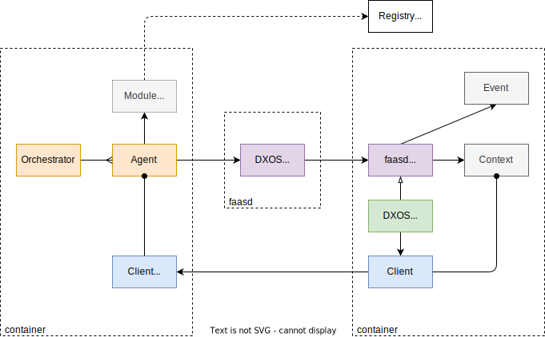

# Remote Functions

## Spec

- Run long-lived functions that operate over users' ECHO spaces and interace with external systems.
- Isolation of individual functions.
- Controlled access to resources (e.g., storage, network). Enables "pure" stateless funcitons.
- Funcitons triggered by external events (e.g., signaling, HALO/ECHO mutations, timers, other functions).
- Support multiple runtimes (e.g., WASI; potential to run within browser).
- Global registration and discovery (DMG).
- Life cycle management (i.e., install, start, pause, stop, destory).

## Use Cases

- Backups and epoch management for individual private and shared spaces (auto-provisioned by user/app.)
- Universal search across user's (or groups)'s spaces.
- Local training of LLM over a set of spaces.
- Bridges to external data sources (e.g., Protonmail, Calendar, enterprise SQL database, web crawler, OAuth APIs.)

## Goals

- Reuse of existing open source systems.
- Memory efficient runtime enabling high density.

## Non-Goals

- Coordination of funtions (or function state) runtime across multiple VMs (i.e., homogenous network).

## Issues

- Support for low-spec machines (e.g., Raspberry PI, IoT).

## Archiecture

### Definitions

- **VM**: Docker machine.
- **Orchestrator**:
  - manages life-cycle of agents and functions.
  - manages agent connectivity (e.g., swarms).
  - controls funciton invocation via events.
  - monitoring and resource management.
- **Agent**: 
  - DXOS peer (`@dxos/client`) with HALO (identity) and access to Spaces.
  - Context for function invocation.
- **Function**:
  - Short-lived function ("lambda").
  - Invoked with context (Agent, resource APIs) and event.
  - DMG record (module) defines a group of Functions, and their runtime requirements (runtime, resources, versioned APIs, and dependency graph -- which may include other functions.) Module definition includes the CID or the resource bundle.
  - Resources may include "system" services (e.g., storage, network access) and external endpoints (e.g., Local network services like IMAP server, LLM, or remote services like OAuth gateways.)
- **DMG**:
  - Federated registry that enables publishing and discover of funcitons.
  - Content-addressable graph database; contains dependency graph.
  - Allows for isolated (private) registration, and federation across DXOS ecosystem (via DXN URIs: e.g., `org.dxos/function/universal-indexer`, `com.example/function/llama-training`, `com.example/function/proton-mail-bridge`)

### Schematic

 

