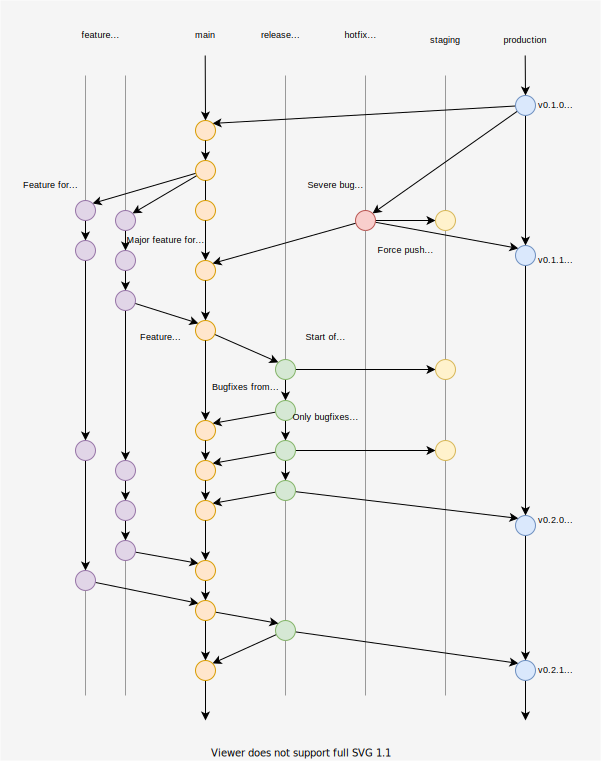

# DXOS Monorepo Branch Flow

:::note
This section is under development
:::

*   The default branch for development is `main`, if you are contributing this is where you make PRs to.
*   Feature branches within the repo are prefixed with the contributors username.
*   External contributors may contribute by forking the repo and sending PRs from their fork.
*   All feature branches are squashed when being merged to `main`.
*   When preparing a new release, a release candidate is cut from `main` using a Github action, these branches are prefixed with `rc-`.
*   On `rc-` branches Release Please runs and calculates what the next version should be.
*   Any further bug fixes merged to the `rc-` branch will also be pushed to `main`.
*   Once the Release Please PR is merged and the release is tagged, the `rc-` branch is merged into `main` and `production` before the branch is deleted.
*   The workflow for hotfixes is identical except it starts by branching from `production` and the branch is prefixed with `hotfix-`.
*   The current workflow for `staging` is force pushing any branch there as needed, the expectation is that this would generally be only be done from `rc-` or `hotfix-` branches.

## Publishing

*   All merges to `main` automatically publish apps to dev.kube.dxos.org.
*   All merges to `staging` automatically publish apps to staging.kube.dxos.org and publish npm packages under the `next` tag.
*   All merges to `production` automatically publish apps to kube.dxos.org and publish npm packages under the `latest` tag.

## Diagram

Based on: https://nvie.com/posts/a-successful-git-branching-model/

Workflow:

*   merge release candidates and hot fixes w/ `git merge --no-ff`
*   merge feature branches by squashing
*   staging is force pushed to from other branches
*   main/production maintain history
