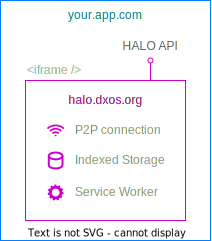

# Overview

ECHO (The **E**ventually **C**onsistent **H**ierrarhical **O**bject store) is a peer-to-peer graph database written in TypeScript.

*   Secure, P2P data replication based on [CRDTs](https://en.wikipedia.org/wiki/Conflict-free_replicated_data_type)
*   No servers or central authority, all the data is with the clients
*   Connectivity with peers via [WebRTC](https://en.wikipedia.org/wiki/WebRTC)
*   Supports for multiple concurrent writers
*   Collaboration on key-value objects, bodies of text, and other "custom data models".
*   Supports offline writes and conflict resolution when peers rejoin the network

### Spaces

Data is replicated within containers called `spaces`. A `space` is an instance of an ECHO database which can be replicated by a number of peers.

### Objects

Units of data are referred to as `objects` (like documents or rows in other databases). `Objects` always belong to a space. Objects can have fields with values, and strong relationships to other objects to form trees or graphs.

### Glossary

See the [glossary](glossary) for definitions of other terms you'll find in this guide.

## How to use ECHO
If using ECHO with React, install `@dxos/react-client` and follow the [React guide](react).

Otherwise, ECHO is available from `@dxos/client` to any Node.js or Browser environment. See [Configuration](configuration).

In general:

*   [Install](installation) the appropriate npm package `@dxos/client` or `@dxos/react-client`
*   Create a [Client](configuration) (or a [ClientProvider](react/cofiguration) in react)
*   Set up an identity with [HALO](../halo)
*   Create or Join a [Space](spaces)
*   Choose between the [Typed and Untyped ECHO APIs](typed)
*   [Query items](queries) (in [react](react/queries))
*   [Create items](mutations#creating-items) (in [react](react/mutations))
*   [Mutate items](mutations#mutating-data) (in [react](react/mutations))

## Local Vault Topology
ECHO is uniquely organized to give control over information over to the end-user and their devices. Browsers isolate web apps running on different domains, and this property is used to isolate the main "vault" of storage to a specific domain. By default that's `halo.dxos.org` but developers are free to [operate their own](advanced#custom-halo-source) copies of HALO on their local machine (e.g. using KUBE), their local network, or any other domain. The vault domain is responsible for holding the end-user's identity and all ECHO data in browser local storage, exposing it to applications via an API over [`postMessage`](https://developer.mozilla.org/en-US/docs/Web/API/Window/postMessage). A service worker and the CRDT-based architecture of ECHO enable both offline and real-time collaboration.

This means that when apps request the user's identity (ask to log in), they are in fact obtaining a secure identifier from the local HALO application directly, without making any network calls. Any reads and writes end up storing data in a database owned by the `halo.dxos.com` application, which serves as an identity wallet and data vault where applications can be revoked from accessing user data at any time.

