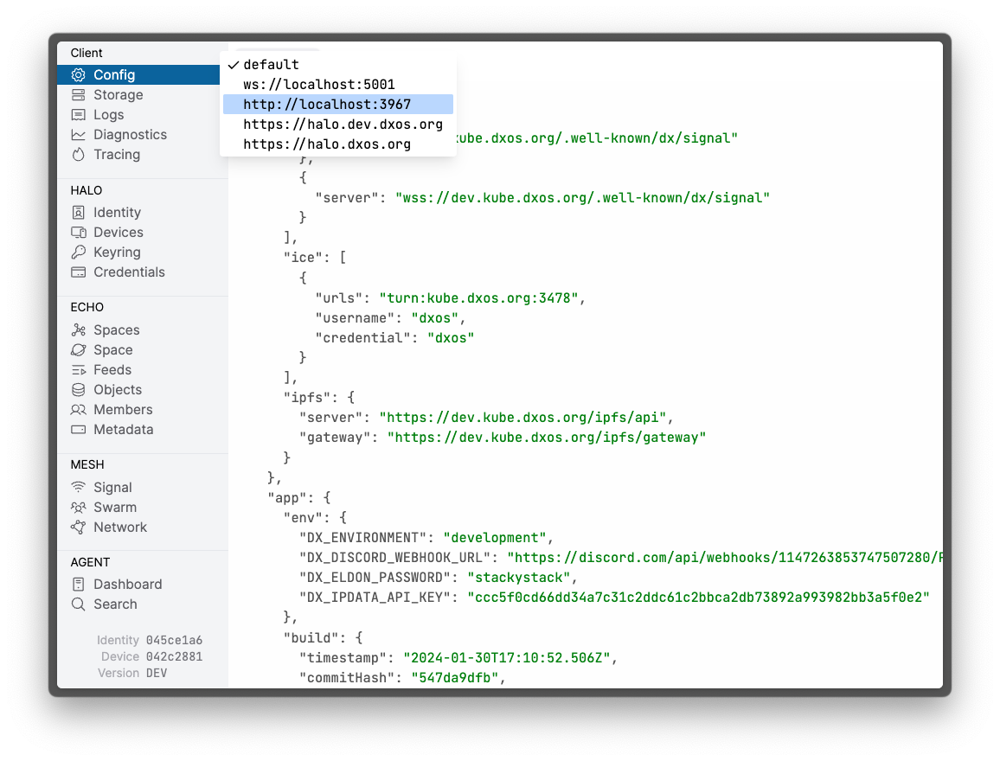

# DXOS Inspector

Using this tool you can connect to any instance of ECHO to visualize and debug the state of the application.

*   Launch the [Inspector Tool](https://devtools.dxos.org)

:::tip
Inspect any target HALO vault using the `?target=vault:https://...` argument in the URL
:::
