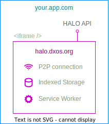

---
dir:
  text: Platform Overview
  order: 2.5
prev: ../getting-started
---

# ECHO Database

ECHO (The **E**ventually **C**onsistent **H**ierarhical **O**bject store) is a peer-to-peer graph database written in TypeScript.

*   Secure, P2P data replication based on [CRDTs](https://en.wikipedia.org/wiki/Conflict-free_replicated_data_type).
*   No servers or central authority, all the data is with the clients.
*   Connectivity with peers via [WebRTC](https://en.wikipedia.org/wiki/WebRTC).
*   Support for multiple concurrent writers.
*   Collaboration on key-value objects, bodies of text, and other "custom data models".
*   Support for offline writes and conflict resolution when peers rejoin the network.

::: note Tell us what you think
Join our [Discord](https://discord.gg/KsDBXuUxvD) and talk to us about the kind of database you are looking for.
:::

## Spaces

Spaces are units of sharing and access control in ECHO. They are equivalent to "collections" in a document store.

**A `space` is an instance of an ECHO database which can be replicated by a number of peers.**

A given peer is typically a part of many spaces at any given time.

There are several steps to establishing a space between peers:

1.  **Peer A** listens on the peer network for peers intereseted in a specific [invite code](../glossary#invitation-code) it generated.
2.  **Peer B** obtains the [invite code](../glossary#invitation-code) and locates the listening **Peer A** via the [signaling network](../glossary#signaling-service).
3.  **Peer A** and **Peer B** establish a secure connection via [Diffie Hellmann](https://en.wikipedia.org/wiki/Diffie%E2%80%93Hellman_key_exchange) key exchange.
4.  **Peer A** generates an [authorization code](../glossary#authorization-code) and sends it to **Peer B** via another safe channel (i.e.: shows a QR code).
5.  Finally, **Peer B** provides the [authorization code](../glossary#authorization-code) back to **Peer A** over the new connection.

This verifies that the connection is secure, and the identities of peers are mutually confirmed.

::: tip Tip
If you're using `react`, DXOS provides a simple [UI flow](../react/spaces#joining-spaces) that implements generating and accepting invitations to spaces.
:::

**Next steps:**

*   Create or join a space in [TypeScript](../typescript/spaces)
*   Create or join a space in [React](../react/spaces)

## Objects

Units of data are referred to as `objects` (like documents or rows in other databases). `Objects` always belong to a space. Objects can have fields with values, and strong relationships to other objects to form trees or graphs.

## Glossary

See the [glossary](../glossary) for definitions of other terms you'll find in this guide.

## How to use ECHO

*   Install the appropriate npm package [`@dxos/client`](../typescript) or [`@dxos/react-client`](../react)
*   Create a [Client](../typescript#configuration) (or a [ClientProvider](../react#cofiguration) in react)
*   Set up an identity with [HALO](./halo)
*   Create or Join a [Space](#spaces)
*   [Query objects](../typescript/queries) (in [react](../react/queries))
*   [Create objects](../typescript/mutations#creating-objects) (in [react](../react/mutations))
*   [Mutate objects](../typescript/mutations) (in [react](../react/mutations))

## Local Vault Topology

ECHO is uniquely organized to give control over information to the end-user and their devices.

Browsers isolate web apps running on different domains, and this property is used to isolate the main `vault` of storage to a specific domain. By default that's [HALO](./halo) on `halo.dxos.org` but developers are free to [operate their own](../typescript/config#custom-halo-source) copies of HALO on their local machine (e.g. using [KUBE](./kube)), their local network, or any other domain.

The vault domain is responsible for holding end-user identity (keys, credentials, metadata, ..., etc.) and all ECHO data in persistent browser or disk storage. It exposes this data to applications via an API over [`postMessage`](https://developer.mozilla.org/en-US/docs/Web/API/Window/postMessage).

A service worker and the CRDT-based architecture of ECHO enable both offline and real-time collaboration.

This means that when apps request the user's identity (ask to log in), they are in fact obtaining a secure identifier from the local HALO application directly, without making any network calls. Any reads and writes end up storing data in a database owned by the `halo.dxos.org` application, which serves as an identity wallet and data vault where specific devices or applications can be revoked from accessing user data at any time.

::: note
For Node.js applications, the vault is implemented by an in-process storage engine that persists to files on disk, and is not isolated from the consuming application the way it is in browser.
:::

::: warning
The vault relies on worker ES modules and as such is [not yet functional in Firefox](https://developer.mozilla.org/en-US/docs/Web/API/Worker). The feature is currently under development however, currently behind the `about:config` preference `dom.workers.modules.enabled`. The hope and expectation is that this should be enabled by default in the not-too-distant future.
:::

## Next steps

*   If using `react` see the [React guide](../react/)
*   Otherwise, follow the [TypeScript guide](../typescript/)
